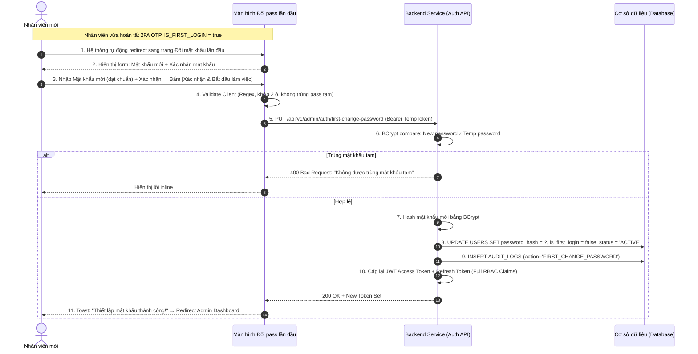

| Module | modules\authentication\admin\first-change-password |
| ------ | --------------------------------------------------- |
| Menu   | Cổng quản trị / Đổi mật khẩu lần đầu (Admin / First Time Change Password) |
| Mô tả  | Dùng để **bắt buộc nhân viên mới** đặt lại mật khẩu cá nhân an toàn thay cho mật khẩu tạm thời được hệ thống sinh tự động khi tạo tài khoản. Màn hình này tự động xuất hiện ngay sau khi nhân viên hoàn tất xác thực 2FA OTP trong lần đăng nhập đầu tiên (cờ `IS_FIRST_LOGIN = true`). Nhân viên **không thể bỏ qua, không thể truy cập bất kỳ chức năng quản trị nào** cho đến khi hoàn thành thiết lập mật khẩu mới đạt chuẩn bảo mật. Sau khi đổi mật khẩu thành công, hệ thống cập nhật `IS_FIRST_LOGIN = false`, chuyển trạng thái tài khoản từ `Pending` sang `Active`, cấp lại JWT Token đầy đủ quyền RBAC và điều hướng nhân viên vào Admin Dashboard. Áp dụng style UI, layout, component theo **style chung của project**. |

**Tổng quan màn Đổi mật khẩu lần đầu (UC-01.18):**
- A. Giao diện Màn hình Đổi mật khẩu lần đầu
  - A.1. Header & Thông báo bắt buộc
  - A.2. Thông tin các trường dữ liệu trên form
  - A.3. Button hành động
- B. Quy tắc nghiệp vụ (Business Rules)
  - BR-01: Điều kiện tiên quyết và Bảo vệ truy cập (Access Guard)
  - BR-02: Quy chuẩn Mật khẩu mới (Password Policy — Chuẩn hóa toàn hệ thống)
  - BR-03: Không cho phép tái sử dụng mật khẩu tạm thời (No Reuse Temp Password)
  - BR-04: Cập nhật trạng thái tài khoản và cấp lại Token (Account Activation & Token Refresh)
- C. Luồng nghiệp vụ chi tiết (Workflows)
  - C.1. Luồng đổi mật khẩu lần đầu thành công (Main Flow)
  - C.2. Luồng ngoại lệ (Alternative Flows)
  - C.3. Sơ đồ tuần tự nghiệp vụ (Sequence Diagram)
- D. Danh mục thông báo / Cảnh báo hệ thống (System Messages)

---

# A. Giao diện Màn hình Đổi mật khẩu lần đầu

Giao diện toàn trang (Full-screen), không hiển thị thanh Header chức năng hay Sidebar menu quản trị để nhấn mạnh rằng nhân viên **bắt buộc** phải hoàn thành bước này trước:

## A.1. Header & Thông báo bắt buộc

| Tên | Loại dữ liệu | Bắt buộc | Mô tả |
| --- | ------------ | -------- | ----- |
| Logo hệ thống | Image | | Logo cửa hàng (60x60px), căn giữa phía trên. |
| Tiêu đề trang | Title | | **"Thiết lập mật khẩu mới"** (font-size 22px, bold, căn giữa). |
| Thông báo bắt buộc | Alert Info Box | | Hộp thông báo nền xanh nhạt: *"Đây là lần đầu tiên bạn đăng nhập vào hệ thống. Vì lý do bảo mật, bạn cần thiết lập một mật khẩu cá nhân mới thay cho mật khẩu tạm thời được cấp. Bạn sẽ không thể truy cập các chức năng làm việc cho đến khi hoàn tất bước này."* |
| Thông tin nhân viên | Text | | Dòng text nhỏ: *"Tài khoản: **an.nguyen@aqs.vn** (Mã NV: **NV0025**)"*. |

## A.2. Thông tin các trường dữ liệu trên form

| Tên | Loại dữ liệu | Bắt buộc | Mô tả | Mô tả Database | Độ dài |
| --- | ------------ | -------- | ----- | -------------- | ------ |
| Mật khẩu mới | PasswordInput | x | Ô nhập mật khẩu cá nhân mới thay cho mật khẩu tạm thời.  Placeholder: **"Nhập mật khẩu mới"**.  Tính năng: - Icon mắt (Toggle Eye) ẩn/hiện mật khẩu. - Thanh đánh giá độ mạnh mật khẩu (Strength Meter) hiển thị realtime bên dưới: *Yếu* (đỏ) / *Trung bình* (vàng) / *Mạnh* (xanh lá).  Quy tắc kiểm tra (Validate — theo **BR-02**): - Tối thiểu **8 ký tự** trở lên. - Phải chứa ít nhất: 1 chữ cái in hoa, 1 chữ cái in thường, 1 chữ số và 1 ký tự đặc biệt (`@#$%^&*!...`). - Không được trùng với mật khẩu tạm thời vừa dùng để đăng nhập (**BR-03**).  Cảnh báo lỗi inline: - Để trống: *Vui lòng nhập mật khẩu mới.* - Quá ngắn: *Mật khẩu phải có tối thiểu 8 ký tự.* - Thiếu yêu cầu: *Mật khẩu phải bao gồm chữ hoa, chữ thường, số và ký tự đặc biệt.* - Trùng pass tạm: *Mật khẩu mới không được trùng với mật khẩu tạm thời.* | PASSWORD_HASH | 128 |
| Xác nhận mật khẩu mới | PasswordInput | x | Nhập lại mật khẩu mới để xác nhận đối soát.  Placeholder: **"Nhập lại mật khẩu mới"**.  Icon Toggle Eye ẩn/hiện.  Validate: - Phải khớp chính xác với ô Mật khẩu mới phía trên. - Lỗi inline: *Xác nhận mật khẩu không khớp.* | | |

## A.3. Button hành động

| Tên | Loại dữ liệu | Bắt buộc | Mô tả |
| --- | ------------ | -------- | ----- |
| Xác nhận & Bắt đầu làm việc | Button | | Button Primary, full-width, label: **"Xác nhận & Bắt đầu làm việc"**.  Khi bấm: Validate toàn form → Gửi API đổi mật khẩu → Thành công: Cập nhật CSDL (`IS_FIRST_LOGIN = false`, `STATUS = 'ACTIVE'`), cấp lại JWT Token đầy đủ quyền RBAC, chuyển thẳng vào Admin Dashboard. |

> **Lưu ý giao diện:** Không có nút "Bỏ qua", "Hủy" hay "Quay lại". Nhân viên bắt buộc phải hoàn thành bước này. Nếu đóng tab/trình duyệt rồi đăng nhập lại, màn hình này sẽ tiếp tục xuất hiện cho đến khi đổi mật khẩu thành công.

---

# B. Quy tắc nghiệp vụ (Business Rules)

## BR-01: Điều kiện tiên quyết và Bảo vệ truy cập (Access Guard)
1. **Điều kiện hiển thị:** Màn hình này chỉ được kích hoạt khi tài khoản nhân viên có `IS_FIRST_LOGIN = true` trong bảng `USERS`.
2. **Bảo vệ route (Route Guard):** JWT Token tạm được cấp sau bước 2FA OTP chỉ có scope hạn chế (`scope: 'first_change_password'`). Mọi request đến API quản trị khác (`/api/v1/admin/*`) sẽ bị từ chối với mã `403 Forbidden`.
3. **Chống truy cập ngược:** Nếu nhân viên cố tình chỉnh sửa URL hoặc gọi API khác khi chưa đổi mật khẩu, Backend luôn redirect lại trang này.

## BR-02: Quy chuẩn Mật khẩu mới (Password Policy — Chuẩn hóa toàn hệ thống)
Quy tắc mật khẩu áp dụng **thống nhất trên toàn hệ thống** (bao gồm Register, ChangePassword, ForgotPassword, StaffCreate, FirstTimeChangePassword):
1. **Độ dài tối thiểu:** 8 ký tự trở lên (không giới hạn tối đa cứng, khuyến nghị ≤ 128 ký tự).
2. **Độ phức tạp:** Phải chứa đồng thời ít nhất:
   - 1 chữ cái in hoa (A-Z).
   - 1 chữ cái in thường (a-z).
   - 1 chữ số (0-9).
   - 1 ký tự đặc biệt (`@#$%^&*!()_+-=[]{}|;':",.<>?/~`).
3. **Regex chuẩn:** `^(?=.*[a-z])(?=.*[A-Z])(?=.*\d)(?=.*[@#$%^&*!()_+\-=\[\]{}|;':",.<>?/~]).{8,}$`

## BR-03: Không cho phép tái sử dụng mật khẩu tạm thời (No Reuse Temp Password)
1. Hệ thống lưu hash mật khẩu tạm hiện tại để đối soát.
2. Nếu nhân viên nhập mật khẩu mới trùng khớp BCrypt compare với mật khẩu tạm đang dùng → Từ chối và báo lỗi: *"Mật khẩu mới không được trùng với mật khẩu tạm thời."*

## BR-04: Cập nhật trạng thái tài khoản và cấp lại Token (Account Activation & Token Refresh)
Sau khi mật khẩu mới hợp lệ và cập nhật thành công:
1. `UPDATE USERS SET PASSWORD_HASH = ?, IS_FIRST_LOGIN = false, STATUS = 'ACTIVE', UPDATED_AT = NOW() WHERE ID = ?`.
2. Hủy JWT Token tạm (scope hạn chế).
3. Cấp lại cặp JWT Access Token + Refresh Token **mới** với đầy đủ Claims/Permissions theo vai trò RBAC.
4. Ghi Audit Log: `ACTION = 'FIRST_CHANGE_PASSWORD'`, `PERFORMED_BY = staff_id`.

---

# C. Luồng nghiệp vụ chi tiết (Workflows)

## C.1. Luồng đổi mật khẩu lần đầu thành công (Main Flow)

- **Bước 1:** Nhân viên đăng nhập lần đầu qua [StaffLogin.md](file:///E:/FA26/Capstone/Aqs-ba/docs/Fe-01/Admin/Account/StaffLogin.md) → Xác thực 2FA thành công → Hệ thống phát hiện `IS_FIRST_LOGIN = true`.
- **Bước 2:** Hệ thống tự động chuyển hướng sang màn hình **Thiết lập mật khẩu mới** (trang này), cấp JWT Token tạm.
- **Bước 3:** Nhân viên nhập Mật khẩu mới (đạt chuẩn BR-02) và Xác nhận mật khẩu.
- **Bước 4:** Nhân viên bấm nút **"Xác nhận & Bắt đầu làm việc"**.
- **Bước 5:** Client validate form (khớp 2 ô, đạt chuẩn độ mạnh, không trùng pass tạm).
- **Bước 6:** Gửi request `PUT /api/v1/admin/auth/first-change-password` kèm JWT Token tạm.
- **Bước 7:** Backend hash mật khẩu mới (BCrypt), cập nhật `PASSWORD_HASH`, set `IS_FIRST_LOGIN = false`, `STATUS = 'ACTIVE'`.
- **Bước 8:** Cấp lại JWT Access Token + Refresh Token đầy đủ quyền RBAC.
- **Bước 9:** Giao diện hiển thị Toast: *"Thiết lập mật khẩu thành công! Chào mừng bạn đến với hệ thống."* → Chuyển hướng vào Admin Dashboard.

## C.2. Luồng ngoại lệ (Alternative Flows)

### A1. Mật khẩu mới trùng mật khẩu tạm
- **Xử lý:** Báo lỗi inline: *"Mật khẩu mới không được trùng với mật khẩu tạm thời."*

### A2. Mật khẩu không đạt chuẩn bảo mật
- **Xử lý:** Hiển thị lỗi cụ thể bên dưới ô nhập (quá ngắn / thiếu chữ hoa / thiếu số / thiếu ký tự đặc biệt).

### A3. Xác nhận mật khẩu không khớp
- **Xử lý:** Lỗi inline: *"Xác nhận mật khẩu không khớp."*

### A4. Nhân viên đóng tab rồi đăng nhập lại
- **Xử lý:** `IS_FIRST_LOGIN` vẫn bằng `true` → Hệ thống lại redirect về màn hình này sau khi xác thực 2FA.

## C.3. Sơ đồ tuần tự nghiệp vụ (Sequence Diagram)

---

# D. Danh mục thông báo / Cảnh báo hệ thống (System Messages)

| Mã thông báo | Loại hiển thị | Nội dung thông báo | Điều kiện xuất hiện |
| ------------ | ------------- | ------------------ | ------------------- |
| `MSG_FTCP_01` | Inline Error | *Vui lòng nhập mật khẩu mới.* | Để trống ô Mật khẩu mới. |
| `MSG_FTCP_02` | Inline Error | *Mật khẩu phải có tối thiểu 8 ký tự.* | Mật khẩu dưới 8 ký tự. |
| `MSG_FTCP_03` | Inline Error | *Mật khẩu phải bao gồm chữ hoa, chữ thường, số và ký tự đặc biệt.* | Thiếu yêu cầu độ phức tạp. |
| `MSG_FTCP_04` | Inline Error | *Mật khẩu mới không được trùng với mật khẩu tạm thời.* | Password mới = Password tạm. |
| `MSG_FTCP_05` | Inline Error | *Xác nhận mật khẩu không khớp.* | Hai ô mật khẩu không khớp nhau. |
| `MSG_FTCP_06` | Toast Success | *Thiết lập mật khẩu thành công! Chào mừng bạn đến với hệ thống.* | Đổi mật khẩu lần đầu thành công, chuyển vào Admin Dashboard. |
| `MSG_FTCP_07` | Toast Error | *Có lỗi xảy ra. Vui lòng thử lại.* | Lỗi mạng hoặc Server khi xử lý. |
