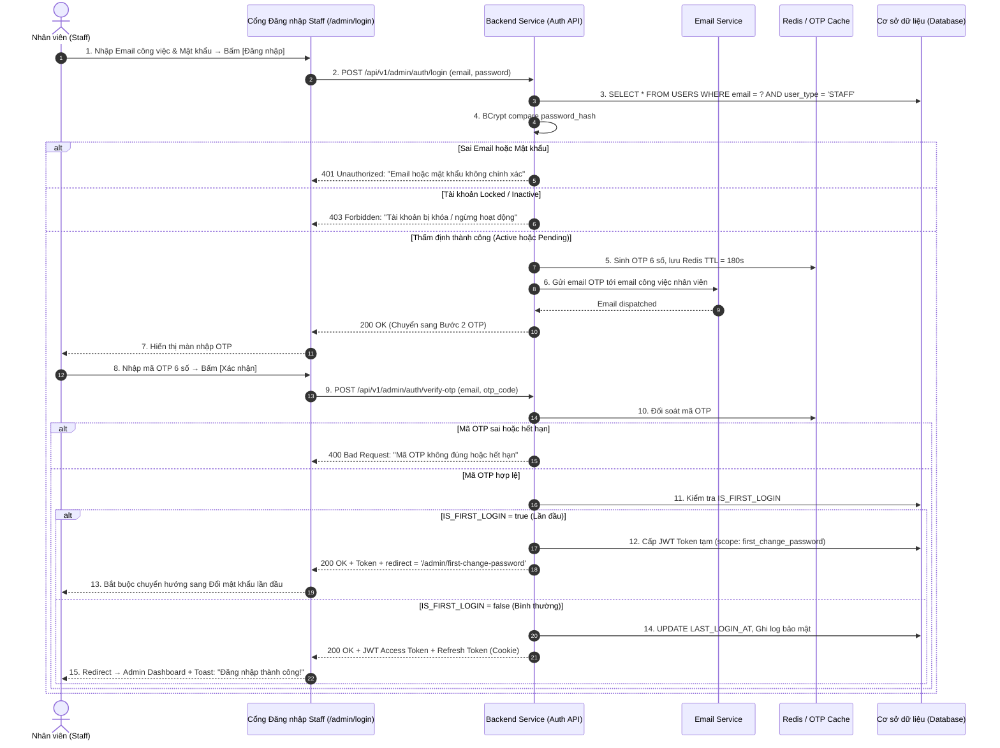

| Module | modules\authentication\admin\staff-login |
| ------ | ---------------------------------------- |
| Menu   | Cổng đăng nhập Nhân viên / Staff Login Portal (`/admin/login`) |
| Mô tả  | Dùng để cho phép đối tượng **Nhân viên nội bộ (Staff / Admin)** đăng nhập vào hệ thống quản trị thông qua **Email công việc** và **Mật khẩu**. Sau khi thẩm định thông tin tài khoản hợp lệ, hệ thống kích hoạt cơ chế **Xác thực 2 bước (2FA)** bằng mã OTP 6 chữ số gửi qua **Email công việc** (thay vì SMS). Nhân viên nhập đúng mã OTP còn hiệu lực → Hệ thống cấp JWT Token kèm danh sách quyền (Permissions/Roles) và điều hướng vào **Bảng điều khiển quản trị (Admin Dashboard)** tương ứng. Trường hợp đặc biệt: Nếu tài khoản đang ở trạng thái **Chờ kích hoạt (`Pending`)** với cờ `IS_FIRST_LOGIN = true`, hệ thống bắt buộc chuyển hướng sang màn hình [Đổi mật khẩu lần đầu](file:///E:/FA26/Capstone/Aqs-ba/docs/Fe-01/Admin/Account/FirstTimeChangePassword.md) trước khi cho phép truy cập bất kỳ chức năng nào. Áp dụng style UI, layout, component theo **style chung của project**. |

**Tổng quan màn Đăng nhập Nhân viên (UC-01.17):**
- A. Màn hình Đăng nhập Staff (Form đăng nhập chính)
  - A.1. Header form đăng nhập
  - A.2. Thông tin các trường dữ liệu trên form
  - A.3. Button và liên kết điều hướng
- B. Màn hình Xác thực OTP đăng nhập qua Email (2FA Email Verification)
  - B.1. Thông tin giao diện nhập mã OTP
  - B.2. Button và thao tác màn OTP
- C. Quy tắc nghiệp vụ (Business Rules)
  - BR-01: Thẩm định thông tin đăng nhập bằng Email công việc (Email & Password Validation)
  - BR-02: Kiểm tra trạng thái tài khoản nhân viên (Staff Account Status Check)
  - BR-03: Khóa tạm thời khi nhập sai mật khẩu liên tiếp (Brute-Force Protection)
  - BR-04: Cơ chế xác thực 2 bước bằng OTP qua Email (2FA Email OTP)
  - BR-05: Chống Spam & Giới hạn gửi lại mã OTP (Anti-Spam & Rate Limiting)
  - BR-06: Giới hạn số lần nhập sai mã OTP (OTP Retry Limit)
  - BR-07: Phân luồng sau đăng nhập theo trạng thái tài khoản (Post-Login Routing)
  - BR-08: Quản lý phiên làm việc & Cấp phát Token theo vai trò (Session & RBAC Token)
- D. Luồng nghiệp vụ chi tiết (Workflows)
  - D.1. Luồng đăng nhập nhân viên thành công (Main Flow - Happy Path)
  - D.2. Luồng đăng nhập lần đầu tiên (First Login → Force Change Password)
  - D.3. Luồng ngoại lệ & Xử lý lỗi (Alternative & Exception Flows)
  - D.4. Sơ đồ tuần tự nghiệp vụ (Sequence Diagram)
- E. Danh mục thông báo / Cảnh báo hệ thống (System Messages)

---

# A. Màn hình Đăng nhập Staff (Form đăng nhập chính)

Giao diện đăng nhập nhân viên được thiết kế dạng Card Layout ở trung tâm trang với thương hiệu cửa hàng, tách biệt hoàn toàn với cổng đăng nhập Customer. URL cổng: `/admin/login`.

## A.1. Header form đăng nhập

| Tên | Loại dữ liệu | Bắt buộc | Mô tả |
| --- | ------------ | -------- | ----- |
| Logo hệ thống | Image | | Logo thương hiệu cửa hàng (kích thước 60x60px) căn giữa phía trên form. |
| Tiêu đề form | Title | | **"Đăng nhập Quản trị"** (font-size 22px, bold, căn giữa). |
| Phụ đề mô tả | Text | | *"Cổng đăng nhập dành cho nhân viên và quản trị viên hệ thống"* (màu xám, font nhỏ). |

## A.2. Thông tin các trường dữ liệu trên form

| Tên | Loại dữ liệu | Bắt buộc | Mô tả | Mô tả Database | Độ dài |
| --- | ------------ | -------- | ----- | -------------- | ------ |
| Email công việc | TextInput | x | Ô nhập địa chỉ Email công việc được cấp khi tạo tài khoản nhân viên.<br><br>Placeholder: **"Nhập email công việc (VD: an.nguyen@aqs.vn)"**.<br><br>Validate Client-side:<br>- Không được để trống.<br>- Kiểm tra đúng định dạng email chuẩn RFC 5322.<br><br>Cảnh báo lỗi inline:<br>- Để trống: *Vui lòng nhập email công việc.*<br>- Sai format: *Email không đúng định dạng.* | EMAIL | 255 |
| Mật khẩu | PasswordInput | x | Ô nhập mật khẩu tài khoản nhân viên.<br><br>Placeholder: **"Nhập mật khẩu"**.<br><br>Tính năng:<br>- Icon mắt (Toggle Eye) ẩn/hiện mật khẩu ở góc phải ô nhập.<br>- Mặc định hiển thị ẩn (type=password, dấu chấm tròn `•••••`).<br><br>Validate:<br>- Không được để trống.<br><br>Cảnh báo lỗi inline:<br>- Để trống: *Vui lòng nhập mật khẩu.* | PASSWORD_HASH | |
| Ghi nhớ đăng nhập | Checkbox | | Label: **"Ghi nhớ đăng nhập"**.<br><br>Nằm cùng hàng với link "Quên mật khẩu?".<br><br>Khi tích: Refresh Token được cấp thời hạn dài hơn (30 ngày thay vì 24 giờ). | | |

## A.3. Button và liên kết điều hướng

| Tên | Loại dữ liệu | Bắt buộc | Mô tả |
| --- | ------------ | -------- | ----- |
| Đăng nhập | Button | | Button chính (Primary), full-width, label: **"Đăng nhập"**.<br><br>Khi bấm: Validate form → Gửi request đăng nhập → Nếu hợp lệ: chuyển sang Bước 2 Xác thực OTP qua Email. |
| Quên mật khẩu? | Hyperlink | | Text link nhỏ bên phải: *"Quên mật khẩu?"*.<br><br>Nhấp vào mở luồng khôi phục mật khẩu nhân viên: Nhập Email công việc $\rightarrow$ Hệ thống gửi mã OTP 6 số về Email công việc (theo đúng nguyên tắc: với nhân viên, mọi mã xác thực OTP đều gửi qua Email thay vì SMS); hoặc nhân viên liên hệ Quản trị viên để được đặt lại mật khẩu nhanh trên [StaffDetail.md](file:///E:/FA26/Capstone/Aqs-ba/docs/Fe-01/Admin/Staff/StaffDetail.md). |

---

# B. Màn hình Xác thực OTP đăng nhập qua Email (2FA Email Verification)

Sau khi nhân viên nhập đúng Email công việc và Mật khẩu, hệ thống chuyển sang màn hình xác thực mã OTP gửi qua **Email** (khác với Customer dùng SMS):

## B.1. Thông tin giao diện nhập mã OTP

| Tên | Loại dữ liệu | Bắt buộc | Mô tả | Mô tả Database | Độ dài |
| --- | ------------ | -------- | ----- | -------------- | ------ |
| Tiêu đề bước | Title | | **"Xác thực đăng nhập (2FA)"** kèm icon khiên bảo mật. | | |
| Hướng dẫn nhận mã | FormedText | | *"Mã xác thực OTP gồm 6 chữ số đã được gửi tới hòm thư email **an***@aqs.vn**. Vui lòng kiểm tra hòm thư (bao gồm mục Spam/Junk) và nhập mã bên dưới."* (Email được che giấu bảo mật). | | |
| Ô nhập mã OTP | NumberInput (PIN Box) | x | Gồm **6 ô nhập số riêng biệt** (Single-digit input boxes).<br><br>Quy tắc tương tác: Chỉ chấp nhận số `0–9`, tự nhảy ô, hỗ trợ auto-paste, tự động submit khi điền đủ 6 số.<br><br>Cảnh báo lỗi inline:<br>- Chưa đủ 6 số: *Vui lòng nhập đủ mã OTP gồm 6 chữ số.*<br>- Mã sai: *Mã xác minh không chính xác. Bạn còn [X] lần thử.*<br>- Mã hết hạn: *Mã xác minh đã hết hiệu lực. Vui lòng bấm "Gửi lại mã".* | OTP_CODE (Redis TTL) | 6 |
| Đồng hồ đếm ngược | Timer / Text | | **"Mã có hiệu lực trong: mm:ss"** (3:00 → 00:00). Khi hết: *"Mã OTP đã hết hạn"*. | | |
| Bộ đếm lượt gửi | Text | | *"Số lượt gửi lại mã còn lại: [3 - Y] lần"*. | | |

## B.2. Button và thao tác màn OTP

| Tên | Loại dữ liệu | Bắt buộc | Mô tả |
| --- | ------------ | -------- | ----- |
| Xác nhận | Button | | Button Primary, full-width, label: **"Xác nhận đăng nhập"**.<br><br>Chỉ active khi đã nhập đủ 6 số. Khi bấm: Gửi request xác thực OTP. Đúng mã & còn hạn → Cấp Token, chuyển vào Admin Dashboard (hoặc Force Change Password nếu lần đầu). |
| Gửi lại mã OTP | Button / Link | | Label: **"Gửi lại mã OTP qua Email"**.<br><br>Bị disable trong Cooldown 60 giây. Tối đa 3 lần/10 phút. Khi bấm: Hủy mã cũ, sinh mã mới, gửi lại qua Email. |
| Quay lại | Hyperlink | | *"← Quay lại đăng nhập bằng tài khoản khác"*. Hủy phiên OTP hiện tại, quay về form đăng nhập. |

---

# C. Quy tắc nghiệp vụ (Business Rules)

## BR-01: Thẩm định thông tin đăng nhập bằng Email công việc (Email & Password Validation)
1. **Tra cứu tài khoản:** Hệ thống tìm bản ghi trong `USERS` theo `EMAIL` và `USER_TYPE = 'STAFF'`.
2. **Đối soát mật khẩu:** So khớp chuỗi mật khẩu nhập vào với hash `PASSWORD_HASH` bằng BCrypt compare.
3. **Nguyên tắc bảo mật (chống Account Enumeration):** Nếu Email không tồn tại HOẶC Mật khẩu sai → Hiển thị chung: *"Email hoặc mật khẩu không chính xác."* Tuyệt đối không tiết lộ Email có tồn tại hay không.

## BR-02: Kiểm tra trạng thái tài khoản nhân viên (Staff Account Status Check)
Sau khi thẩm định đúng Email & Mật khẩu:
1. **`Active`:** Tài khoản hợp lệ → Tiếp tục sang bước gửi OTP.
2. **`Pending`:** Tài khoản mới tạo, nhân viên chưa đổi mật khẩu lần đầu → Vẫn cho phép tiếp tục sang 2FA, nhưng sau khi xác thực OTP sẽ bị bắt buộc redirect sang [FirstTimeChangePassword.md](file:///E:/FA26/Capstone/Aqs-ba/docs/Fe-01/Admin/Account/FirstTimeChangePassword.md) (theo **BR-07**).
3. **`Locked`:** Chặn đăng nhập: *"Tài khoản của bạn đã bị khóa. Vui lòng liên hệ quản trị viên để được hỗ trợ."*
4. **`Inactive`:** Tài khoản đã thôi việc / ngừng hoạt động: *"Tài khoản này đã ngừng hoạt động. Vui lòng liên hệ quản trị viên."*

## BR-03: Khóa tạm thời khi nhập sai mật khẩu liên tiếp (Brute-Force Protection)
1. Duy trì biến đếm `FAILED_LOGIN_ATTEMPTS` theo Email.
2. Nhập sai liên tiếp **5 lần** → Khóa tạm 15 phút: `LOCKED_UNTIL = NOW() + 15 MIN`.
3. Thông báo: *"Bạn đã nhập sai mật khẩu quá 5 lần. Chức năng đăng nhập tạm khóa trong 15 phút."*
4. Đăng nhập thành công → Reset `FAILED_LOGIN_ATTEMPTS = 0`.

## BR-04: Cơ chế xác thực 2 bước bằng OTP qua Email (2FA Email OTP)
1. **Kênh gửi:** Mã OTP được gửi qua **Email công việc** (không phải SMS) vì nhân viên sử dụng Email làm định danh đăng nhập.
2. **Sinh mã OTP:** Chuỗi ngẫu nhiên **6 chữ số** (CSPRNG), lưu Redis với TTL **3–5 phút**.
3. **Nội dung email:** Tiêu đề: *"[AQS Store] Mã xác thực đăng nhập của bạn"*. Nội dung: Chào nhân viên, mã OTP, hiệu lực 3 phút, cảnh báo không chia sẻ.
4. **Sử dụng một lần (One-Time Use):** Mã OTP bị hủy ngay sau khi xác thực thành công.

## BR-05: Chống Spam & Giới hạn gửi lại mã OTP (Anti-Spam & Rate Limiting)
1. Tối đa **3 lần gửi lại OTP trong 10 phút** cho cùng một Email.
2. Cooldown tối thiểu **60 giây** giữa 2 lần gửi liên tiếp.
3. Vượt quá giới hạn: Disable nút gửi lại, thông báo: *"Bạn đã yêu cầu gửi mã quá 3 lần. Vui lòng thử lại sau."*

## BR-06: Giới hạn số lần nhập sai mã OTP (OTP Retry Limit)
1. Tối đa **5 lần** nhập sai OTP.
2. Mỗi lần sai: *"Mã xác minh không chính xác. Bạn còn [5 - X] lần thử."*
3. Sai lần thứ 5: Hủy mã OTP hiện tại, yêu cầu gửi mã mới.

## BR-07: Phân luồng sau đăng nhập theo trạng thái tài khoản (Post-Login Routing)
Sau khi xác thực 2FA OTP thành công, hệ thống kiểm tra cờ `IS_FIRST_LOGIN`:
1. **`IS_FIRST_LOGIN = true` (Lần đầu đăng nhập):**
   - Hệ thống cấp JWT Access Token **tạm thời** chỉ có quyền truy cập duy nhất vào trang Đổi mật khẩu lần đầu.
   - Bắt buộc chuyển hướng sang [FirstTimeChangePassword.md](file:///E:/FA26/Capstone/Aqs-ba/docs/Fe-01/Admin/Account/FirstTimeChangePassword.md).
   - Nhân viên không thể truy cập bất kỳ chức năng nào khác cho đến khi hoàn tất đổi mật khẩu.
2. **`IS_FIRST_LOGIN = false` (Đăng nhập bình thường):**
   - Cấp JWT Access Token đầy đủ quyền theo vai trò RBAC.
   - Điều hướng thẳng vào **Admin Dashboard** (Bảng điều khiển quản trị).

## BR-08: Quản lý phiên làm việc & Cấp phát Token theo vai trò (Session & RBAC Token)
1. **Access Token (JWT):** Thời hạn 15–60 phút, chứa Claims: `user_id`, `email`, `roles: ['ROLE_ADMIN', 'ROLE_SALES']`, `user_type: 'STAFF'`, `branch_id`, `primary_role`.
2. **Refresh Token:** HTTP-Only Secure Cookie, thời hạn 24h (không tích Ghi nhớ) hoặc 30 ngày (có tích).
3. **Cập nhật hệ thống:** `LAST_LOGIN_AT = NOW()`, ghi log bảo mật (IP, User-Agent), reset bộ đếm sai mật khẩu và OTP.

---

# D. Luồng nghiệp vụ chi tiết (Workflows)

## D.1. Luồng đăng nhập nhân viên thành công (Main Flow - Happy Path)

```
[BƯỚC 1: NHẬP EMAIL & MẬT KHẨU]        [BƯỚC 2: XÁC THỰC OTP QUA EMAIL]      [BƯỚC 3: ADMIN DASHBOARD]
  NV nhập Email công việc & Pass             NV kiểm tra mail & nhập OTP 6 số       Đăng nhập thành công
             │                                           │                                  │
             ▼                                           ▼                                  ▼
  Thẩm định Email/Pass trong CSDL            Đối soát mã OTP trong Redis            Cấp JWT Token RBAC
  Kiểm tra trạng thái (Active/Pending)       (Đúng mã & còn hiệu lực)              HTTP-Only Cookie
             │                                           │                                  │
             ▼                                           ▼                                  ▼
  Sinh OTP 6 số gửi qua Email             Check IS_FIRST_LOGIN?                   Redirect Admin Dashboard
  Chuyển sang Bước 2                         true → Force Change Password            hoặc Force Change Password
```

## D.2. Luồng đăng nhập lần đầu tiên (First Login → Force Change Password)

- **Bước 1–6:** Giống luồng D.1 (Nhập email + pass tạm → OTP qua email → Xác thực thành công).
- **Bước 7:** Hệ thống kiểm tra `IS_FIRST_LOGIN = true`.
- **Bước 8:** Cấp JWT Token tạm (chỉ cho phép truy cập route `/admin/first-change-password`).
- **Bước 9:** Bắt buộc chuyển hướng sang [FirstTimeChangePassword.md](file:///E:/FA26/Capstone/Aqs-ba/docs/Fe-01/Admin/Account/FirstTimeChangePassword.md).
- **Bước 10:** Sau khi nhân viên đặt mật khẩu mới thành công → Hệ thống cập nhật `IS_FIRST_LOGIN = false`, `STATUS = 'ACTIVE'` → Cấp lại JWT Token đầy đủ quyền → Redirect vào Admin Dashboard.

## D.3. Luồng ngoại lệ & Xử lý lỗi (Alternative & Exception Flows)

### A1. Email không tồn tại hoặc Mật khẩu sai
- Hiển thị thông báo chung: *"Email hoặc mật khẩu không chính xác."*

### A2. Tài khoản đang bị khóa (Locked)
- Chặn đăng nhập: *"Tài khoản của bạn đã bị khóa. Vui lòng liên hệ quản trị viên."*

### A3. Tài khoản đã ngừng hoạt động (Inactive)
- Chặn đăng nhập: *"Tài khoản này đã ngừng hoạt động. Vui lòng liên hệ quản trị viên."*

### A4. Nhập sai mật khẩu quá 5 lần
- Khóa tạm 15 phút, thông báo đợi hoặc dùng Quên mật khẩu.

### A5. Email gửi OTP thất bại (Mail Service Error)
- *"Gửi mã xác thực thất bại. Vui lòng kiểm tra lại email hoặc thử lại sau."*

## D.4. Sơ đồ tuần tự nghiệp vụ (Sequence Diagram)



---

# E. Danh mục thông báo / Cảnh báo hệ thống (System Messages)

| Mã thông báo | Loại hiển thị | Nội dung thông báo | Điều kiện xuất hiện |
| ------------ | ------------- | ------------------ | ------------------- |
| `MSG_SLOG_01` | Inline Error | *Email hoặc mật khẩu không chính xác.* | Sai Email hoặc Mật khẩu (thông báo chung chống dò). |
| `MSG_SLOG_02` | Inline Error | *Vui lòng nhập email công việc.* | Để trống ô Email. |
| `MSG_SLOG_03` | Inline Error | *Email không đúng định dạng.* | Nhập sai cấu trúc email RFC 5322. |
| `MSG_SLOG_04` | Inline Error | *Vui lòng nhập mật khẩu.* | Để trống ô Mật khẩu. |
| `MSG_SLOG_05` | Toast Error  | *Tài khoản của bạn đã bị khóa. Vui lòng liên hệ quản trị viên.* | Trạng thái tài khoản = `Locked`. |
| `MSG_SLOG_06` | Toast Error  | *Tài khoản này đã ngừng hoạt động. Vui lòng liên hệ quản trị viên.* | Trạng thái tài khoản = `Inactive`. |
| `MSG_SLOG_07` | Toast Warning| *Bạn đã nhập sai mật khẩu quá 5 lần. Đăng nhập tạm khóa trong 15 phút.* | Nhập sai password 5 lần liên tiếp. |
| `MSG_SLOG_08` | Inline Error | *Vui lòng nhập đủ mã OTP gồm 6 chữ số.* | Chưa điền đủ 6 ô OTP. |
| `MSG_SLOG_09` | Inline Error | *Mã xác minh không chính xác. Bạn còn [X] lần thử.* | Nhập sai mã OTP. |
| `MSG_SLOG_10` | Inline Error | *Mã xác minh đã hết hiệu lực. Vui lòng bấm "Gửi lại mã".* | OTP hết hạn TTL. |
| `MSG_SLOG_11` | Toast Warning| *Bạn đã yêu cầu gửi mã quá 3 lần trong 10 phút. Vui lòng thử lại sau.* | Vượt quá 3 lần resend OTP / 10 phút. |
| `MSG_SLOG_12` | Toast Error  | *Gửi mã xác thực qua email thất bại. Vui lòng thử lại sau.* | Mail Service gặp lỗi. |
| `MSG_SLOG_13` | Toast Success| *Đăng nhập thành công! Chào mừng bạn quay trở lại.* | Đăng nhập bình thường thành công. |
