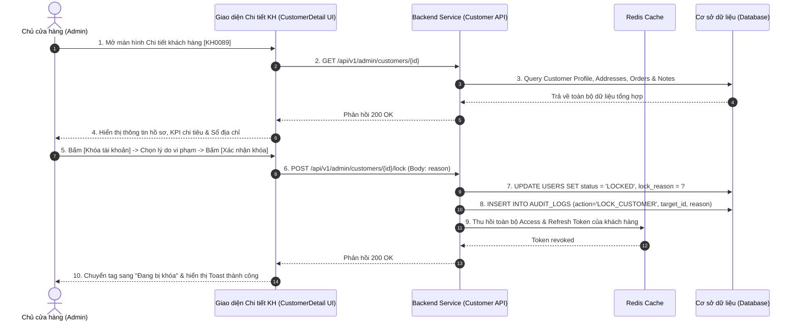

| Module | modules\account\admin\customer\detail |
| ------ | -------------------------------------- |
| Menu   | Trang chủ / Quản trị hệ thống / Quản lý khách hàng / Chi tiết khách hàng (Admin / Customer / Detail) |
| Mô tả  | Dùng để cho phép **Chủ cửa hàng (Store Owner / Admin)** và nhân viên có thẩm quyền xem toàn diện hồ sơ của một khách hàng (**UC-01.15**), bao gồm: Thông tin định danh cá nhân, các chỉ số giao dịch mua sắm (Tổng chi tiêu, Số đơn hàng, Tỷ lệ nhận hàng thành công), Sổ địa chỉ giao hàng nhận hàng của khách (đồng bộ từ phân hệ Khách hàng), Lịch sử đơn hàng đã đặt và Ghi chú nội bộ của cửa hàng. Màn hình đồng thời cung cấp chức năng **Khóa hoặc Mở khóa tài khoản khách hàng (UC-01.16)** khi phát hiện các hành vi vi phạm chính sách, bom hàng hoặc gian lận voucher khuyến mãi. Áp dụng style UI, layout, component theo **style chung của project**. |

**Tổng quan màn Chi tiết hồ sơ & Quản trị khách hàng:**
- A. Bố cục Header, Chỉ số KPI & Thanh công cụ hành động
  - A.1. Header trang, trạng thái tài khoản & Button Khóa/Mở khóa
  - A.2. Thẻ chỉ số giao dịch tổng hợp (Customer KPI Cards)
- B. Nội dung chi tiết các Tab chức năng
  - B.1. Tab "Thông tin cá nhân & Tài khoản" (UC-01.15)
  - B.2. Tab "Sổ địa chỉ nhận hàng"
  - B.3. Tab "Lịch sử đơn hàng gần đây"
  - B.4. Tab "Ghi chú nội bộ & Lịch sử vi phạm (Staff Notes & Audit)"
- C. Danh mục Modal nghiệp vụ quản trị
  - C.1. Modal Khóa tài khoản khách hàng (UC-01.16)
  - C.2. Modal Mở khóa tài khoản khách hàng
  - C.3. Modal Thêm ghi chú nội bộ mới
- D. Quy tắc nghiệp vụ (Business Rules)
  - BR-01: Phân quyền & Bảo mật thông tin cá nhân khách hàng (Customer Data Privacy)
  - BR-02: Quy tắc Khóa tài khoản & Thu hồi quyền mua hàng (Lock Policy & Token Revocation)
  - BR-03: Đồng bộ dữ liệu Sổ địa chỉ với phân hệ Khách hàng (Address Book Sync)
  - BR-04: Quy chuẩn Ghi chú nội bộ & Lưu vết kiểm toán (Staff Notes Governance)
- E. Luồng nghiệp vụ chi tiết (Workflows)
  - E.1. Luồng xem chi tiết hồ sơ khách hàng (UC-01.15)
  - E.2. Luồng khóa tài khoản khách hàng vi phạm (UC-01.16)
  - E.3. Luồng mở khóa tài khoản khách hàng
  - E.4. Luồng thêm ghi chú chăm sóc khách hàng nội bộ
  - E.5. Sơ đồ tuần tự nghiệp vụ (Sequence Diagram)
- F. Danh mục thông báo / Cảnh báo hệ thống (System Messages)

---

# A. Bố cục Header, Chỉ số KPI & Thanh công cụ hành động

## A.1. Header trang, trạng thái tài khoản & Button Khóa/Mở khóa

| Tên | Loại thành phần | Mô tả chi tiết |
| --- | --------------- | -------------- |
| Nút Quay lại | IconButton | Mũi tên trái `←` kèm text: *"Danh sách khách hàng"*. Nhấp vào quay về màn [CustomerList.md](file:///E:/FA26/Capstone/Aqs-ba/docs/Fe-01/Admin/Customer/CustomerList.md). |
| Avatar & Tên KH | UserSummary | Avatar tròn lớn (60x60px) + Tên khách hàng (chữ in đậm, font-size 22px) + Mã KH: `[KH0089]`. |
| Tag Hạng thành viên | TierBadge | Badge phân hạng khách hàng thân thiết: *Kim Cương, Vàng, Bạc, Đồng, Thành viên Mới*. |
| Tag Trạng thái | StatusBadge | Tag màu lớn phản ánh trạng thái tài khoản: - **Đang hoạt động (Active)**: Màu xanh lục - **Đang bị khóa (Locked)**: Màu đỏ (kèm tooltip lý do khóa khi hover) - **Ngừng hoạt động (Inactive)**: Màu xám (tài khoản tạm ngưng theo yêu cầu) |
| Nút Trạng thái tài khoản | ButtonGroup | **1. Khi tài khoản đang Active:** - Nút đỏ: **"Khóa tài khoản"** (Mở Modal C.1). - Nút xám: **"Ngừng hoạt động"** (Chuyển `STATUS = 'INACTIVE'`).  **2. Khi tài khoản đang Locked:** - Nút xanh: **"Mở khóa tài khoản"** (Mở Modal C.2).  **3. Khi tài khoản đang Inactive:** - Nút xanh: **"Kích hoạt lại"** (Chuyển `STATUS = 'ACTIVE'`). |

## A.2. Thẻ chỉ số giao dịch tổng hợp (Customer KPI Cards)

Hàng 4 thẻ thống kê nhanh đặt ngay dưới header giúp Admin nắm bắt giá trị khách hàng:

| Tên thẻ KPI | Giá trị mẫu | Ý nghĩa & Quy tắc tính toán |
| ----------- | ----------- | --------------------------- |
| **Tổng chi tiêu lũy kế** | `18.520.000 đ` | Tổng giá trị thanh toán của tất cả đơn hàng đã hoàn thành (`COMPLETED`). |
| **Tổng số đơn hàng** | `14 đơn` | Gồm: 12 thành công, 1 đã hủy, 1 hoàn trả. |
| **Tỷ lệ nhận hàng** | `92.3%` | Tỷ lệ đơn giao thành công trên tổng số đơn phát sinh giao nhận. Cảnh báo đỏ nếu $< 70\%$. |
| **Lần mua gần nhất** | `2 ngày trước` | Ngày đặt đơn hàng thành công gần nhất (`28/09/2026`). |

---

# B. Nội dung chi tiết các Tab chức năng

## B.1. Tab "Thông tin cá nhân & Tài khoản" (UC-01.15)

Hiển thị toàn bộ thông tin đăng ký và hồ sơ định danh của khách hàng:

| Tên | Loại dữ liệu | Mô tả chi tiết | Mô tả Database |
| --- | ------------ | -------------- | -------------- |
| Mã khách hàng | Text | Mã định danh duy nhất (VD: `KH0089`). Readonly. | CUSTOMER_CODE |
| Họ và tên | Text | Họ và tên đầy đủ của khách hàng (`FULL_NAME`). Readonly. | FULL_NAME |
| Số điện thoại | Text | Số điện thoại tài khoản chính chủ (`PHONE_NUMBER`). | PHONE_NUMBER |
| Email | Text | Địa chỉ email liên kết tài khoản (`EMAIL`). Nếu chưa có hiển thị: *"Chưa liên kết"*. | EMAIL |
| Giới tính | Text | *Nam*, *Nữ* hoặc *Khác*. | GENDER |
| Ngày sinh | Date | Ngày tháng năm sinh của khách hàng (`DD/MM/YYYY`). | BIRTH_DATE |
| Ngày đăng ký | DateTime | Thời điểm tạo tài khoản thành công (`DD/MM/YYYY HH:mm`). | CREATED_AT |
| Lần đăng nhập cuối | DateTime | Thời gian đăng nhập gần nhất trên Web/Mobile App. | LAST_LOGIN_AT |
| IP đăng nhập cuối | Text | Địa chỉ IP của phiên đăng nhập gần nhất (VD: `113.161.42.18`). | LAST_LOGIN_IP |

## B.2. Tab "Sổ địa chỉ nhận hàng"

Hiển thị toàn bộ danh sách địa chỉ nhận hàng mà khách hàng đã lưu trong hồ sơ cá nhân (đồng bộ từ phân hệ [Address.md](file:///E:/FA26/Capstone/Aqs-ba/docs/Fe-01/Common/Profile/Address.md)):

| Tên | Loại thành phần | Mô tả chi tiết |
| --- | --------------- | -------------- |
| Bảng Sổ địa chỉ | DataTable | Danh sách các địa chỉ nhận hàng của khách. |
| Họ tên người nhận | Text | Tên người nhận hàng được lưu tại địa chỉ đó. |
| Số điện thoại nhận | Text | SĐT liên hệ nhận hàng của địa chỉ. |
| Địa chỉ chi tiết | Text | Số nhà, tên đường, Phường/Xã, Quận/Huyện, Tỉnh/Thành phố. |
| Nhãn địa chỉ | Tag | Nhãn phân loại: **Nhà Riêng** hoặc **Văn Phòng**. |
| Đánh dấu Mặc định | Badge | Badge màu đỏ viền cam: **Mặc định** (Chỉ duy nhất 1 địa chỉ mặc định). |

> **Mục đích quản trị:** Giúp nhân viên bán hàng/chăm sóc khách hàng hỗ trợ khách tạo đơn hàng qua điện thoại (Hotline Order) hoặc điều chỉnh địa chỉ giao khi khách gọi yêu cầu hỗ trợ khẩn cấp.

## B.3. Tab "Lịch sử đơn hàng gần đây"

Bảng danh sách các đơn hàng gần nhất của khách hàng:

| Mã đơn hàng | Ngày đặt | Số lượng SP | Tổng tiền (VNĐ) | Phương thức TT | Trạng thái đơn | Thao tác |
| ----------- | -------- | ----------- | --------------- | -------------- | -------------- | -------- |
| `ORD-2026-0925` | `25/09/2026 14:20` | 3 sản phẩm | `1.450.000 đ` | VNPAY (Đã TT) | Hoàn thành (Xanh lá) | [Xem đơn] |
| `ORD-2026-0810` | `10/08/2026 09:15` | 1 sản phẩm | `850.000 đ` | COD (Tiền mặt) | Hoàn thành (Xanh lá) | [Xem đơn] |
| `ORD-2026-0704` | `04/07/2026 18:30` | 2 sản phẩm | `620.000 đ` | COD (Tiền mặt) | Đã hủy (Xám) | [Xem đơn] |

## B.4. Tab "Ghi chú nội bộ & Lịch sử vi phạm (Staff Notes & Audit)"

Cho phép nhân viên và Admin lưu các ghi chú riêng tư về đặc điểm khách hàng (khách hàng không nhìn thấy phần này):

| Tên | Loại thành phần | Mô tả chi tiết |
| --- | --------------- | -------------- |
| Nút Thêm ghi chú | Button | Button Primary nhỏ: **"+ Thêm ghi chú"** $\rightarrow$ Mở Modal C.3. |
| Danh sách ghi chú | Timeline / CardList | Hiển thị các ghi chú theo thứ tự thời gian mới nhất lên đầu: - **Nội dung ghi chú:** (VD: *"Khách yêu cầu chỉ giao hàng sau 17h chiều"*, *"Khách từng bom 1 đơn hàng cá rồng, yêu cầu cọc 50% trước khi ship ngoại tỉnh"*). - **Người tạo:** Tên nhân viên + Mã NV. - **Thời gian tạo:** `DD/MM/YYYY HH:mm`. |
| Lịch sử Khóa / Mở khóa | Audit Table | Bảng lịch sử các lần tài khoản bị khóa/mở khóa: - *Thời gian* \| *Hành động (Khóa / Mở khóa)* \| *Người thực hiện* \| *Lý do ghi nhận*. |

---

# C. Danh mục Modal nghiệp vụ quản trị

## C.1. Modal Khóa tài khoản khách hàng (UC-01.16)

Kích hoạt khi Admin nhấn nút **"Khóa tài khoản"**:

| Tên | Loại thành phần | Mô tả chi tiết |
| --- | --------------- | -------------- |
| Tiêu đề Modal | Modal Title | **"Khóa tài khoản khách hàng"** (Icon cảnh báo màu đỏ) |
| Cảnh báo hệ thống | Alert Warning | *"Cảnh báo: Khách hàng sẽ bị đăng xuất khỏi ứng dụng và không thể đăng nhập hoặc đặt thêm đơn hàng mới. Giỏ hàng hiện tại của khách sẽ bị vô hiệu hóa."* |
| Lý do khóa mẫu | Select | **Dropdown chọn nhanh lý do vi phạm:** 1. *Bom hàng nhiều lần không lý do chính đáng* 2. *Lạm dụng / Gian lận mã khuyến mãi voucher* 3. *Spam đơn hàng ảo phá hoại hệ thống* 4. *Quấy rối, xúc phạm nhân viên / Vi phạm điều khoản* 5. *Lý do khác...* |
| Chi tiết lý do | TextArea (Bắt buộc) | Ô nhập giải thích chi tiết (tối thiểu 10 ký tự, tối đa 500 ký tự) để phục vụ giải quyết khiếu nại sau này. |
| Nút Hủy | Button (Secondary) | Label **"Hủy bỏ"** - Đóng modal. |
| Nút Xác nhận Khóa | Button (Danger) | Label **"Xác nhận khóa"** - Cập nhật trạng thái `Locked`, thu hồi session khách hàng, reload màn hình. |

## C.2. Modal Mở khóa tài khoản khách hàng

Kích hoạt khi Admin nhấn nút **"Mở khóa tài khoản"** đối với khách hàng đang bị khóa:

| Tên | Loại thành phần | Mô tả chi tiết |
| --- | --------------- | -------------- |
| Tiêu đề Modal | Modal Title | **"Mở khóa tài khoản khách hàng"** |
| Nội dung xác nhận | Text | *"Bạn có chắc chắn muốn mở khóa tài khoản cho khách hàng **{FULL_NAME}** (Mã KH: **{CUSTOMER_CODE}**)? Sau khi mở khóa, khách hàng sẽ có thể đăng nhập và mua sắm lại bình thường."* |
| Ghi chú mở khóa | TextArea (Tùy chọn) | Lý do mở khóa (ví dụ: *"Khách đã gọi giải trình và thanh toán bù tiền ship đơn bom"*). |
| Nút Hủy | Button | Label **"Hủy"** |
| Nút Xác nhận Mở khóa | Button (Primary) | Label **"Xác nhận mở khóa"** |

## C.3. Modal Thêm ghi chú nội bộ mới

Kích hoạt khi nhân viên/Admin bấm nút **"+ Thêm ghi chú"** tại Tab B.4:

| Tên | Loại thành phần | Mô tả chi tiết |
| --- | --------------- | -------------- |
| Tiêu đề Modal | Modal Title | **"Thêm ghi chú chăm sóc khách hàng"** |
| Nội dung ghi chú | TextArea (Bắt buộc) | Nhập ghi chú về thói quen mua sắm, lưu ý vận chuyển hoặc lịch sử khiếu nại (tối đa 500 ký tự). |
| Nút Lưu ghi chú | Button (Primary) | Label **"Lưu ghi chú"** - Lưu vào bảng `CUSTOMER_NOTES` và cập nhật timeline. |

---

# D. Quy tắc nghiệp vụ (Business Rules)

## BR-01: Phân quyền & Bảo mật thông tin cá nhân khách hàng (Customer Data Privacy)
1. **Chủ cửa hàng (Admin) & Quản lý bán hàng:** Có toàn quyền xem đầy đủ thông tin định danh, xem sổ địa chỉ, lịch sử đơn và thực hiện Khóa/Mở khóa.
2. **Nhân viên thông thường (NV Bán hàng, Shipper):**
   - Chỉ được xem thông tin liên hệ và địa chỉ phục vụ xử lý đơn hàng.
   - **Không có quyền** Khóa hoặc Mở khóa tài khoản khách hàng.

## BR-02: Quy tắc Khóa tài khoản & Thu hồi quyền mua hàng (Lock Policy & Token Revocation)
1. **Thu hồi phiên đăng nhập:** Khi tài khoản khách hàng chuyển sang trạng thái `LOCKED`:
   - Toàn bộ Access Token & Refresh Token của khách hàng bị hủy ngay lập tức trên Redis.
   - Khách hàng đang online trên Web/App sẽ nhận được thông báo phiên hết hạn và bị đẩy về màn hình đăng nhập.
2. **Chặn đăng nhập:** Khi tài khoản đang ở trạng thái `LOCKED`, người dùng nhập đúng thông tin đăng nhập vẫn bị chặn với thông báo lỗi: *"Tài khoản của bạn đã bị tạm khóa do vi phạm chính sách của cửa hàng. Vui lòng liên hệ hotline hỗ trợ."*
3. **Chặn tạo đơn hàng:** Khách hàng bị khóa tuyệt đối không thể gửi request đặt đơn hàng mới (`POST /api/v1/orders`).

## BR-03: Đồng bộ dữ liệu Sổ địa chỉ với phân hệ Khách hàng (Address Book Sync)
Tab Sổ địa chỉ nhận hàng hiển thị dữ liệu trực tiếp từ bảng `USER_ADDRESSES` của khách hàng đó (đồng bộ 100% với các địa chỉ khách tự tạo tại [Address.md](file:///E:/FA26/Capstone/Aqs-ba/docs/Fe-01/Common/Profile/Address.md)). Admin chỉ có quyền xem, không được tự ý sửa đổi địa chỉ của khách nếu không có yêu cầu từ chính chủ.

## BR-04: Quy chuẩn Ghi chú nội bộ & Lưu vết kiểm toán (Staff Notes Governance)
1. Ghi chú nội bộ là tài liệu bảo mật nội bộ cửa hàng, tuyệt đối không hiển thị trên giao diện của khách hàng (Frontend Client).
2. Khi một ghi chú được tạo, hệ thống tự động gắn kèm `STAFF_ID`, `CREATED_AT` và không cho phép xóa ghi chú (chỉ cho phép sửa nội dung nếu là chính người tạo ghi chú đó).
3. Mọi hành động Khóa hoặc Mở khóa tài khoản khách hàng đều được lưu vào bảng `AUDIT_LOGS` phục vụ đối soát và giải quyết khiếu nại.

## BR-05: Quy tắc Bảo lưu thứ hạng vĩnh viễn (No Tier Downgrade) & Mã định danh tự động
1. **Tiêu nhiều lên hạng:** Hạng thành viên được thăng cấp tự động khi tổng chi tiêu tích lũy từ các đơn hàng thành công (`TOTAL_SPENT`) đạt các ngưỡng: Mới ($< 1\text{ tr}$) $\rightarrow$ Đồng ($1\text{ tr}$) $\rightarrow$ Bạc ($5\text{ tr}$) $\rightarrow$ Vàng ($15\text{ tr}$) $\rightarrow$ Kim Cương ($30\text{ tr}$).
2. **Không tự động hạ hạng:** Sau khi đạt thứ hạng, khách hàng **được giữ nguyên thứ hạng vĩnh viễn**, không bao giờ bị hạ hạng hay trừ điểm kể cả khi không mua hàng trong thời gian dài (không áp dụng cơ chế tụt hạng theo chu kỳ).
3. **Mã khách hàng tự động (`CUSTOMER_CODE`):** Mã có định dạng `KH` + 6 số (VD: `KH000089`) sinh tự động khi khách hàng đăng ký thành công, là duy nhất và không cho phép chỉnh sửa.

---

# E. Luồng nghiệp vụ chi tiết (Workflows)

## E.1. Luồng xem chi tiết hồ sơ khách hàng (UC-01.15)

- **Bước 1:** Admin tại trang danh sách [CustomerList.md](file:///E:/FA26/Capstone/Aqs-ba/docs/Fe-01/Admin/Customer/CustomerList.md) nhấp vào Mã KH hoặc chọn *"Xem chi tiết hồ sơ"*.
- **Bước 2:** Hệ thống tải dữ liệu tổng hợp từ API `GET /api/v1/admin/customers/{id}`:
  - Thông tin cá nhân & tài khoản.
  - Các chỉ số KPI giao dịch (Tổng chi tiêu, số đơn, tỷ lệ nhận hàng).
  - Danh sách địa chỉ nhận hàng và 10 đơn hàng gần nhất.
  - Lịch sử ghi chú nội bộ và lịch sử kiểm toán khóa/mở khóa.
- **Bước 3:** Giao diện hiển thị các phân vùng thông tin và các thẻ KPI.

## E.2. Luồng khóa tài khoản khách hàng vi phạm (UC-01.16)

- **Bước 1:** Admin bấm nút **"Khóa tài khoản"** trên Header trang chi tiết.
- **Bước 2:** Hệ thống hiển thị Modal xác nhận C.1.
- **Bước 3:** Admin chọn lý do mẫu (ví dụ: *"Bom hàng nhiều lần không lý do"*) và gõ thêm chi tiết giải trình.
- **Bước 4:** Admin bấm nút **"Xác nhận khóa"**.
- **Bước 5:** Backend cập nhật `STATUS = 'LOCKED'`, lưu lý do khóa, ghi bản ghi vào bảng `AUDIT_LOGS`.
- **Bước 6:** Backend gọi lệnh thu hồi Token của khách hàng trong Redis.
- **Bước 7:** Đóng modal, chuyển Badge sang màu đỏ `Đang bị khóa`, hiển thị Toast xanh: *"Khóa tài khoản khách hàng thành công!"*.

## E.3. Luồng mở khóa tài khoản khách hàng

- **Bước 1:** Với khách hàng đang bị khóa, Admin bấm nút **"Mở khóa tài khoản"**.
- **Bước 2:** Hệ thống mở Modal C.2. Admin nhập ghi chú giải trình mở khóa và bấm **"Xác nhận mở khóa"**.
- **Bước 3:** Backend cập nhật trạng thái `STATUS = 'ACTIVE'`, ghi Audit Log.
- **Bước 4:** Đóng modal, chuyển Badge sang màu xanh `Đang hoạt động`, hiển thị Toast thành công.

## E.4. Luồng thêm ghi chú chăm sóc khách hàng nội bộ

- **Bước 1:** Tại Tab B.4, nhân viên bấm nút **"+ Thêm ghi chú"**.
- **Bước 2:** Hệ thống mở Modal C.3. Nhân viên nhập nội dung ghi chú và bấm **"Lưu ghi chú"**.
- **Bước 3:** Backend lưu bản ghi vào bảng `CUSTOMER_NOTES`.
- **Bước 4:** Giao diện đóng modal và chèn ngay dòng ghi chú mới vào đầu danh sách Timeline.

## E.5. Sơ đồ tuần tự nghiệp vụ (Sequence Diagram)

---

# F. Danh mục thông báo / Cảnh báo hệ thống (System Messages)

| Mã thông báo | Loại hiển thị | Nội dung thông báo | Điều kiện xuất hiện |
| ------------ | ------------- | ------------------ | ------------------- |
| `MSG_CUSTD_01` | Toast Success | *Khóa tài khoản khách hàng thành công!* | Khóa tài khoản thành công từ Modal C.1. |
| `MSG_CUSTD_02` | Toast Success | *Mở khóa tài khoản khách hàng thành công!* | Mở khóa tài khoản thành công từ Modal C.2. |
| `MSG_CUSTD_03` | Toast Success | *Thêm ghi chú khách hàng thành công!* | Thêm ghi chú mới thành công từ Modal C.3. |
| `MSG_CUSTD_04` | Inline Error  | *Vui lòng nhập nội dung giải thích lý do khóa (tối thiểu 10 ký tự).* | Không nhập hoặc nhập lý do khóa quá ngắn. |
| `MSG_CUSTD_05` | Inline Error  | *Nội dung ghi chú không được để trống.* | Để trống ô nhập ghi chú nội bộ. |
| `MSG_CUSTD_06` | Toast Error   | *Bạn không có quyền thực hiện thao tác khóa/mở khóa khách hàng.* | Nhân viên không đủ thẩm quyền Admin thực hiện thao tác. |
| `MSG_CUSTD_07` | Toast Error   | *Có lỗi xảy ra trong quá trình lưu dữ liệu. Vui lòng thử lại sau.* | Lỗi mạng hoặc server. |
