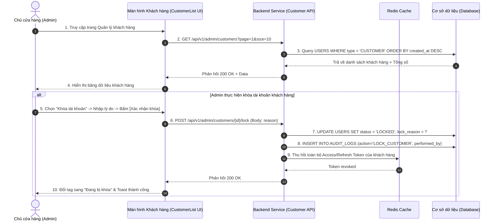

| Module | modules\account\admin\customer\list |
| ------ | ------------------------------------ |
| Menu   | Trang chủ / Quản trị hệ thống / Quản lý khách hàng / Danh sách khách hàng (Admin / Customer Management) |
| Mô tả  | Dùng để cho phép **Chủ cửa hàng (Store Owner / Admin)** và nhân viên quản trị theo dõi, tra cứu, tìm kiếm và phân tích toàn bộ tệp khách hàng đã đăng ký tài khoản trong hệ thống. Màn hình cung cấp bộ lọc chuyên sâu (Từ khóa Tên/SĐT/Email, Trạng thái tài khoản, Hạng thành viên Loyalty, Khoảng ngày đăng ký), hiển thị bảng dữ liệu khách hàng tích hợp các chỉ số kinh doanh quan trọng (Số đơn hàng đã mua, Tổng chi tiêu tích lũy, Lần mua gần nhất), hỗ trợ phân trang Server-side, xem chi tiết hồ sơ khách hàng, thao tác nhanh Khóa/Mở khóa tài khoản và Xuất dữ liệu tệp khách hàng ra file Excel. Áp dụng style UI, layout, component theo **style chung của project**. |

**Tổng quan màn Danh sách và tìm kiếm tài khoản khách hàng (UC-01.14):**
- A. Danh sách khách hàng (Màn hình chính)
  - A.1. Bộ lọc tìm kiếm đa tiêu chí (Search Card)
  - A.2. Bảng dữ liệu danh sách khách hàng & chỉ số mua sắm
  - A.3. Button chức năng thanh công cụ
  - A.4. Phân trang dữ liệu (Server-side Pagination)
- B. Modal Khóa nhanh tài khoản khách hàng
  - B.1. Modal Xác nhận Khóa tài khoản khách hàng
- C. Quy tắc nghiệp vụ (Business Rules)
  - BR-01: Phân quyền truy cập dữ liệu khách hàng (Customer Data Access RBAC)
  - BR-02: Cơ chế tìm kiếm & lọc đa điều kiện kết hợp (Search & Filter Logic)
  - BR-03: Trạng thái tài khoản khách hàng (Customer Account Status)
  - BR-04: Quy chuẩn tính toán Phân hạng thành viên & Tổng chi tiêu (Customer Tier & Lifetime Value)
  - BR-05: Quy tắc xuất dữ liệu khách hàng ra Excel (Customer Data Export Policy)
- D. Luồng nghiệp vụ chi tiết (Workflows)
  - D.1. Luồng tra cứu, lọc và phân trang khách hàng (Main Flow)
  - D.2. Luồng thao tác khóa nhanh tài khoản khách hàng
  - D.3. Luồng xuất dữ liệu khách hàng ra Excel
  - D.4. Sơ đồ tuần tự nghiệp vụ (Sequence Diagram)
- E. Danh mục thông báo / Cảnh báo hệ thống (System Messages)

---

# A. Danh sách khách hàng (Màn hình chính)

## A.1. Bộ lọc tìm kiếm đa tiêu chí (Search Card)

| Tên | Loại dữ liệu | Bắt buộc | Mô tả | Mô tả Database | Độ dài |
| --- | ------------ | -------- | ----- | -------------- | ------ |
| Khung tìm kiếm | SearchCard | | Bao bọc các bộ lọc ở đầu trang. Cho phép kết hợp đồng thời nhiều điều kiện (logic **AND**). | | |
| Từ khóa tìm kiếm | TextInput | | Cho phép tìm kiếm nhanh theo thông tin khách hàng.  Placeholder: **"Tìm theo Tên khách hàng, Số điện thoại hoặc Email..."**.  Quy tắc tìm kiếm: Tìm kiếm chứa từ khóa (`LIKE %keyword%`), không phân biệt hoa thường trên các trường: `FULL_NAME`, `PHONE_NUMBER`, `EMAIL`. Nhấn **Enter** tương đương nhấn nút **"Tìm kiếm"**. | | 100 |
| Trạng thái | Select | | Lọc theo trạng thái hoạt động của tài khoản khách hàng.  Danh sách tùy chọn: - **Tất cả** (Mặc định) - **Đang hoạt động (Active)**: Khách hàng đang mua sắm bình thường. - **Đang bị khóa (Locked)**: Tài khoản bị khóa do bom hàng, gian lận voucher, quấy rối hoặc vi phạm chính sách cửa hàng. - **Ngừng hoạt động (Inactive)**: Tài khoản khách hàng tạm ngưng hoạt động hoặc theo yêu cầu đóng tài khoản của khách. | STATUS | 20 |
| Hạng thành viên | Select | | Lọc theo phân hạng khách hàng thân thiết (Loyalty Tier).  Danh sách tùy chọn: - **Tất cả hạng** (Mặc định) - **Thành viên Mới (New)** (Dưới 1 triệu) - **Hạng Đồng (Bronze)** (Từ 1 - dưới 5 triệu) - **Hạng Bạc (Silver)** (Từ 5 - dưới 15 triệu) - **Hạng Vàng (Gold)** (Từ 15 - dưới 30 triệu) - **Hạng Kim Cương (Diamond)** (Từ 30 triệu trở lên) | MEMBER_TIER | 20 |
| Ngày đăng ký | DatePickerRange | | Lọc theo khoảng thời gian khách hàng tạo tài khoản.  Giao diện: Chọn **Từ ngày** - **Đến ngày** (DD/MM/YYYY). Có các nút chọn nhanh: *Hôm nay, 7 ngày qua, 30 ngày qua, Tháng này*. | CREATED_AT | DATE |
| Làm mới | Button | | Button outline, icon refresh + label **"Làm mới"**.  Hành vi: Xóa toàn bộ từ khóa, đưa các dropdown về "Tất cả", xóa khoảng ngày và tải lại trang 1 danh sách gốc. | | |
| Tìm kiếm | Button | | Button primary, icon kính lúp + label **"Tìm kiếm"**.  Hành vi: Gửi request truy vấn dữ liệu theo các điều kiện lọc và tải lại danh sách tại trang 1. | | |

## A.2. Bảng dữ liệu danh sách khách hàng & chỉ số mua sắm

| Tên | Loại dữ liệu | Bắt buộc | Mô tả | Mô tả Database | Độ dài |
| --- | ------------ | -------- | ----- | -------------- | ------ |
| Bảng khách hàng | DataTable | | Bảng hiển thị danh sách khách hàng có phân trang Server-side, hỗ trợ sắp xếp theo các cột: Số đơn, Tổng chi tiêu, Ngày tạo. | | |
| STT | Number | | Số thứ tự tăng dần từ 1 theo từng trang hiển thị: `(Trang - 1) * Số dòng + Index`. | | 10 |
| Mã KH | Hyperlink | | Mã định danh khách hàng tự động sinh bởi hệ thống (VD: `KH000089`, `KH000152`).  Dạng link xanh đậm. Nhấp vào sẽ mở màn hình [Chi tiết khách hàng](file:///E:/FA26/Capstone/Aqs-ba/docs/Fe-01/Admin/Customer/CustomerDetail.md). | CUSTOMER_CODE | 20 |
| Khách hàng | UserCell / Avatar | | Avatar tròn thu nhỏ (36x36px) kèm Họ và tên đầy đủ của khách hàng (`FULL_NAME`). Nếu chưa có avatar hiển thị ký tự viết tắt. | FULL_NAME / AVATAR_URL | 100 |
| Số điện thoại | Text | | Số điện thoại tài khoản chính chủ của khách hàng (VD: `0966 875 204`). | PHONE_NUMBER | 15 |
| Email | Text | | Địa chỉ email liên kết của khách hàng. Nếu chưa liên kết email hiển thị: *"Chưa liên kết"*. | EMAIL | 255 |
| Hạng thành viên | Tag / TierBadge | | Tag màu thể hiện phân hạng Loyalty của khách (Bảo lưu vĩnh viễn, tiêu nhiều lên hạng): - **Kim Cương**: Tag xanh tím lấp lánh (Diamond) - **Vàng**: Tag vàng kim (Gold) - **Bạc**: Tag xám bạc (Silver) - **Đồng**: Tag nâu đồng (Bronze) - **Mới**: Tag xám nhạt (New) | MEMBER_TIER | 20 |
| Số đơn hàng | Number / Badge | | Tổng số đơn hàng khách hàng đã đặt thành công (Trạng thái đơn: Hoàn thành). Hiển thị số lượng đơn (VD: `12 đơn`). Cho phép bấm vào để xem danh sách đơn hàng của khách. | TOTAL_ORDERS | INT |
| Tổng chi tiêu | Currency | | Tổng số tiền khách hàng đã thanh toán thành công lũy kế từ trước đến nay. Định dạng tiền tệ VNĐ (VD: `8.450.000 đ`). Cho phép click sắp xếp tăng/giảm. | TOTAL_SPENT | DECIMAL |
| Ngày tham gia | Date | | Ngày khách hàng đăng ký tài khoản trên hệ thống. Định dạng: `DD/MM/YYYY`. | CREATED_AT | DATE |
| Trạng thái | Tag / StatusBadge | | Tag màu trạng thái tài khoản: - **Đang hoạt động**: Tag xanh lục (Green) - `Active` - **Đang bị khóa**: Tag đỏ (Red) - `Locked` - **Ngừng hoạt động**: Tag xám (Gray) - `Inactive` | STATUS | 20 |
| Thao tác | ActionMenu | | Dropdown icon 3 chấm `...` cho từng khách hàng: 1. **Xem chi tiết hồ sơ**: Chuyển đến [CustomerDetail.md](file:///E:/FA26/Capstone/Aqs-ba/docs/Fe-01/Admin/Customer/CustomerDetail.md). 2. **Khóa tài khoản**: Hiển thị khi đang `Active` (Mở modal B.1). 3. **Mở khóa tài khoản**: Hiển thị khi đang `Locked`. 4. **Ngừng hoạt động (Inactive)**: Chuyển trạng thái tạm ngưng theo yêu cầu. | | |

## A.3. Button chức năng thanh công cụ

| Tên | Loại dữ liệu | Bắt buộc | Mô tả |
| --- | ------------ | -------- | ----- |
| Xuất Excel | Button | | Button Outline, icon file excel + label **"Xuất Excel"**.  Hành vi: Tải về file `.xlsx` danh sách khách hàng theo đúng kết quả bộ lọc hiện tại. |

## A.4. Phân trang dữ liệu (Server-side Pagination)

| Tên | Loại | Mô tả |
| --- | ---- | ----- |
| Tổng số khách hàng | Text | Hiển thị: *"Tổng số: **{total}** khách hàng"* ở góc trái footer bảng. |
| Chọn số dòng/trang | Select | Cho phép chọn: **10** (mặc định), **20**, **50**, **100** khách hàng/trang. |
| Bộ điều hướng trang | Pagination | Các nút Previous, số trang `1, 2, 3...`, Next. |

---

# B. Modal Khóa nhanh tài khoản khách hàng

## B.1. Modal Xác nhận Khóa tài khoản khách hàng

Hiển thị khi Admin/Nhân viên bấm chọn thao tác *"Khóa tài khoản"* tại cột Thao tác trên danh sách:

| Tên | Loại thành phần | Mô tả chi tiết |
| --- | --------------- | -------------- |
| Tiêu đề Modal | Modal Title | **"Khóa tài khoản khách hàng"** (Icon cảnh báo màu đỏ) |
| Tóm tắt khách hàng | Alert Box | Hiển thị: Mã KH, Tên khách hàng, Số điện thoại và Số đơn hàng hiện tại. |
| Cảnh báo hệ thống | Text Warning | *"Cảnh báo: Khách hàng này sẽ bị đăng xuất khỏi toàn bộ ứng dụng web/mobile và không thể đăng nhập hoặc đặt thêm bất kỳ đơn hàng mới nào."* |
| Lý do khóa | Select / TextArea | **Dropdown chọn lý do phổ biến:** - *Bom hàng nhiều lần không nhận lý do chính đáng* - *Gian lận mã giảm giá / voucher khuyến mãi* - *Spam đơn hàng ảo phá hoại hệ thống* - *Hành vi quấy rối nhân viên / Vi phạm điều khoản* - *Lý do khác...*  **Ô nhập chi tiết (TextArea - Bắt buộc nếu chọn Khác hoặc nhập thêm chi tiết):** Tối thiểu 10 ký tự, tối đa 500 ký tự. |
| Nút Hủy | Button (Secondary) | Label **"Hủy bỏ"** - Đóng modal. |
| Nút Xác nhận Khóa | Button (Danger) | Label **"Xác nhận khóa"** - Gọi API cập nhật trạng thái `Locked`, thu hồi token của khách hàng, ghi Audit Log và reload bảng. |

---

# C. Quy tắc nghiệp vụ (Business Rules)

## BR-01: Phân quyền truy cập dữ liệu khách hàng (Customer Data Access RBAC)
1. **Chủ cửa hàng (Admin) & Quản lý bán hàng:** Có toàn quyền tra cứu, xem thông tin khách hàng, lịch sử mua sắm và thực hiện Khóa / Mở khóa tài khoản.
2. **Nhân viên bán hàng (NVBH) & Shipper:** Được tra cứu thông tin liên hệ và địa chỉ để phục vụ chốt đơn và giao hàng; **không có quyền** thực hiện Khóa hoặc Mở khóa tài khoản khách hàng.

## BR-02: Cơ chế tìm kiếm & lọc đa điều kiện kết hợp (Search & Filter Logic)
Tất cả các điều kiện lọc được kết hợp theo logic **AND**:
- `(FULL_NAME LIKE %kw% OR PHONE_NUMBER LIKE %kw% OR EMAIL LIKE %kw%)`
- VÀ `STATUS = selected_status` (nếu khác "Tất cả")
- VÀ `MEMBER_TIER = selected_tier` (nếu khác "Tất cả")
- VÀ `CREATED_AT BETWEEN from_date AND to_date` (nếu có chọn khoảng ngày).

## BR-03: Trạng thái tài khoản khách hàng (Customer Account Status)
1. `ACTIVE` (Đang hoạt động): Tài khoản đăng ký hợp lệ, được phép đăng nhập, lưu địa chỉ và đặt mua hàng bình thường.
2. `LOCKED` (Đang bị khóa):
   - Bị khóa bởi Admin kèm lý do lưu vết kiểm toán.
   - Khi bị khóa: Toàn bộ Token JWT / Session của khách hàng bị thu hồi ngay lập tức.
   - Khách hàng không thể đăng nhập vào Web/App. Nếu cố tình đăng nhập sẽ nhận được thông báo lỗi: *"Tài khoản của bạn đã bị tạm khóa do vi phạm chính sách của cửa hàng. Vui lòng liên hệ hotline hỗ trợ để biết thêm chi tiết."*
   - Toàn bộ giỏ hàng hiện tại bị đóng băng, không cho phép thanh toán.
3. `INACTIVE` (Ngừng hoạt động):
   - Áp dụng khi khách hàng yêu cầu tạm ngưng/đóng tài khoản hoặc tài khoản không hoạt động trong thời gian dài theo chính sách hệ thống.
   - Toàn bộ phiên làm việc bị thu hồi, khách hàng không thể đăng nhập cho đến khi liên hệ Admin/CSKH kích hoạt lại tài khoản.

## BR-04: Quy chuẩn tính toán Phân hạng thành viên & Tổng chi tiêu (Customer Tier & Lifetime Spend)
1. **Tổng chi tiêu trọn đời (`TOTAL_SPENT`):** Tổng giá trị thanh toán thực tế của tất cả các đơn hàng có trạng thái `COMPLETED` (Đã giao hàng và thanh toán thành công). Không tính các đơn hàng đã bị Hủy (`CANCELLED`) hoặc Hoàn trả (`RETURNED`).
2. **Quy tắc phân hạng thành viên tự động (Loyalty Tiers):**
   - **Thành viên Mới (New):** Tổng chi tiêu $< 1.000.000\text{ đ}$.
   - **Hạng Đồng (Bronze):** Từ $1.000.000\text{ đ}$ đến $< 5.000.000\text{ đ}$.
   - **Hạng Bạc (Silver):** Từ $5.000.000\text{ đ}$ đến $< 15.000.000\text{ đ}$.
   - **Hạng Vàng (Gold):** Từ $15.000.000\text{ đ}$ đến $< 30.000.000\text{ đ}$.
   - **Hạng Kim Cương (Diamond):** Từ $30.000.000\text{ đ}$ trở lên.
3. **Cơ chế Tiêu nhiều lên hạng (Tích lũy chi tiêu lũy kế):**
   - Hạng thành viên được hệ thống tự động kiểm tra và thăng hạng ngay khi một đơn hàng chuyển sang trạng thái Hoàn thành (`COMPLETED`).
4. **Nguyên tắc Bảo lưu thứ hạng vĩnh viễn (No Tier Downgrade - Tuyệt đối không tụt hạng):**
   - Hạng thành viên của khách hàng sau khi đạt được **sẽ được bảo lưu vĩnh viễn**, chỉ có chiều đi lên khi tích lũy thêm chi tiêu.
   - **Không tự động hạ hạng:** Khách hàng không mua sắm hoặc không phát sinh đơn hàng trong thời gian dài vẫn **giữ nguyên hạng thành viên cao nhất đã đạt được**.
   - Tuyệt đối **không áp dụng cơ chế trừ điểm tích lũy, reset điểm cuối năm hay tụt hạng theo chu kỳ**.

## BR-05: Quy tắc xuất dữ liệu khách hàng ra Excel (Customer Data Export Policy)
1. File Excel kết xuất theo bộ lọc hiện tại, tối đa 5.000 dòng/lần xuất.
2. Tên file: `Danh_sach_khach_hang_YYYYMMDD_HHmmss.xlsx`.
3. Cột xuất: STT, Mã KH, Họ tên, SĐT, Email, Hạng thành viên, Số đơn hàng, Tổng chi tiêu (VNĐ), Ngày đăng ký, Trạng thái tài khoản. Bảo mật thông tin: Không xuất mật khẩu hay thông tin thẻ ngân hàng.

## BR-06: Quy tắc sinh Mã định danh khách hàng tự động (Auto-Generated Customer Code)
1. Mã khách hàng (`CUSTOMER_CODE`) được hệ thống tự động sinh ra ngay khi khách hàng hoàn tất đăng ký tài khoản (tại [Register.md](file:///E:/FA26/Capstone/Aqs-ba/docs/Fe-01/Common/Account/Register.md)).
2. **Quy chuẩn định dạng:** Tiền tố `KH` kết hợp chuỗi 6 chữ số tăng dần tự động (Zero-padded), ví dụ: `KH000001`, `KH000002`, ..., `KH000152`.
3. **Tính chất:** Duy nhất trên toàn hệ thống, ở trạng thái Chỉ đọc (Read-only), không cho phép chỉnh sửa hoặc tái sử dụng cho tài khoản khác.

---

# D. Luồng nghiệp vụ chi tiết (Workflows)

## D.1. Luồng tra cứu, lọc và phân trang khách hàng (Main Flow)

- **Bước 1:** Admin vào menu **Quản trị hệ thống** $\rightarrow$ chọn **Quản lý khách hàng**.
- **Bước 2:** Hệ thống tải dữ liệu trang 1 (10 khách hàng/trang, sắp xếp theo ngày đăng ký mới nhất).
- **Bước 3:** Admin nhập từ khóa (Tên/SĐT/Email), chọn Hạng thành viên hoặc khoảng ngày tạo.
- **Bước 4:** Bấm nút **"Tìm kiếm"** (hoặc Enter).
- **Bước 5:** Backend truy vấn CSDL và trả về danh sách khách hàng khớp điều kiện. Giao diện cập nhật bảng kết quả.

## D.2. Luồng thao tác khóa nhanh tài khoản khách hàng

- **Bước 1:** Tại dòng khách hàng vi phạm, Admin nhấn chọn thao tác **"Khóa tài khoản"**.
- **Bước 2:** Hệ thống mở Modal xác nhận B.1.
- **Bước 3:** Admin chọn lý do mẫu hoặc gõ lý do chi tiết và bấm **"Xác nhận khóa"**.
- **Bước 4:** Backend cập nhật `STATUS = 'LOCKED'`, ghi nhận lý do và thời gian khóa, hủy ngay Token trong Redis.
- **Bước 5:** Đóng modal, chuyển tag trạng thái khách hàng sang màu đỏ `Đang bị khóa`, hiển thị Toast thông báo thành công.

## D.3. Luồng xuất dữ liệu khách hàng ra Excel

- **Bước 1:** Admin chọn các tiêu chí lọc cần kết xuất dữ liệu trên `SearchCard`.
- **Bước 2:** Bấm nút **"Xuất Excel"**.
- **Bước 3:** Backend thực hiện truy vấn và trả về file stream `.xlsx`. Trình duyệt tự động tải file về máy tính.

## D.4. Sơ đồ tuần tự nghiệp vụ (Sequence Diagram)

---

# E. Danh mục thông báo / Cảnh báo hệ thống (System Messages)

| Mã thông báo | Loại hiển thị | Nội dung thông báo | Điều kiện xuất hiện |
| ------------ | ------------- | ------------------ | ------------------- |
| `MSG_CUSTL_01` | Toast Success | *Khóa tài khoản khách hàng thành công!* | Khóa tài khoản khách hàng thành công từ Modal B.1. |
| `MSG_CUSTL_02` | Toast Success | *Mở khóa tài khoản khách hàng thành công!* | Mở khóa tài khoản khách hàng thành công từ Action Menu. |
| `MSG_CUSTL_03` | Inline Error  | *Vui lòng chọn hoặc nhập lý do khóa tài khoản.* | Để trống lý do khóa khi xác nhận. |
| `MSG_CUSTL_04` | Toast Info    | *Đang xuất dữ liệu danh sách khách hàng ra Excel, vui lòng đợi...* | Khi nhấn nút "Xuất Excel". |
| `MSG_CUSTL_05` | Toast Error   | *Có lỗi xảy ra khi tải dữ liệu khách hàng. Vui lòng thử lại sau.* | Lỗi mạng hoặc kết nối server. |
