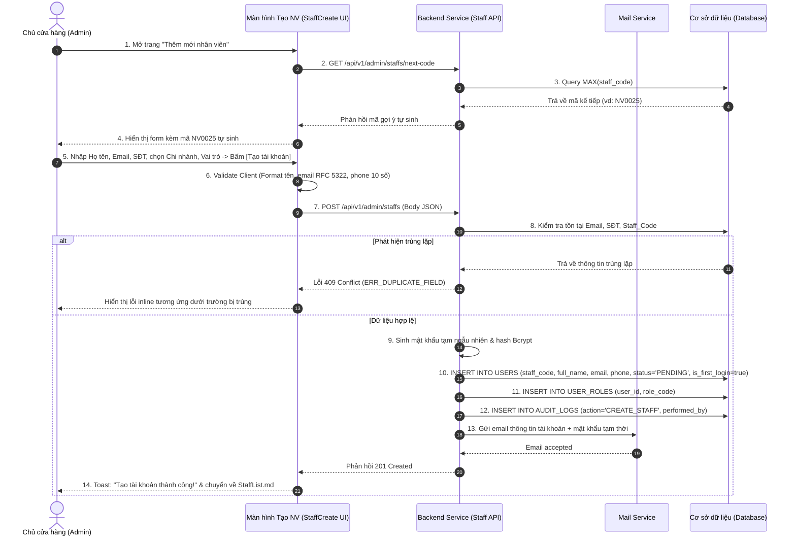

| Module | modules\account\admin\staff\create |
| ------ | ----------------------------------- |
| Menu   | Trang chủ / Quản trị hệ thống / Quản lý nhân viên / Thêm mới nhân viên (Admin / Staff / Create) |
| Mô tả  | Dùng để cho phép **Chủ cửa hàng (Store Owner / Admin)** khởi tạo tài khoản làm việc cho nhân viên mới trong hệ thống. Thông tin khởi tạo gồm: Mã nhân viên (tự động sinh theo quy tắc hoặc nhập tay), Họ và tên, Email công việc, Số điện thoại, Chi nhánh trực thuộc, Vai trò ban đầu và Ghi chú nội bộ. Sau khi bấm **"Tạo tài khoản"**, hệ thống tự động sinh một mật khẩu ngẫu nhiên an toàn, lưu tài khoản ở trạng thái **Chờ kích hoạt (Pending)** và gửi email thông báo kèm mật khẩu tạm thời đến hòm thư công việc của nhân viên. Nhân viên bắt buộc phải đổi mật khẩu mới trong lần đầu tiên đăng nhập. Áp dụng style UI, layout, component theo **style chung của project**. |

**Tổng quan màn Tạo tài khoản nhân viên (UC-01.08):**
- A. Bố cục và Form nhập liệu Thêm mới nhân viên
  - A.1. Header trang và nút điều hướng
  - A.2. Thông tin các trường dữ liệu trên form
  - A.3. Button hành động Footer form
- B. Quy tắc nghiệp vụ (Business Rules)
  - BR-01: Phân quyền khởi tạo tài khoản nhân viên (Authorization)
  - BR-02: Quy chuẩn sinh Mã nhân viên & Kiểm tra trùng lặp (Staff Code Rule)
  - BR-03: Tính duy nhất của Email công việc và Số điện thoại (Uniqueness Validation)
  - BR-04: Cơ chế sinh mật khẩu ngẫu nhiên & Gửi email kích hoạt (Password & Mail Dispatch)
  - BR-05: Bắt buộc đổi mật khẩu ở lần đăng nhập đầu tiên (Force Password Change)
- C. Luồng nghiệp vụ chi tiết (Workflows)
  - C.1. Luồng tạo mới nhân viên thành công (Main Flow - Happy Path)
  - C.2. Luồng ngoại lệ & Xử lý lỗi trùng lặp (Alternative Flows)
  - C.3. Sơ đồ tuần tự nghiệp vụ (Sequence Diagram)
- D. Danh mục thông báo / Cảnh báo hệ thống (System Messages)

---

# A. Bố cục và Form nhập liệu Thêm mới nhân viên

## A.1. Header trang và nút điều hướng

| Tên | Loại dữ liệu | Bắt buộc | Mô tả |
| --- | ------------ | -------- | ----- |
| Nút Quay lại | IconButton | | Nút icon mũi tên trái `←` kèm text: *"Danh sách nhân viên"*. Nhấp vào sẽ quay về màn hình [StaffList.md](file:///E:/FA26/Capstone/Aqs-ba/docs/Fe-01/Admin/Staff/StaffList.md). |
| Tiêu đề trang | Title | | Tiêu đề lớn: **"Thêm mới nhân viên"** (font size 20px, bold). |
| Phụ đề mô tả | Text | | Dòng text phụ màu xám bên dưới: *"Khởi tạo thông tin nhân viên, cấp vai trò làm việc và gửi thông tin kích hoạt tài khoản"*. |

## A.2. Thông tin các trường dữ liệu trên form

Form được bố trí dạng Card 2 cột hiện đại, chia làm 2 khối thông tin: **Khối thông tin cá nhân & liên hệ** và **Khối thông tin công việc & phân quyền**.

| Tên | Loại dữ liệu | Bắt buộc | Mô tả | Mô tả Database | Độ dài |
| --- | ------------ | -------- | ----- | -------------- | ------ |
| **Mã nhân viên** | TextInput / Checkbox | x | Mã định danh nhân sự trong cửa hàng.  Giao diện tích hợp checkbox: `[x] Tự động sinh mã`. - **Nếu tích chọn (Mặc định):** Ô nhập ở trạng thái disabled, hệ thống tự động sinh mã theo cú pháp: `NV` + 4 chữ số tăng dần (VD: `NV0025`). - **Nếu bỏ tích:** Cho phép Admin tự nhập mã tùy biến theo quy chuẩn doanh nghiệp.  Quy tắc kiểm tra: - Định dạng: Bắt đầu bằng `NV` tiếp theo là từ 3 đến 8 chữ số (Regex: `^NV[0-9]{3,8}$`). - Kiểm tra không được trùng lặp với Mã NV đã có trong CSDL. | STAFF_CODE | 20 |
| **Họ và tên** | TextInput | x | Họ và tên đầy đủ của nhân viên.  Placeholder: **"Nhập họ và tên nhân viên (VD: Nguyễn Văn An)"**.  Quy tắc kiểm tra (Validate): - Không được để trống. - Độ dài từ 2 đến 100 ký tự. - Chỉ chứa chữ cái tiếng Việt và khoảng trắng, không chứa số và ký tự đặc biệt (Regex: `^[\p{L}\s]{2,100}$`). | FULL_NAME | 100 |
| **Email công việc** | TextInput | x | Địa chỉ email chính thức cấp cho nhân viên để nhận thông báo và làm tài khoản đăng nhập.  Placeholder: **"Nhập email (VD: an.nguyen@aqs.vn)"**.  Quy tắc kiểm tra (Validate): - Đúng định dạng chuẩn email RFC 5322. - Bắt buộc phải duy nhất: Không trùng lặp với bất kỳ Email nào đã tồn tại trong toàn bộ bảng `USERS` (kể cả nhân viên hay khách hàng).  Lỗi inline: - Để trống: *Vui lòng nhập email công việc.* - Sai định dạng: *Email không đúng định dạng.* - Trùng lặp: *Email này đã được sử dụng trong hệ thống.* | EMAIL | 255 |
| **Số điện thoại** | TextInput | x | Số điện thoại liên hệ cá nhân/công việc của nhân viên.  Placeholder: **"Nhập số điện thoại (10 chữ số)"**.  Quy tắc kiểm tra (Validate): - Đúng định dạng 10 chữ số di động Việt Nam bắt đầu bằng số `0` (Regex: `^(0[3|5|7|8|9])[0-9]{8}$`). - Bắt buộc phải duy nhất trong hệ thống.  Lỗi inline: *Số điện thoại đã tồn tại trong hệ thống.* | PHONE_NUMBER | 15 |
| **Chi nhánh làm việc** | Select | x | Chọn cửa hàng/chi nhánh phân công công tác cho nhân viên.  Dữ liệu dropdown lấy từ bảng `BRANCHES`.  Placeholder: **"Chọn chi nhánh làm việc"**.  Bắt buộc chọn 1 chi nhánh (Nếu vai trò là Admin toàn quyền có thể chọn *"Toàn hệ thống"*). | BRANCH_ID | 20 |
| **Vai trò ban đầu** | Select / RadioGroup | x | Chọn vai trò công việc chính được bàn giao cho nhân viên.  Danh sách lựa chọn gồm 5 vai trò: 1. **NV Bán hàng (NVBH)**: Phụ trách tạo đơn, tư vấn tại quầy, chăm sóc giỏ hàng. 2. **Kế toán**: Quản lý thu chi, sổ quỹ, duyệt phiếu thu tiền. 3. **Shipper**: Nhận đơn giao hàng, cập nhật trạng thái vận chuyển. 4. **KT Bán hàng (KTBH)**: Kỹ thuật thủy sinh, tư vấn lắp đặt bể/cây cảnh. 5. **Admin**: Quản trị viên cửa hàng.  Mặc định: *"NV Bán hàng (NVBH)"*. Bắt buộc chọn 1 vai trò chính. | ROLE_CODE | 50 |
| **Ghi chú nội bộ** | TextArea | | Ghi chú thêm về nhân sự (vị trí thử việc, kinh nghiệm, thông tin liên hệ khẩn cấp...).  Placeholder: **"Nhập ghi chú nhân sự (tùy chọn)..."**.  Độ dài tối đa 500 ký tự. | NOTES | 500 |

## A.3. Button hành động Footer form

| Tên | Loại dữ liệu | Bắt buộc | Mô tả |
| --- | ------------ | -------- | ----- |
| Hủy bỏ | Button | | Button outline dạng: **"Hủy bỏ"**.  Hành vi: Chuyển hướng quay lại màn hình danh sách [StaffList.md](file:///E:/FA26/Capstone/Aqs-ba/docs/Fe-01/Admin/Staff/StaffList.md). Nếu form đã nhập liệu, hiển thị popup xác nhận hủy thay đổi. |
| Tạo tài khoản | Button | | Button primary màu cam thương hiệu, icon check + label **"Tạo tài khoản"**.  Hành vi: Kiểm tra tính hợp lệ dữ liệu toàn form $\rightarrow$ Kích hoạt luồng tạo tài khoản, sinh mật khẩu ngẫu nhiên và gửi email kích hoạt (theo **BR-04**). |

---

# B. Quy tắc nghiệp vụ (Business Rules)

## BR-01: Phân quyền khởi tạo tài khoản nhân viên (Authorization)
Chỉ người dùng có vai trò `Admin` (Chủ cửa hàng) mới có quyền truy cập màn hình này và thực hiện lệnh tạo tài khoản nhân viên. Các vai trò khác (NVBH, Kế toán, Shipper, KTBH) khi truy cập URL sẽ bị chặn và điều hướng về trang 403 Forbidden.

## BR-02: Quy chuẩn sinh Mã nhân viên & Kiểm tra trùng lặp (Staff Code Rule)
1. **Chế độ tự động (Auto-generate):** Hệ thống tìm mã nhân viên có số thứ tự lớn nhất hiện tại (VD: `NV0024`), tự động cộng thêm 1 để sinh ra mã mới `NV0025`. Đảm bảo định dạng chuẩn `NV` + 4 chữ số (zero-padded).
2. **Chế độ nhập tay (Manual):** Nếu người dùng bỏ tích tự sinh và nhập mã tùy biến, hệ thống kiểm tra định dạng `^NV[0-9]{3,8}$`.
3. Kiểm tra tính duy nhất: `STAFF_CODE` là trường khóa duy nhất (Unique Constraint). Nếu trùng lặp, chặn submit và báo lỗi inline.

## BR-03: Tính duy nhất của Email công việc và Số điện thoại (Uniqueness Validation)
1. Cả `EMAIL` và `PHONE_NUMBER` đều là các định danh dùng trong xác thực và liên lạc bảo mật.
2. Hệ thống kiểm tra trong bảng `USERS`:
   - `SELECT COUNT(1) FROM USERS WHERE EMAIL = ?` $\rightarrow$ Phải bằng 0.
   - `SELECT COUNT(1) FROM USERS WHERE PHONE_NUMBER = ?` $\rightarrow$ Phải bằng 0.
3. Nếu phát hiện trùng lặp, hệ thống trả về mã lỗi tương ứng và tô đỏ trường bị trùng.

## BR-04: Cơ chế sinh mật khẩu ngẫu nhiên & Gửi email kích hoạt (Password & Mail Dispatch)
Ngay sau khi thông tin nhân viên hợp lệ và bản ghi được lưu:
1. Hệ thống tự động sinh một chuỗi **Mật khẩu ngẫu nhiên tạm thời (Temporary Password)** có độ dài **10 ký tự**, bao gồm chữ in hoa, chữ thường, chữ số và ký tự đặc biệt (VD: `Aqs@982kLm`).
2. Mật khẩu được mã hóa chuẩn **Bcrypt (cost factor = 10)** và lưu vào trường `PASSWORD_HASH`.
3. Tài khoản được khởi tạo với trạng thái:
   - `STATUS = 'PENDING'` (Chờ kích hoạt).
   - `IS_FIRST_LOGIN = true` (Đánh dấu bắt buộc đổi mật khẩu).
4. Hệ thống kích hoạt dịch vụ Mail gửi một email kích hoạt tới địa chỉ `EMAIL` của nhân viên:
   - Tiêu đề: *"[AQS Store] Thông tin kích hoạt tài khoản làm việc của bạn"*
   - Nội dung: Chào mừng nhân viên mới, cung cấp Tên đăng nhập (Email/SĐT/Mã NV), Mật khẩu tạm thời, đường link dẫn đến cổng đăng nhập và lời nhắc: *"Mật khẩu tạm thời có hiệu lực trong 24 giờ. Bạn bắt buộc phải đổi mật khẩu mới trong lần đầu tiên đăng nhập."*

## BR-05: Bắt buộc đổi mật khẩu ở lần đăng nhập đầu tiên (Force Password Change)
1. Khi nhân viên sử dụng thông tin mật khẩu tạm thời để đăng nhập thành công vào hệ thống lần đầu:
2. Hệ thống kiểm tra cờ `IS_FIRST_LOGIN == true`:
   - Ngay lập tức chặn quyền truy cập vào màn hình làm việc chính.
   - Bắt buộc chuyển hướng người dùng đến màn hình [Đổi mật khẩu lần đầu](file:///E:/FA26/Capstone/Aqs-ba/docs/Fe-01/Admin/Account/FirstTimeChangePassword.md).
   - Sau khi nhân viên đặt mật khẩu mới thành công: Cập nhật `IS_FIRST_LOGIN = false` và `STATUS = 'ACTIVE'`, sau đó mới cho phép truy cập các chức năng theo vai trò được giao.

---

# C. Luồng nghiệp vụ chi tiết (Workflows)

## C.1. Luồng tạo mới nhân viên thành công (Main Flow - Happy Path)

- **Bước 1:** Admin tại trang danh sách nhân viên nhấn nút **"Thêm nhân viên"**.
- **Bước 2:** Hệ thống hiển thị form Thêm mới nhân viên với Mã NV được tự sinh sẵn (VD: `NV0025`), checkbox *"Tự động sinh mã"* đang được tích, vai trò mặc định *"NV Bán hàng"*.
- **Bước 3:** Admin nhập Họ tên, Email công việc, Số điện thoại, chọn Chi nhánh làm việc và nhập Ghi chú (nếu có).
- **Bước 4:** Admin nhấn nút **"Tạo tài khoản"**.
- **Bước 5:** Client validate dữ liệu (không trống, regex hợp lệ), gửi request `POST /api/v1/admin/staffs` lên Backend.
- **Bước 6:** Backend kiểm tra tính duy nhất của Mã NV, Email, SĐT trong CSDL.
- **Bước 7:** Backend sinh mật khẩu tạm thời ngẫu nhiên 10 ký tự, hash Bcrypt.
- **Bước 8:** Lưu bản ghi vào bảng `USERS` với `STATUS = 'PENDING'`, `IS_FIRST_LOGIN = true`. Lưu vai trò vào bảng quan hệ `USER_ROLES`.
- **Bước 9:** Kích hoạt gửi email kích hoạt tài khoản kèm mật khẩu tạm đến email nhân viên.
- **Bước 10:** Ghi bản ghi Audit Log (`ACTION = 'CREATE_STAFF'`, `PERFORMED_BY = admin_id`).
- **Bước 11:** Backend trả về HTTP 201 Created. Frontend hiển thị Toast thông báo: *"Tạo tài khoản nhân viên thành công! Thông tin đăng nhập đã được gửi tới email của nhân viên."*, sau đó tự động điều hướng về màn hình danh sách [StaffList.md](file:///E:/FA26/Capstone/Aqs-ba/docs/Fe-01/Admin/Staff/StaffList.md).

## C.2. Luồng ngoại lệ & Xử lý lỗi trùng lặp (Alternative Flows)

### A1. Email công việc đã tồn tại
- **Điều kiện:** Admin nhập địa chỉ email đã được sử dụng bởi một tài khoản khác trong hệ thống.
- **Xử lý:** Backend trả về lỗi `409 Conflict` (Code: `ERR_EMAIL_EXISTS`). Giao diện dừng luồng, hiển thị lỗi đỏ inline dưới ô Email: *"Email này đã được sử dụng trong hệ thống. Vui lòng kiểm tra lại."* và focus con trỏ vào ô Email.

### A2. Số điện thoại đã tồn tại
- **Điều kiện:** SĐT vừa nhập đã thuộc về một tài khoản khác.
- **Xử lý:** Giao diện hiển thị lỗi inline: *"Số điện thoại này đã được sử dụng trong hệ thống."*.

### A3. Nhập trùng Mã nhân viên (Khi bỏ tích tự sinh)
- **Điều kiện:** Admin bỏ tích tự sinh và tự gõ mã NV đã tồn tại (VD: `NV0001`).
- **Xử lý:** Báo lỗi inline: *"Mã nhân viên đã tồn tại. Vui lòng chọn mã khác."*.

### A4. Lỗi gửi email từ Mail Service (Mail Delivery Failed)
- **Điều kiện:** Hòm thư không tồn tại hoặc lỗi kết nối SMTP/Mail Provider.
- **Xử lý:** Bản ghi tài khoản vẫn được tạo trong CSDL ở trạng thái `Pending`. Hệ thống hiển thị cảnh báo Toast vàng: *"Tài khoản đã được tạo nhưng gặp lỗi khi gửi email kích hoạt. Bạn có thể sử dụng nút 'Gửi lại thư kích hoạt' tại danh sách nhân viên."*.

## C.3. Sơ đồ tuần tự nghiệp vụ (Sequence Diagram)

---

# D. Danh mục thông báo / Cảnh báo hệ thống (System Messages)

| Mã thông báo | Loại hiển thị | Nội dung thông báo | Điều kiện xuất hiện |
| ------------ | ------------- | ------------------ | ------------------- |
| `MSG_STFC_01` | Inline Error  | *Vui lòng nhập họ và tên nhân viên.* | Để trống trường Họ và tên. |
| `MSG_STFC_02` | Inline Error  | *Vui lòng nhập địa chỉ email công việc.* | Để trống trường Email. |
| `MSG_STFC_03` | Inline Error  | *Địa chỉ email không đúng định dạng.* | Nhập sai cấu trúc RFC 5322 email. |
| `MSG_STFC_04` | Inline Error  | *Email này đã được sử dụng trong hệ thống.* | Email bị trùng trong CSDL. |
| `MSG_STFC_05` | Inline Error  | *Số điện thoại không đúng định dạng (10 chữ số).* | Sai format SĐT Việt Nam. |
| `MSG_STFC_06` | Inline Error  | *Số điện thoại này đã được sử dụng trong hệ thống.* | SĐT bị trùng trong CSDL. |
| `MSG_STFC_07` | Inline Error  | *Mã nhân viên đã tồn tại. Vui lòng chọn mã khác.* | Nhập tay mã NV bị trùng. |
| `MSG_STFC_08` | Toast Success | *Tạo tài khoản nhân viên thành công! Thông tin đăng nhập đã được gửi tới email nhân viên.* | Tạo tài khoản thành công và gửi mail kích hoạt. |
| `MSG_STFC_09` | Toast Warning | *Tài khoản đã tạo nhưng gửi mail thất bại. Vui lòng gửi lại thư kích hoạt ở danh sách.* | Lỗi dịch vụ gửi email. |
