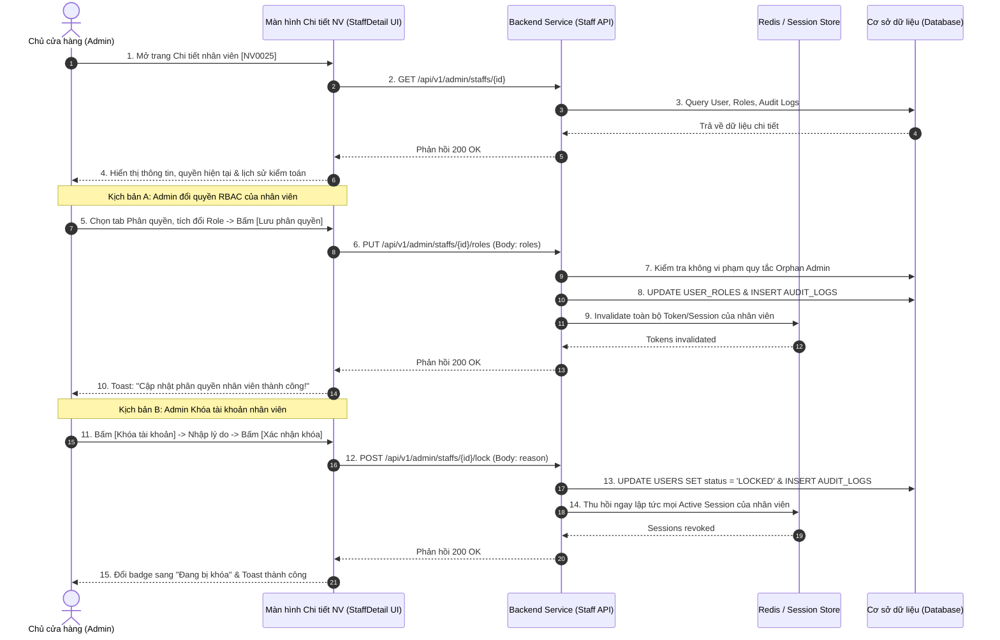

| Module | modules\account\admin\staff\detail |
| ------ | ----------------------------------- |
| Menu   | Trang chủ / Quản trị hệ thống / Quản lý nhân viên / Chi tiết nhân viên (Admin / Staff / Detail) |
| Mô tả  | Dùng để cho phép **Chủ cửa hàng (Store Owner / Admin)** xem toàn diện hồ sơ của một nhân viên, thực hiện các nghiệp vụ quản trị cấp cao bao gồm: Cập nhật thông tin cá nhân và chi nhánh làm việc (**UC-01.13**); Gán hoặc điều chỉnh vai trò phân quyền RBAC (**UC-01.09**); Thực hiện Khóa hoặc Mở khóa tài khoản kèm lý do kiểm toán (**UC-01.10**); Đặt lại mật khẩu khẩn cấp (**UC-01.12**) và Tra cứu nhật ký kiểm toán (Audit Log) theo dõi toàn bộ lịch sử thay đổi quyền hạn và trạng thái của nhân viên. Tích hợp cơ chế thu hồi Session/Token thời gian thực để đảm bảo an ninh hệ thống. Áp dụng style UI, layout, component theo **style chung của project**. |

**Tổng quan màn Chi tiết & Quản trị nhân viên:**
- A. Bố cục chung & Thanh công cụ hành động (Action Toolbar)
  - A.1. Header trang, trạng thái tài khoản & Button thanh công cụ
- B. Nội dung chi tiết các Tab chức năng
  - B.1. Tab "Thông tin cá nhân & Công việc" (UC-01.13)
  - B.2. Tab "Phân quyền vai trò (RBAC)" (UC-01.09)
  - B.3. Tab "Nhật ký kiểm toán (Audit Log)"
- C. Danh mục Modal nghiệp vụ quản trị
  - C.1. Modal Khóa tài khoản nhân viên (UC-01.10)
  - C.2. Modal Mở khóa tài khoản nhân viên
  - C.3. Modal Đặt lại mật khẩu cho nhân viên (UC-01.12)
- D. Quy tắc nghiệp vụ (Business Rules)
  - BR-01: Ma trận phân quyền vai trò RBAC & Thu hồi quyền thời gian thực (Real-time Token Invalidation)
  - BR-02: Quy tắc chống Orphan Admin (Prevent Self-Demotion & Self-Lock)
  - BR-03: Cơ chế ghi vết kiểm toán bắt buộc (Mandatory Audit Logging)
  - BR-04: Xử lý thu hồi Session khi Khóa tài khoản hoặc Reset mật khẩu (Session Termination)
  - BR-05: Ràng buộc tính hợp lệ khi cập nhật thông tin cá nhân
- E. Luồng nghiệp vụ chi tiết (Workflows)
  - E.1. Luồng gán/đổi vai trò nhân viên (UC-01.09)
  - E.2. Luồng khóa tài khoản nhân viên (UC-01.10)
  - E.3. Luồng đặt lại mật khẩu nhân viên (UC-01.12)
  - E.4. Luồng chỉnh sửa thông tin nhân viên (UC-01.13)
  - E.5. Sơ đồ tuần tự nghiệp vụ (Sequence Diagram)
- F. Danh mục thông báo / Cảnh báo hệ thống (System Messages)

---

# A. Bố cục chung & Thanh công cụ hành động (Action Toolbar)

## A.1. Header trang, trạng thái tài khoản & Button thanh công cụ

Giao diện header hiển thị thông tin tóm tắt của nhân viên và các nút hành động khẩn cấp:

| Tên | Loại thành phần | Mô tả chi tiết |
| --- | --------------- | -------------- |
| Nút Quay lại | IconButton | Mũi tên trái `←` kèm text: *"Danh sách nhân viên"*. Nhấp vào quay về màn [StaffList.md](file:///E:/FA26/Capstone/Aqs-ba/docs/Fe-01/Admin/Staff/StaffList.md). |
| Avatar & Tên NV | UserSummary | Avatar tròn lớn (60x60px) + Tên nhân viên in đậm (font-size 22px) + Mã NV: `[NV0025]`. |
| Tag Trạng thái | StatusBadge | Tag màu lớn phản ánh trạng thái hiện tại: - **Đang hoạt động (Active)**: Màu xanh lục - **Đang bị khóa (Locked)**: Màu đỏ (kèm tooltip lý do khóa khi hover) - **Chờ kích hoạt (Pending)**: Màu vàng cam - **Ngừng hoạt động / Thôi việc (Inactive)**: Màu xám (kèm ghi chú/lý do thôi việc khi hover) |
| Nút Đặt lại mật khẩu | Button (Outline) | Icon chìa khóa + label **"Đặt lại mật khẩu"**.  Hành vi: Mở Modal C.3 để Admin cấp lại mật khẩu mới khi nhân viên quên pass hoặc bàn giao ca gấp. |
| Nút Đổi trạng thái (Khóa / Thôi việc / Mở lại) | ButtonGroup | Nhóm nút xử lý trạng thái tài khoản:  **1. Khi tài khoản đang Active:** - Nút màu đỏ (Danger): **"Khóa tài khoản"** (Mở Modal C.1). - Nút màu xám (Secondary): **"Đánh dấu Thôi việc"** (Mở Modal C.4 để cập nhật trạng thái `Inactive` khi nhân viên tự thôi việc/nghỉ việc).  **2. Khi tài khoản đang Locked:** - Nút màu xanh lá (Success): **"Mở khóa tài khoản"** (Mở Modal C.2).  **3. Khi tài khoản đang Inactive:** - Nút màu xanh dương: **"Kích hoạt lại làm việc"** (Chuyển trạng thái về `Active` khi nhân viên đi làm lại).  *Lưu ý:* Bị ẩn hoặc disabled các thao tác Khóa/Thôi việc nếu tài khoản này chính là Admin đang đăng nhập (chống tự vô hiệu hóa tài khoản của chính mình). |

---

# B. Nội dung chi tiết các Tab chức năng

Màn hình chia thành 3 Tab nội dung:

## B.1. Tab "Thông tin cá nhân & Công việc" (UC-01.13)

Cho phép xem và cập nhật thông tin liên hệ, chi nhánh công tác của nhân viên:

| Tên | Loại dữ liệu | Bắt buộc | Mô tả | Mô tả Database | Độ dài |
| --- | ------------ | -------- | ----- | -------------- | ------ |
| Mã nhân viên | TextInput | | Hiển thị mã NV (VD: `NV0025`).  Trạng thái: **Readonly (Chỉ đọc)**, không cho phép sửa sau khi đã khởi tạo. | STAFF_CODE | 20 |
| Email công việc | TextInput | | Hiển thị email công việc dùng để đăng nhập.  Trạng thái: **Readonly (Chỉ đọc)** trên form này (việc đổi email công việc gắn liền với tài khoản đăng nhập phải thông qua quy trình bảo mật nội bộ). | EMAIL | 255 |
| Họ và tên | TextInput | x | Họ và tên đầy đủ của nhân viên.  Cho phép sửa trực tiếp.  Validate: 2 đến 100 ký tự, chữ cái tiếng Việt hợp lệ. | FULL_NAME | 100 |
| Số điện thoại | TextInput | x | Số điện thoại liên hệ.  Cho phép sửa trực tiếp.  Validate: 10 chữ số đầu 0, kiểm tra tính duy nhất (không trùng với nhân viên khác). | PHONE_NUMBER | 15 |
| Chi nhánh làm việc | Select | x | Chi nhánh/cửa hàng phân công nhân viên làm việc.  Dropdown chọn từ bảng `BRANCHES`. Cho phép đổi chi nhánh khi nhân viên điều chuyển công tác. | BRANCH_ID | 20 |
| Ghi chú nội bộ | TextArea | | Ghi chú thêm về nhân sự, kỹ năng, chức danh chuyên trách.  Tối đa 500 ký tự. | NOTES | 500 |
| Ngày tham gia | Text | | Ngày tài khoản được khởi tạo vào hệ thống (`CREATED_AT`). Định dạng: `DD/MM/YYYY HH:mm`. Readonly. | CREATED_AT | DATETIME |
| Lần đăng nhập cuối | Text | | Thời điểm gần nhất nhân viên đăng nhập hệ thống (`LAST_LOGIN_AT`). Readonly. | LAST_LOGIN_AT | DATETIME |
| Lưu thay đổi | Button | | Button Primary, label: **"Lưu thay đổi"**.  Hành vi: Validate dữ liệu $\rightarrow$ Gọi API `PUT /api/v1/admin/staffs/{id}` $\rightarrow$ Cập nhật CSDL $\rightarrow$ Hiển thị Toast thành công: *"Cập nhật thông tin nhân viên thành công!"*. | | |

## B.2. Tab "Phân quyền vai trò (RBAC)" (UC-01.09)

Quản lý các vai trò được phân quyền cho tài khoản nhân viên. Hệ thống hỗ trợ mô hình RBAC với các vai trò định sẵn:

| Tên Vai trò | Mã Role | Mô tả phạm vi thẩm quyền | Gán quyền |
| ----------- | ------- | ------------------------ | --------- |
| **Admin (Quản trị viên)** | `ROLE_ADMIN` | Toàn quyền quản trị hệ thống: Quản lý toàn bộ nhân viên, xem mọi chi nhánh, cấu hình hệ thống, quản lý tài chính, khách hàng. | Checkbox / Toggle |
| **NV Bán hàng (NVBH)** | `ROLE_SALES` | Phụ trách bán hàng tại quầy và online: Tạo đơn hàng, tra cứu sản phẩm/tồn kho, áp mã khuyến mãi, tư vấn khách hàng. | Checkbox / Toggle |
| **Kế toán** | `ROLE_ACCOUNTANT` | Phụ trách tài chính: Quản lý hóa đơn chứng từ, sổ quỹ tiền mặt, công nợ nhà cung cấp, duyệt đối soát thanh toán. | Checkbox / Toggle |
| **Shipper** | `ROLE_SHIPPER` | Phụ trách giao nhận hàng hóa: Nhận đơn giao hàng, cập nhật lộ trình, thu tiền COD, báo cáo giao thành công/thất bại. | Checkbox / Toggle |
| **KT Bán hàng (KTBH)** | `ROLE_TECH_SALES`| Kỹ thuật viên thủy sinh: Tư vấn kỹ thuật setup bể cá cảnh, bảo dưỡng bể, hỗ trợ kỹ thuật chuyên sâu cho khách hàng. | Checkbox / Toggle |

**Quy tắc & Thao tác tại Tab Phân quyền:**
- Tài khoản có thể được gán 1 hoặc kết hợp nhiều vai trò (ví dụ: vừa là *NV Bán hàng* vừa là *KT Bán hàng*).
- Có trường chọn: **"Vai trò chính (Primary Role)"** (Radio list) để xác định giao diện làm việc mặc định khi nhân viên đăng nhập.
- Button: **"Lưu phân quyền"** (Primary Button).
  - Khi bấm: Hệ thống kiểm tra an toàn theo **BR-02** (chống tự gỡ Admin) $\rightarrow$ Cập nhật bảng `USER_ROLES` $\rightarrow$ Ghi Audit Log $\rightarrow$ Kích hoạt thu hồi Token theo **BR-01** (nếu nhân viên đang online).

## B.3. Tab "Nhật ký kiểm toán (Audit Log)"

Hiển thị bảng lịch sử toàn bộ các hành động quản trị đã tác động lên tài khoản nhân viên này để phục vụ minh bạch và kiểm soát nội bộ:

| Thời gian | Hành động | Vai trò trước | Vai trò sau | Người thực hiện | Lý do / Chi tiết | Địa chỉ IP |
| --------- | --------- | ------------- | ----------- | --------------- | ---------------- | ---------- |
| `DD/MM/YYYY HH:mm` | `UPDATE_ROLES` | NV Bán hàng | NV Bán hàng, KTBH | Nguyễn Văn Chủ (Admin) | Thêm nhiệm vụ kỹ thuật bể | `113.161.x.x` |
| `DD/MM/YYYY HH:mm` | `LOCK_ACCOUNT` | -- | -- | Nguyễn Văn Chủ (Admin) | Nghi ngờ lộ mật khẩu | `113.161.x.x` |
| `DD/MM/YYYY HH:mm` | `RESET_PASSWORD`| -- | -- | Nguyễn Văn Chủ (Admin) | Cấp lại pass theo yêu cầu | `113.161.x.x` |
| `DD/MM/YYYY HH:mm` | `CREATE_STAFF` | -- | NV Bán hàng | Nguyễn Văn Chủ (Admin) | Khởi tạo tài khoản mới | `113.161.x.x` |

---

# C. Danh mục Modal nghiệp vụ quản trị

## C.1. Modal Khóa tài khoản nhân viên (UC-01.10)

Kích hoạt khi Admin nhấn nút **"Khóa tài khoản"**:

| Tên | Loại thành phần | Mô tả chi tiết |
| --- | --------------- | -------------- |
| Tiêu đề Modal | Modal Title | **"Khóa tài khoản nhân viên"** (Icon cảnh báo màu đỏ) |
| Cảnh báo hệ thống | Alert Warning | *"Lưu ý: Toàn bộ phiên làm việc của nhân viên này sẽ bị thu hồi lập tức. Nhân viên sẽ bị đăng xuất khỏi hệ thống và không thể đăng nhập lại cho đến khi được mở khóa."* |
| Lý do khóa | TextArea (Bắt buộc) | Nhập nguyên nhân khóa tài khoản (tối thiểu 10 ký tự, tối đa 500 ký tự). Bắt buộc phải nhập để phục vụ kiểm toán nội bộ. |
| Nút Hủy | Button (Secondary) | Label **"Hủy bỏ"** - Đóng modal. |
| Nút Xác nhận Khóa | Button (Danger) | Label **"Xác nhận khóa"** - Gọi API khóa tài khoản, thu hồi session, ghi Audit Log và cập nhật trạng thái sang `Locked`. |

## C.2. Modal Mở khóa tài khoản nhân viên

Kích hoạt khi Admin nhấn nút **"Mở khóa tài khoản"** đối với nhân viên đang ở trạng thái `Locked`:

| Tên | Loại thành phần | Mô tả chi tiết |
| --- | --------------- | -------------- |
| Tiêu đề Modal | Modal Title | **"Mở khóa tài khoản nhân viên"** (Icon chìa khóa mở màu xanh) |
| Nội dung xác nhận | Text | *"Bạn có chắc chắn muốn mở khóa cho tài khoản nhân viên **{FULL_NAME}** (Mã NV: **{STAFF_CODE}**)? Sau khi mở khóa, nhân viên sẽ có thể đăng nhập lại hệ thống bằng mật khẩu hiện tại."* |
| Ghi chú mở khóa | TextArea (Tùy chọn) | Ô nhập lý do mở khóa (phục vụ lưu vết kiểm toán). |
| Nút Hủy | Button (Secondary) | Label **"Hủy"** - Đóng modal. |
| Nút Xác nhận Mở khóa | Button (Primary) | Label **"Xác nhận mở khóa"** - Cập nhật trạng thái sang `Active`, reload giao diện. |

## C.3. Modal Đặt lại mật khẩu cho nhân viên (UC-01.12)

Kích hoạt khi Admin nhấn nút **"Đặt lại mật khẩu"**:

| Tên | Loại thành phần | Mô tả chi tiết |
| --- | --------------- | -------------- |
| Tiêu đề Modal | Modal Title | **"Đặt lại mật khẩu nhân viên"** |
| Tóm tắt nhân viên | Alert Box | Hiển thị: Mã NV, Tên, Email công việc của nhân viên. |
| Phương thức đặt lại | RadioGroup | Cho phép Admin lựa chọn 1 trong 2 phương thức linh hoạt:  1. **Gửi liên kết đặt lại mật khẩu qua Email (Khuyên dùng):** Hệ thống tạo mã Token bảo mật và gửi link reset mật khẩu trực tiếp đến hòm thư công việc của nhân viên. Link có hiệu lực trong 24h.  2. **Tạo mật khẩu tạm thời hiển thị ngay trên màn hình:** Hệ thống tự động sinh một mật khẩu ngẫu nhiên an toàn và hiển thị trực tiếp lên modal cho Admin copy bàn giao cho nhân viên (rất tiện khi nhân viên đang đứng quầy làm việc). |
| Hộp hiển thị pass tạm | CopyBox | Chỉ hiển thị khi chọn phương thức 2 sau khi bấm Xác nhận: Ô hiển thị mật khẩu tạm (VD: `Aqs@7392xP`) kèm nút icon Copy tiện lợi. Lời nhắc: *"Mật khẩu này chỉ hiển thị một lần duy nhất. Nhân viên bắt buộc phải đổi mật khẩu khi đăng nhập."* |
| Cảnh báo phiên | Text Info | *"Hành động này sẽ tự động đăng xuất nhân viên khỏi mọi thiết bị và trình duyệt đang mở."* |
| Nút Hủy | Button | Label **"Đóng"** |
| Nút Thực hiện | Button (Primary) | Label **"Tiến hành đặt lại"** |

## C.4. Modal Đánh dấu Thôi việc cho nhân viên (Inactive Status Modal)

Kích hoạt khi Admin bấm nút **"Đánh dấu Thôi việc"**:

| Tên | Loại thành phần | Mô tả chi tiết |
| --- | --------------- | -------------- |
| Tiêu đề Modal | Modal Title | **"Xác nhận nhân viên thôi việc"** (Icon xám cảnh báo) |
| Tóm tắt nhân viên | Alert Box | Hiển thị: Mã NV, Tên, Email công việc và Chi nhánh hiện tại. |
| Lý do thôi việc | Select / TextArea | **Lựa chọn lý do:** - *Nhân viên tự nguyện xin thôi việc* - *Hết hạn hợp đồng lao động không tái ký* - *Chuyển công tác / Nghỉ việc theo thỏa thuận* - *Lý do khác...*  Ô ghi chú chi tiết (TextArea): Tối thiểu 5 ký tự, tối đa 500 ký tự. |
| Cảnh báo hệ thống | Text Warning | *"Hệ thống sẽ chuyển trạng thái tài khoản sang **Inactive (Ngừng hoạt động)**, thu hồi ngay lập tức toàn bộ phiên làm việc và quyền truy cập vào cổng quản trị. Toàn bộ lịch sử bán hàng, hóa đơn và chứng từ do nhân viên này lập trong quá khứ vẫn được bảo toàn nguyên vẹn."* |
| Nút Hủy | Button (Secondary) | Label **"Hủy bỏ"** - Đóng modal. |
| Nút Xác nhận Thôi việc | Button (Danger / Outline) | Label **"Xác nhận Thôi việc"** - Gọi API cập nhật `STATUS = 'INACTIVE'`, lưu thời gian & lý do thôi việc, thu hồi token, ghi Audit Log và reload trang. |

---

# D. Quy tắc nghiệp vụ (Business Rules)

## BR-01: Ma trận phân quyền vai trò RBAC & Thu hồi quyền thời gian thực (Real-time Token Invalidation)
1. **Phân quyền vai trò:** Một nhân viên có thể mang 1 hoặc nhiều vai trò trong bảng: `ROLE_ADMIN`, `ROLE_SALES`, `ROLE_ACCOUNTANT`, `ROLE_SHIPPER`, `ROLE_TECH_SALES`.
2. **Cơ chế thu hồi quyền thời gian thực (Real-time Revocation):**
   - Khi Admin thay đổi vai trò (đặc biệt là **hạ quyền** hoặc gỡ bỏ một vai trò), hệ thống ngay lập tức đưa các Token/Session hiện tại của nhân viên đó vào danh sách đen (Token Blacklist / Invalidate Redis Cache).
   - Tại request HTTP tiếp theo của nhân viên đó, API Gateway/Middleware sẽ trả về lỗi `401 Unauthorized` hoặc `403 Forbidden` kèm thông báo: *"Quyền hạn của bạn đã được quản trị viên cập nhật. Vui lòng đăng nhập lại."*
   - Nhân viên bị điều hướng về màn hình đăng nhập để nhận lại Token với bộ Claims/Permissions mới.

## BR-02: Quy tắc chống Orphan Admin (Prevent Self-Demotion & Self-Lock)
1. **Chống tự khóa chính mình:** Admin đang đăng nhập không thể tự nhấn nút "Khóa tài khoản" của chính bản thân. Nút khóa sẽ bị disable hoặc ẩn trên giao diện của tài khoản đó.
2. **Chống tự gỡ quyền Admin:** Nếu trong hệ thống chỉ còn duy nhất 1 tài khoản có vai trò `Admin`, hệ thống tuyệt đối không cho phép gỡ vai trò `Admin` của tài khoản này để tránh tình trạng hệ thống không còn bất kỳ quản trị viên nào có quyền điều hành ("Orphan Admin").

## BR-03: Cơ chế ghi vết kiểm toán bắt buộc (Mandatory Audit Logging)
Mọi hành động nhạy cảm thực hiện trên màn hình này BẮT BUỘC phải ghi bản ghi vào bảng `AUDIT_LOGS`:
1. **Trường dữ liệu ghi nhận:** `TIMESTAMP`, `PERFORMED_BY` (ID của Admin thực hiện), `TARGET_USER_ID`, `ACTION` (`UPDATE_INFO`, `UPDATE_ROLES`, `LOCK_ACCOUNT`, `UNLOCK_ACCOUNT`, `SET_INACTIVE`, `RE_ACTIVATE`, `RESET_PASSWORD`), `OLD_VALUE`, `NEW_VALUE`, `REASON` (Lý do bắt buộc khi khóa/thôi việc), `IP_ADDRESS`, `USER_AGENT`.
2. Bảng Audit Log được thiết lập chế độ chỉ đọc đối với giao diện, không cho phép bất kỳ ai sửa hoặc xóa dữ liệu nhật ký kiểm toán.

## BR-04: Xử lý thu hồi Session khi Khóa tài khoản, Thôi việc hoặc Reset mật khẩu (Session Termination)
1. Khi tài khoản chuyển sang trạng thái `LOCKED`, `INACTIVE` hoặc được thực hiện `RESET_PASSWORD`:
2. Hệ thống thu hồi ngay lập tức toàn bộ Refresh Token và Access Token đang lưu hành của tài khoản đó trong Redis/Database.
3. Nhân viên bị văng ra khỏi hệ thống ngay trong hành động click chuột tiếp theo trên màn hình.

## BR-05: Ràng buộc tính hợp lệ khi cập nhật thông tin cá nhân
1. Họ và tên: Bắt buộc, từ 2 đến 100 ký tự tiếng Việt hợp lệ.
2. Số điện thoại: Định dạng 10 số. Nếu thay đổi số điện thoại mới, hệ thống phải kiểm tra số mới không được trùng lặp với bất kỳ tài khoản nào khác trong hệ thống.
3. Mã nhân viên và Email công việc: Ở trạng thái Chỉ đọc (Readonly), không thể chỉnh sửa tại màn hình này.

## BR-06: Quy chuẩn trạng thái Thôi việc (Inactive State & Re-activate)
1. **Chuyển sang Inactive:** Khi nhân viên nghỉ việc/tự thôi việc, Admin thực hiện chuyển trạng thái sang `Inactive`.
2. **Quyền hạn khi Inactive:** Tài khoản bị vô hiệu hóa đăng nhập toàn diện tại Cổng quản trị [StaffLogin.md](file:///E:/FA26/Capstone/Aqs-ba/docs/Fe-01/Admin/Account/StaffLogin.md).
3. **Bảo toàn dữ liệu:** Không xóa bản ghi nhân viên; giữ nguyên các chứng từ, đơn hàng, báo cáo liên quan do nhân viên này từng xử lý.
4. **Kích hoạt lại (Re-activate):** Nếu nhân viên quay trở lại làm việc, Admin có thể bấm nút **"Kích hoạt lại làm việc"** để chuyển `STATUS = 'ACTIVE'`, cho phép nhân viên tiếp tục đăng nhập làm việc bình thường.

---

# E. Luồng nghiệp vụ chi tiết (Workflows)

## E.1. Luồng gán/đổi vai trò nhân viên (UC-01.09)

- **Bước 1:** Admin truy cập màn hình Chi tiết nhân viên, chuyển sang tab **"Phân quyền vai trò (RBAC)"**.
- **Bước 2:** Hệ thống tải danh sách vai trò hiện tại của nhân viên.
- **Bước 3:** Admin tích/bỏ tích các checkbox vai trò tương ứng và chọn Vai trò chính.
- **Bước 4:** Admin bấm nút **"Lưu phân quyền"**.
- **Bước 5:** Backend kiểm tra quy tắc Orphan Admin (**BR-02**).
- **Bước 6:** Cập nhật bảng `USER_ROLES`, ghi vết Audit Log (`ACTION = 'UPDATE_ROLES'`).
- **Bước 7:** Vô hiệu hóa session cũ của nhân viên trong Redis.
- **Bước 8:** Trả về phản hồi thành công, giao diện hiển thị Toast: *"Cập nhật phân quyền nhân viên thành công!"*.

## E.2. Luồng khóa tài khoản nhân viên (UC-01.10)

- **Bước 1:** Admin bấm nút **"Khóa tài khoản"** trên thanh công cụ header.
- **Bước 2:** Hệ thống hiển thị Modal xác nhận C.1.
- **Bước 3:** Admin nhập lý do khóa (tối thiểu 10 ký tự) và bấm **"Xác nhận khóa"**.
- **Bước 4:** Backend cập nhật `STATUS = 'LOCKED'`, `LOCK_REASON = ?`, `LOCKED_AT = NOW()`, `LOCKED_BY = admin_id`.
- **Bước 5:** Xóa toàn bộ token của nhân viên trong Redis. Ghi Audit Log.
- **Bước 6:** Backend trả về 200 OK. Đóng modal, chuyển Badge trạng thái sang màu đỏ `Đang bị khóa`, đổi nút thành "Mở khóa tài khoản", hiển thị Toast thành công.

## E.3. Luồng đặt lại mật khẩu nhân viên (UC-01.12)

- **Bước 1:** Admin bấm nút **"Đặt lại mật khẩu"** trên header.
- **Bước 2:** Hệ thống mở Modal C.3. Admin chọn 1 trong 2 phương án: Gửi link qua mail hoặc Tạo mật khẩu tạm trực tiếp.
- **Bước 3:** Admin bấm **"Tiến hành đặt lại"**.
- **Bước 4:** Backend thu hồi toàn bộ phiên làm việc của nhân viên.
  - *Nếu gửi qua email:* Sinh Token reset, gửi link về email nhân viên.
  - *Nếu tạo pass tạm:* Sinh chuỗi ngẫu nhiên 10 ký tự, hash Bcrypt, lưu `IS_FIRST_LOGIN = true`, hiển thị chuỗi text mật khẩu lên modal để Admin copy.
- **Bước 5:** Ghi Audit Log hành động `RESET_PASSWORD`.

## E.4. Luồng chỉnh sửa thông tin nhân viên (UC-01.13)

- **Bước 1:** Tại tab **"Thông tin cá nhân & Công việc"**, Admin sửa Họ tên, SĐT hoặc chọn Chi nhánh mới.
- **Bước 2:** Admin bấm nút **"Lưu thay đổi"**.
- **Bước 3:** Hệ thống validate dữ liệu Client, kiểm tra SĐT duy nhất.
- **Bước 4:** Gửi API `PUT /api/v1/admin/staffs/{id}`, cập nhật bản ghi trong CSDL và ghi Audit Log.
- **Bước 5:** Hiển thị Toast thông báo: *"Cập nhật thông tin nhân viên thành công!"*.

## E.5. Sơ đồ tuần tự nghiệp vụ (Sequence Diagram)

---

# F. Danh mục thông báo / Cảnh báo hệ thống (System Messages)

| Mã thông báo | Loại hiển thị | Nội dung thông báo | Điều kiện xuất hiện |
| ------------ | ------------- | ------------------ | ------------------- |
| `MSG_STFD_01` | Toast Success | *Cập nhật thông tin nhân viên thành công!* | Cập nhật Họ tên, SĐT, chi nhánh thành công. |
| `MSG_STFD_02` | Toast Success | *Cập nhật phân quyền vai trò nhân viên thành công!* | Cập nhật vai trò RBAC thành công. |
| `MSG_STFD_03` | Toast Success | *Khóa tài khoản nhân viên thành công! Toàn bộ phiên làm việc của nhân viên đã bị thu hồi.* | Thực hiện khóa nhân viên thành công từ Modal C.1. |
| `MSG_STFD_04` | Toast Success | *Mở khóa tài khoản nhân viên thành công!* | Mở khóa nhân viên thành công từ Modal C.2. |
| `MSG_STFD_05` | Toast Success | *Đã gửi liên kết đặt lại mật khẩu tới email của nhân viên!* | Thực hiện reset mật khẩu theo phương thức 1 qua email. |
| `MSG_STFD_06` | Inline Error  | *Vui lòng nhập lý do khóa tài khoản (tối thiểu 10 ký tự).* | Không nhập hoặc nhập lý do khóa quá ngắn. |
| `MSG_STFD_07` | Toast Error   | *Không thể tự gỡ quyền Admin của tài khoản duy nhất trong hệ thống.* | Vi phạm quy tắc an toàn Orphan Admin (BR-02). |
| `MSG_STFD_08` | Toast Error   | *Không thể tự khóa tài khoản của chính mình.* | Admin tự thực hiện hành động khóa chính mình. |
| `MSG_STFD_09` | Inline Error  | *Số điện thoại đã được sử dụng bởi một tài khoản khác.* | Sửa SĐT bị trùng lặp với người khác trong CSDL. |
