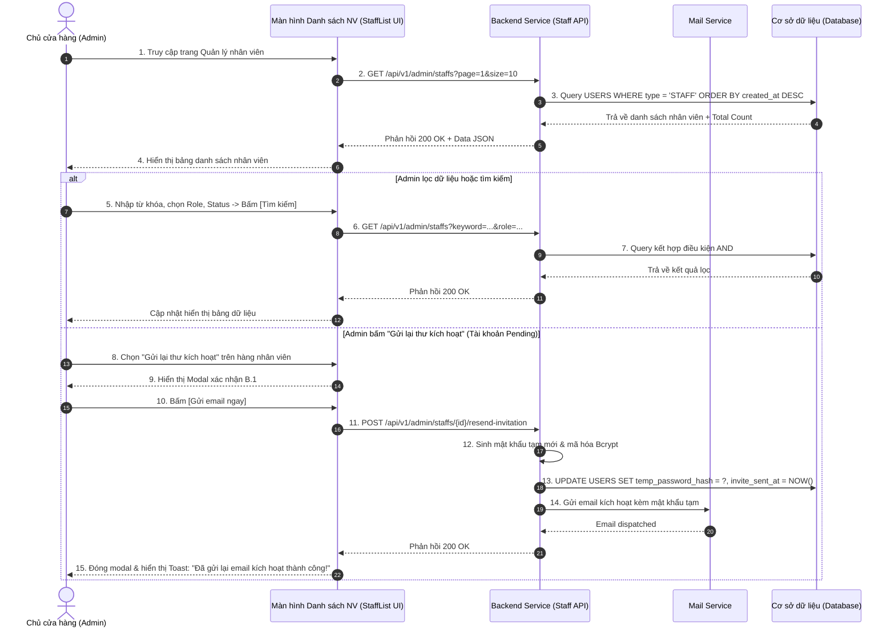

| Module | modules\account\admin\staff\list |
| ------ | --------------------------------- |
| Menu   | Trang chủ / Quản trị hệ thống / Quản lý nhân viên / Danh sách nhân viên (Admin / Staff Management) |
| Mô tả  | Dùng để cho phép **Chủ cửa hàng (Store Owner / Admin)** và Quản lý nhân sự tra cứu, theo dõi, tìm kiếm, lọc và quản lý toàn bộ tài khoản nhân viên nội bộ trong hệ thống. Màn hình cung cấp bộ lọc đa tiêu chí (Từ khóa, Vai trò, Trạng thái, Chi nhánh), hiển thị bảng dữ liệu nhân viên phân trang Server-side, cho phép chuyển hướng sang màn hình Tạo mới, Xem chi tiết/Phân quyền, thực hiện thao tác nhanh (Khóa/Mở khóa, Đặt lại mật khẩu, Gửi lại email kích hoạt cho tài khoản chờ) và Xuất dữ liệu nhân sự ra file Excel. Áp dụng style UI, layout, component theo **style chung của project**. |

**Tổng quan màn Danh sách và tìm kiếm tài khoản nhân viên (UC-01.11):**
- A. Danh sách nhân viên (Màn hình chính)
  - A.1. Bộ lọc tìm kiếm (Search Card)
  - A.2. Bảng dữ liệu danh sách nhân viên
  - A.3. Button chức năng trên thanh công cụ
  - A.4. Phân trang dữ liệu (Server-side Pagination)
- B. Modal Thao tác nhanh trên danh sách
  - B.1. Modal Xác nhận Gửi lại email kích hoạt (Resend Invitation Modal)
  - B.2. Modal Xác nhận Khóa nhanh tài khoản nhân viên
- C. Quy tắc nghiệp vụ (Business Rules)
  - BR-01: Phân quyền truy cập & Phạm vi dữ liệu (Data Scope & RBAC)
  - BR-02: Cơ chế tìm kiếm và kết hợp bộ lọc (Search & Multi-Filter Logic)
  - BR-03: Quy chuẩn trạng thái tài khoản nhân viên (Account Status Lifecycle)
  - BR-04: Quy tắc gửi lại thư kích hoạt (Resend Activation Rules)
  - BR-05: Quy tắc xuất dữ liệu nhân viên ra Excel (Export Policy)
- D. Luồng nghiệp vụ chi tiết (Workflows)
  - D.1. Luồng tra cứu, lọc và phân trang nhân viên (Main Flow)
  - D.2. Luồng gửi lại email kích hoạt cho nhân viên Pending
  - D.3. Luồng xuất file Excel danh sách nhân viên
  - D.4. Sơ đồ tuần tự nghiệp vụ (Sequence Diagram)
- E. Danh mục thông báo / Cảnh báo hệ thống (System Messages)

---

# A. Danh sách nhân viên (Màn hình chính)

## A.1. Bộ lọc tìm kiếm (Search Card)

| Tên | Loại dữ liệu | Bắt buộc | Mô tả | Mô tả Database | Độ dài |
| --- | ------------ | -------- | ----- | -------------- | ------ |
| Khung tìm kiếm | SearchCard | | Khung bao bọc bộ lọc ở phía trên danh sách. Cho phép kết hợp đồng thời nhiều điều kiện lọc (logic **AND**). | | |
| Từ khóa tìm kiếm | TextInput | | Cho phép nhập từ khóa tìm kiếm nhanh.  Placeholder: **"Tìm theo Tên, Email, SĐT hoặc Mã NV..."**.  Quy tắc tìm kiếm: Tìm kiếm dạng chứa từ khóa (`LIKE %keyword%`), không phân biệt hoa thường, áp dụng trên 4 trường: `FULL_NAME`, `EMAIL`, `PHONE_NUMBER`, `STAFF_CODE`. Nhấn **Enter** tương đương nhấn nút **"Tìm kiếm"**. | | 100 |
| Vai trò | MultiSelect | | Lọc danh sách theo vai trò chuyên môn của nhân viên.  Danh sách lựa chọn gồm: - **Admin** (Quản trị viên) - **NV Bán hàng (NVBH)** - **Kế toán** - **Shipper** (Nhân viên giao vận) - **KT Bán hàng (KTBH)** (Kỹ thuật bán hàng)  Placeholder: **"Tất cả vai trò"**. Hỗ trợ chọn nhiều (Multi-select), nút "Chọn tất cả" / "Bỏ chọn". | ROLE_CODE | 50 |
| Trạng thái | Select | | Lọc theo trạng thái hoạt động của tài khoản.  Danh sách tùy chọn: - **Tất cả** (Mặc định) - **Đang hoạt động (Active)**: Nhân viên đã kích hoạt và đang làm việc bình thường. - **Đang bị khóa (Locked)**: Tài khoản bị vô hiệu hóa tạm thời do kỷ luật/nghi ngờ bảo mật. - **Chờ kích hoạt (Pending)**: Đã tạo tài khoản, đã gửi mail mật khẩu tạm nhưng nhân viên chưa đăng nhập đổi pass lần đầu. - **Ngừng hoạt động / Thôi việc (Inactive)**: Nhân viên đã nghỉ việc/tự thôi việc, toàn bộ quyền truy cập bị thu hồi. | STATUS | 20 |
| Chi nhánh | Select | | Lọc theo chi nhánh/cửa hàng làm việc của nhân viên.  Danh sách lấy từ bảng danh mục chi nhánh `BRANCHES`.  Tùy chọn: **"Tất cả chi nhánh"** (Mặc định) hoặc chọn 1 chi nhánh cụ thể (VD: *Chi nhánh Quận 1*, *Chi nhánh Cầu Giấy*...). | BRANCH_ID | 20 |
| Làm mới | Button | | Button outline, icon refresh + label **"Làm mới"**.  Hành vi: Xóa toàn bộ từ khóa và các tiêu chí lọc về giá trị mặc định ("Tất cả"), tải lại trang 1 của danh sách gốc. | | |
| Tìm kiếm | Button | | Button primary, icon kính lúp + label **"Tìm kiếm"**.  Hành vi: Gửi request truy vấn dữ liệu thỏa mãn đồng thời các điều kiện lọc, reset trang hiện tại về trang 1. | | |

## A.2. Bảng dữ liệu danh sách nhân viên

| Tên | Loại dữ liệu | Bắt buộc | Mô tả | Mô tả Database | Độ dài |
| --- | ------------ | -------- | ----- | -------------- | ------ |
| Bảng nhân viên | DataTable | | Hiển thị danh sách kết quả nhân viên dưới dạng bảng dữ liệu có hỗ trợ sắp xếp theo cột và phân trang Server-side. | | |
| STT | Number | | Số thứ tự tăng dần từ 1 theo từng trang hiển thị: `(Trang hiện tại - 1) * Số bản ghi/trang + Index`. | | 10 |
| Mã NV | Hyperlink | | Mã định danh nhân viên (VD: `NV0012`, `NV0045`).  Hiển thị dạng link màu xanh đậm. Khi nhấp vào sẽ mở màn hình **Chi tiết & Phân quyền nhân viên** (`StaffDetail.md`). | STAFF_CODE | 20 |
| Nhân viên | UserCell / Avatar | | Hiển thị Avatar thu nhỏ (kích thước 36x36px) kèm Họ và tên đầy đủ của nhân viên (`FULL_NAME`). Nếu chưa có avatar hiển thị avatar ký tự viết tắt. | FULL_NAME / AVATAR_URL | 100 |
| Số điện thoại | Text | | Số điện thoại liên hệ công việc của nhân viên (VD: `0988 123 456`). | PHONE_NUMBER | 15 |
| Email công việc | Text | | Địa chỉ email công việc dùng để nhận thông báo và đăng nhập hệ thống (VD: `van.a@aqs.vn`). | EMAIL | 255 |
| Vai trò | Tag / Badge | | Hiển thị các vai trò được phân quyền của nhân viên dưới dạng Badge màu phân biệt: - **Admin**: Màu tím đậm (`#722ed1`) - **NV Bán hàng**: Màu xanh dương (`#1890ff`) - **Kế toán**: Màu xanh lá (`#52c41a`) - **Shipper**: Màu cam (`#fa8c16`) - **KT Bán hàng**: Màu ngọc lam (`#13c2c2`) | ROLES | 100 |
| Chi nhánh | Text | | Tên chi nhánh nơi nhân viên được phân công công tác. Nếu là Admin toàn quyền hiển thị: *"Toàn hệ thống"*. | BRANCH_NAME | 100 |
| Trạng thái | Tag / StatusBadge | | Tag màu thể hiện trạng thái tài khoản: - **Đang hoạt động**: Tag xanh lục (Green) - `Active` - **Đang bị khóa**: Tag đỏ (Red) - `Locked` - **Chờ kích hoạt**: Tag vàng cam (Orange) - `Pending` - **Ngừng hoạt động / Thôi việc**: Tag màu xám (Gray) - `Inactive` | STATUS | 20 |
| Lần đăng nhập cuối | DateTime | | Thời điểm gần nhất nhân viên đăng nhập vào hệ thống. Định dạng: `DD/MM/YYYY HH:mm`. Nếu chưa từng đăng nhập hiển thị: *"--"*. | LAST_LOGIN_AT | DATETIME |
| Thao tác | ActionMenu | | Dropdown menu thao tác nhanh cho từng dòng bản ghi (icon 3 chấm `...`): 1. **Xem chi tiết / Sửa**: Chuyển đến `StaffDetail.md`. 2. **Gửi lại thư kích hoạt**: Chỉ hiển thị khi trạng thái là `Pending` (Mở modal B.1). 3. **Đặt lại mật khẩu**: Mở modal cấp lại pass nhanh. 4. **Khóa tài khoản**: Hiển thị khi tài khoản đang `Active` (Mở modal B.2). 5. **Mở khóa tài khoản**: Hiển thị khi tài khoản đang `Locked`. 6. **Đánh dấu Thôi việc (Inactive)**: Hiển thị khi nhân viên nghỉ việc/tự thôi việc (Mở modal xác nhận chuyển sang Inactive). 7. **Kích hoạt lại**: Hiển thị khi tài khoản đang `Inactive` (nhân viên trở lại làm việc). | | |

## A.3. Button chức năng trên thanh công cụ

Nằm ở góc trên bên phải của bảng danh sách:

| Tên | Loại dữ liệu | Bắt buộc | Mô tả |
| --- | ------------ | -------- | ----- |
| Thêm nhân viên | Button | | Button Primary, màu cam thương hiệu, icon dấu cộng `+` + label **"Thêm nhân viên"**.  Hành vi: Điều hướng người dùng sang màn hình [Tạo tài khoản nhân viên](file:///E:/FA26/Capstone/Aqs-ba/docs/Fe-01/Admin/Staff/StaffCreate.md). |
| Xuất Excel | Button | | Button Outline, icon file excel + label **"Xuất Excel"**.  Hành vi: Tải về file `.xlsx` danh sách nhân viên theo đúng điều kiện bộ lọc hiện tại (tối đa 5.000 dòng/lần xuất). |

## A.4. Phân trang dữ liệu (Server-side Pagination)

| Tên | Loại | Mô tả |
| --- | ---- | ----- |
| Tổng số bản ghi | Text | Hiển thị: *"Tổng số: **{total}** nhân viên"* ở góc trái footer bảng. |
| Chọn số dòng/trang | Select | Dropdown cho phép chọn: **10** (mặc định), **20**, **50**, **100** dòng/trang. |
| Bộ điều hướng trang | Pagination | Hiển thị nút Previous, các nút số trang `1, 2, 3...`, nút Next. Bấm chuyển trang sẽ gọi API lấy trang tương ứng. |

---

# B. Modal Thao tác nhanh trên danh sách

## B.1. Modal Xác nhận Gửi lại email kích hoạt (Resend Invitation Modal)

Hiển thị khi Admin bấm chọn thao tác *"Gửi lại thư kích hoạt"* đối với dòng nhân viên đang ở trạng thái `Pending`:

| Tên | Loại thành phần | Mô tả chi tiết |
| --- | --------------- | -------------- |
| Tiêu đề Modal | Modal Title | **"Gửi lại email kích hoạt tài khoản"** |
| Nội dung xác nhận | Text | *"Hệ thống sẽ tạo một mật khẩu tạm thời mới và gửi lại email kích hoạt tới hòm thư **{EMAIL}** của nhân viên **{FULL_NAME}** (Mã NV: **{STAFF_CODE}**). Mật khẩu tạm thời cũ sẽ lập tức bị vô hiệu hóa. Bạn có chắc chắn muốn gửi lại không?"* |
| Nút Hủy | Button (Secondary) | Label **"Hủy bỏ"** - Đóng modal, không thực hiện gửi. |
| Nút Xác nhận | Button (Primary) | Label **"Gửi email ngay"** - Gọi API sinh mật khẩu tạm thời mới, gửi email kích hoạt, hiển thị Toast thành công: *"Đã gửi lại email kích hoạt thành công!"*. |

## B.2. Modal Xác nhận Khóa nhanh tài khoản nhân viên

Hiển thị khi Admin bấm chọn thao tác *"Khóa tài khoản"* tại cột thao tác:

| Tên | Loại thành phần | Mô tả chi tiết |
| --- | --------------- | -------------- |
| Tiêu đề Modal | Modal Title | **"Khóa tài khoản nhân viên"** (Icon cảnh báo màu đỏ) |
| Tóm tắt nhân viên | Alert Box | Hiển thị Mã NV, Họ tên, Vai trò hiện tại của nhân viên chuẩn bị khóa. |
| Cảnh báo an toàn | Text Warning | *"Cảnh báo: Toàn bộ phiên làm việc (Session/Token) hiện tại của nhân viên này sẽ bị thu hồi ngay lập tức. Nhân viên sẽ bị đăng xuất khỏi hệ thống ngay tại thao tác tiếp theo."* |
| Lý do khóa | TextArea (Bắt buộc) | Ô nhập văn bản đa dòng (tối thiểu 10 ký tự, tối đa 500 ký tự). Placeholder: *"Nhập lý do khóa tài khoản để phục vụ kiểm toán nội bộ (VD: Tạm đình chỉ công tác, nghỉ việc, nghi ngờ lộ tài khoản...)"*. |
| Nút Hủy | Button | Label **"Hủy"** - Đóng modal. |
| Nút Xác nhận Khóa | Button (Danger) | Label **"Xác nhận khóa"** - Bị disable nếu chưa nhập lý do. Khi bấm: Gọi API cập nhật trạng thái `Locked`, thu hồi token, ghi Audit Log, reload bảng. |

---

# C. Quy tắc nghiệp vụ (Business Rules)

## BR-01: Phân quyền truy cập & Phạm vi dữ liệu (Data Scope & RBAC)
1. **Quyền truy cập màn hình:** Chỉ người dùng có vai trò `Admin` (Chủ cửa hàng hoặc Quản trị viên hệ thống) mới có quyền truy cập vào phân hệ này.
2. **Phạm vi hiển thị dữ liệu (Data Scope):**
   - **Chủ cửa hàng / Super Admin:** Xem được toàn bộ danh sách nhân viên thuộc tất cả các chi nhánh trên toàn hệ thống.
   - **Quản lý chi nhánh (Store Manager):** Chỉ được xem danh sách nhân viên thuộc chi nhánh mà mình phụ trách; không xem được tài khoản Admin cấp cao hơn.

## BR-02: Cơ chế tìm kiếm và kết hợp bộ lọc (Search & Multi-Filter Logic)
1. Tất cả các điều kiện lọc trên `SearchCard` được kết hợp với nhau theo phép toán logic **AND**:
   - `FULL_NAME LIKE %kw% OR EMAIL LIKE %kw% OR PHONE_NUMBER LIKE %kw% OR STAFF_CODE LIKE %kw%`
   - VÀ `ROLE IN (selected_roles)` (nếu có chọn)
   - VÀ `STATUS = selected_status` (nếu khác "Tất cả")
   - VÀ `BRANCH_ID = selected_branch` (nếu khác "Tất cả").
2. Kết quả trả về được sắp xếp mặc định theo `CREATED_AT DESC` (nhân viên mới tạo hiển thị lên đầu).

## BR-03: Quy chuẩn trạng thái tài khoản nhân viên (Account Status Lifecycle)
1. `Pending` (Chờ kích hoạt): Tài khoản mới được tạo bởi Admin, hệ thống đã gửi email kèm mật khẩu tạm thời. Nhân viên chưa từng đăng nhập đổi mật khẩu lần đầu.
2. `Active` (Đang hoạt động): Tài khoản đã hoàn tất bước đổi mật khẩu lần đầu và đang có quyền đăng nhập làm việc bình thường.
3. `Locked` (Đang bị khóa): Tài khoản bị Admin khóa chủ động (kèm lý do) hoặc bị hệ thống khóa tự động do nhập sai mật khẩu quá 5 lần liên tiếp. Tài khoản không thể đăng nhập.
4. `Inactive` (Ngừng hoạt động / Thôi việc): Áp dụng khi nhân viên tự xin thôi việc, chấm dứt hợp đồng lao động hoặc nghỉ việc. Toàn bộ phiên làm việc/Token bị thu hồi ngay lập tức, tài khoản không thể đăng nhập vào hệ thống quản trị và không xuất hiện trong danh sách phân công mới. Có thể kích hoạt lại nếu nhân viên quay trở lại làm việc.
5. **Chính sách Không xóa cứng (No Hard Delete):** Hệ thống tuyệt đối không cung cấp tính năng xóa vĩnh viễn nhân viên khỏi CSDL để bảo toàn toàn vẹn dữ liệu đơn hàng, phiếu thu, hóa đơn đã từng được lập bởi nhân viên đó trong quá khứ.

## BR-04: Quy tắc gửi lại thư kích hoạt (Resend Activation Rules)
1. Chỉ cho phép gửi lại thư kích hoạt đối với các tài khoản đang ở trạng thái `Pending`.
2. Giới hạn tần suất (Rate Limit): Mỗi tài khoản chỉ được gửi lại tối đa 3 lần trong vòng 15 phút để chống spam email.
3. Mỗi lần gửi lại, hệ thống hủy mã mật khẩu tạm cũ và sinh mã mật khẩu tạm ngẫu nhiên mới (hiệu lực 24 giờ).

## BR-05: Quy tắc xuất dữ liệu nhân viên ra Excel (Export Policy)
1. Dữ liệu xuất ra file Excel lấy chính xác theo kết quả của bộ lọc đang áp dụng trên màn hình.
2. Định dạng file xuất: `.xlsx`, tên file chuẩn: `Danh_sach_nhan_vien_YYYYMMDD_HHmmss.xlsx`.
3. Các cột xuất: STT, Mã NV, Họ tên, SĐT, Email công việc, Vai trò, Chi nhánh, Trạng thái, Ngày tạo, Lần đăng nhập cuối. Không xuất mật khẩu hay dữ liệu nhạy cảm.

---

# D. Luồng nghiệp vụ chi tiết (Workflows)

## D.1. Luồng tra cứu, lọc và phân trang nhân viên (Main Flow)

- **Bước 1:** Chủ cửa hàng vào menu **Quản trị hệ thống** $\rightarrow$ chọn **Quản lý nhân viên**.
- **Bước 2:** Hệ thống tải dữ liệu trang 1 (mặc định 10 dòng/trang, sắp xếp theo ngày tạo mới nhất), hiển thị lên bảng dữ liệu kèm tổng số nhân viên.
- **Bước 3:** Chủ cửa hàng nhập từ khóa tìm kiếm (Tên/SĐT/Mã NV) và/hoặc chọn Vai trò, Chi nhánh, Trạng thái cần lọc.
- **Bước 4:** Chủ cửa hàng nhấn nút **"Tìm kiếm"** (hoặc gõ Enter).
- **Bước 5:** Hệ thống gửi request `GET /api/v1/admin/staffs?page=1&size=10&keyword=...&role=...&status=...`.
- **Bước 6:** Backend truy vấn CSDL và trả về danh sách bản ghi thỏa mãn kèm phân trang. Bảng dữ liệu cập nhật hiển thị kết quả.

## D.2. Luồng gửi lại email kích hoạt cho nhân viên Pending

- **Bước 1:** Tại dòng nhân viên có trạng thái `Pending`, Admin bấm vào icon `...` ở cột Thao tác, chọn **"Gửi lại thư kích hoạt"**.
- **Bước 2:** Hệ thống mở Modal xác nhận B.1.
- **Bước 3:** Admin kiểm tra thông tin email hiển thị trên modal và bấm nút **"Gửi email ngay"**.
- **Bước 4:** Hệ thống gọi API `POST /api/v1/admin/staffs/{id}/resend-invitation`.
- **Bước 5:** Backend tạo chuỗi mật khẩu ngẫu nhiên mới, cập nhật hash vào CSDL, kích hoạt gửi email qua Mail Service.
- **Bước 6:** Hệ thống đóng modal và hiển thị Toast xanh: *"Đã gửi lại email kích hoạt thành công!"*.

## D.3. Luồng xuất file Excel danh sách nhân viên

- **Bước 1:** Admin thiết lập các tiêu chí lọc mong muốn trên `SearchCard` (hoặc để trống để xuất toàn bộ).
- **Bước 2:** Admin bấm nút **"Xuất Excel"** trên thanh công cụ.
- **Bước 3:** Nút chuyển sang trạng thái Loading. Hệ thống gọi API `GET /api/v1/admin/staffs/export?filters...`.
- **Bước 4:** Backend truy vấn dữ liệu, kết xuất file Excel định dạng `.xlsx` và trả về dạng stream/binary.
- **Bước 5:** Trình duyệt tự động tải file xuống máy tính người dùng. Nút quay lại trạng thái bình thường.

## D.4. Sơ đồ tuần tự nghiệp vụ (Sequence Diagram)

---

# E. Danh mục thông báo / Cảnh báo hệ thống (System Messages)

| Mã thông báo | Loại hiển thị | Nội dung thông báo | Điều kiện xuất hiện |
| ------------ | ------------- | ------------------ | ------------------- |
| `MSG_STFL_01` | Toast Success | *Đã gửi lại email kích hoạt cho nhân viên thành công!* | Gửi lại email kích hoạt tài khoản `Pending` thành công. |
| `MSG_STFL_02` | Toast Warning | *Thao tác quá nhanh. Bạn chỉ có thể gửi lại email kích hoạt sau 1 phút.* | Vi phạm giới hạn tần suất gửi lại email kích hoạt (Rate Limit). |
| `MSG_STFL_03` | Toast Success | *Khóa tài khoản nhân viên thành công!* | Thực hiện thao tác khóa tài khoản nhân viên thành công từ Modal B.2. |
| `MSG_STFL_04` | Toast Success | *Mở khóa tài khoản nhân viên thành công!* | Mở khóa tài khoản nhân viên thành công từ Action Menu. |
| `MSG_STFL_05` | Inline Error  | *Vui lòng nhập lý do khóa tài khoản (tối thiểu 10 ký tự).* | Để trống hoặc nhập dưới 10 ký tự lý do khóa trong Modal B.2. |
| `MSG_STFL_06` | Toast Error   | *Không thể khóa tài khoản của chính mình.* | Chủ cửa hàng cố tình thực hiện thao tác khóa tài khoản đang đăng nhập. |
| `MSG_STFL_07` | Toast Info    | *Đang xuất dữ liệu danh sách nhân viên, vui lòng đợi trong giây lát...* | Khi người dùng nhấn nút "Xuất Excel". |
| `MSG_STFL_08` | Toast Error   | *Có lỗi xảy ra trong quá trình tải dữ liệu. Vui lòng thử lại sau.* | Lỗi mạng hoặc lỗi hệ thống backend khi tải danh sách. |
