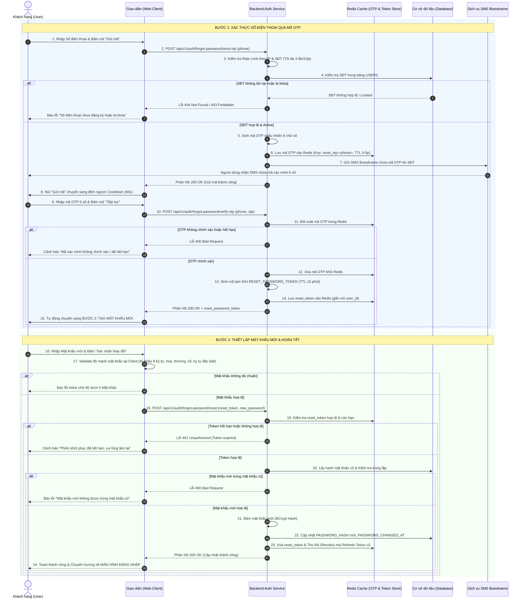

| Module | modules\authentication\common\forgot-password |
| ------ | --------------------------------------------- |
| Menu   | Trang chủ / Quên mật khẩu (Common / Forgot Password) |
| Mô tả  | Dùng để cho phép đối tượng **Khách hàng / Người dùng hệ thống (Customer / User)** thực hiện khôi phục mật khẩu khi bị quên thông qua số điện thoại chính chủ đã đăng ký. Quy trình khôi phục được triển khai tinh gọn và bảo mật qua 2 bước: (1) Nhập Số điện thoại $\rightarrow$ Nhận và xác thực mã OTP gồm 6 chữ số gửi qua SMS Brandname (hiệu lực 3–5 phút, chống spam tối đa 3 lần/10 phút); (2) Thiết lập Mật khẩu mới (chỉ nhập 1 lần kèm icon mắt ẩn/hiện, đáp ứng độ mạnh tối thiểu 8 ký tự trở lên). Sau khi đổi mật khẩu thành công, hệ thống tự động vô hiệu hóa toàn bộ phiên làm việc cũ trên các thiết bị khác để bảo vệ tài khoản, băm mật khẩu mới an toàn và điều hướng người dùng quay về màn hình Đăng nhập `docs/Fe-01/Common/Login.md` kèm thông báo thành công. Áp dụng style UI, layout, component theo **style chung của project**. |

**Tổng quan luồng Khôi phục mật khẩu (UC-01.03):**
- A. Bước 1: Màn hình Yêu cầu khôi phục & Xác thực OTP
  - A.1. Header form Bước 1
  - A.2. Thông tin các trường dữ liệu Bước 1
  - A.3. Button và điều hướng Bước 1
- B. Bước 2: Màn hình Thiết lập Mật khẩu mới
  - B.1. Header form Bước 2
  - B.2. Thông tin các trường dữ liệu Bước 2
  - B.3. Button và thao tác hoàn tất Bước 2
- C. Quy tắc nghiệp vụ (Business Rules)
  - BR-01: Kiểm tra tính tồn tại & Trạng thái của Số điện thoại
  - BR-02: Cơ chế nút "Gửi mã" & Xác thực mã OTP qua SMS
  - BR-03: Cơ chế chống Spam & Giới hạn tần suất gửi mã
  - BR-04: Cấp phát Token đặt lại mật khẩu (Reset Password Token)
  - BR-05: Quy chuẩn Mật khẩu mới & Chống trùng mật khẩu cũ
  - BR-06: Vô hiệu hóa phiên đăng nhập cũ & Cập nhật mật khẩu an toàn
  - BR-07: Điều hướng sau khi đổi mật khẩu thành công
- D. Luồng nghiệp vụ chi tiết (Workflows)
  - D.1. Luồng chính (Main Flow - Happy Path)
  - D.2. Luồng ngoại lệ & Luồng thay thế (Alternative & Exception Flows)
  - D.3. Sơ đồ tuần tự nghiệp vụ (Sequence Diagram)
- E. Danh mục thông báo / Cảnh báo hệ thống (System Messages)

---

# A. Bước 1: Màn hình Yêu cầu khôi phục & Xác thực OTP

Giao diện Bước 1 được thiết kế dạng thẻ trung tâm (Card Layout) tối giản, đồng bộ với phong cách màn hình Đăng ký và Đăng nhập. Trọng tâm của bước này là xác minh danh tính người dùng thông qua mã OTP gửi về số điện thoại.

## A.1. Header form Bước 1

| Tên | Loại dữ liệu | Bắt buộc | Mô tả |
| --- | ------------ | -------- | ----- |
| Tiêu đề Form | Title | | Tiêu đề lớn: **"Quên mật khẩu"**. Bên dưới có dòng phụ đề hướng dẫn: *"Nhập số điện thoại đã đăng ký để nhận mã xác minh khôi phục mật khẩu."* |
| Liên kết Quay lại | Hyperlink | | Nằm ở góc trên bên phải hoặc chân form. Text màu cam/đỏ thương hiệu: **"Đăng nhập"**.<br><br>Thao tác: Nhấp vào sẽ hủy luồng quên mật khẩu và quay về màn hình Đăng nhập `docs/Fe-01/Common/Login.md`. |

## A.2. Thông tin các trường dữ liệu Bước 1

| Tên | Loại dữ liệu | Bắt buộc | Mô tả | Mô tả Database | Độ dài |
| --- | ------------ | -------- | ----- | -------------- | ------ |
| Số điện thoại | TextInput | x | Ô nhập số điện thoại di động đã đăng ký tài khoản cần khôi phục mật khẩu. Không sử dụng mã quốc gia, áp dụng trực tiếp đầu số Việt Nam.<br><br>Placeholder: **"Nhập số điện thoại của bạn"**.<br><br>Quy tắc kiểm tra (Validate):<br>- Không được để trống.<br>- Chỉ chấp nhận ký tự số (`0-9`), tự động chặn nhập chữ và ký tự đặc biệt.<br>- Đúng định dạng 10 chữ số, bắt đầu bằng các đầu số nhà mạng di động hợp lệ tại Việt Nam: `03`, `05`, `07`, `08`, `09` (Regex: `^(03\|05\|07\|08\|09)[0-9]{8}$`).<br>- Tự động trim khoảng trắng thừa.<br>- Kiểm tra số điện thoại phải tồn tại trong CSDL và đang ở trạng thái `Active` theo quy tắc **BR-01** (thực hiện khi bấm nút "Gửi mã" hoặc khi bấm nút "Tiếp tục").<br><br>Cảnh báo lỗi inline dưới ô nhập:<br>- Để trống: *Vui lòng nhập số điện thoại.*<br>- Sai định dạng: *Số điện thoại không hợp lệ (gồm 10 chữ số, bắt đầu bằng 03, 05, 07, 08, 09).*<br>- Không tồn tại: *Số điện thoại này chưa được đăng ký trong hệ thống.* | PHONE_NUMBER | 15 |
| Nút Gửi mã xác nhận | Button (Inline) | x | Nút bấm được nhúng tích hợp nằm ở cạnh phải bên trong/cùng hàng với ô nhập **Số điện thoại**.<br><br>Label mặc định: **"Gửi mã"**.<br><br>Trạng thái & Xử lý:<br>- Disabled nếu ô Số điện thoại chưa nhập đủ 10 số hợp lệ.<br>- Khi bấm: Validate SĐT $\rightarrow$ Kiểm tra SĐT tồn tại trong DB $\rightarrow$ Kiểm tra rate limit IP/SĐT theo **BR-03**.<br>- Nếu thỏa mãn: Gửi mã OTP 6 số qua SMS Brandname. Nút chuyển sang trạng thái đếm ngược: **"Gửi lại sau (X)s"** (với X đếm ngược từ 60 về 0) và tạm thời bị vô hiệu hóa cho đến khi hết 60s cooldown. | Không lưu DB (Chỉ trigger API gửi SMS OTP) | |
| Mã xác minh | NumberInput | x | Ô nhập mã OTP gồm 6 chữ số mà người dùng nhận được từ tin nhắn SMS.<br><br>Placeholder: **"Nhập mã xác minh 6 chữ số"**.<br><br>Quy tắc kiểm tra (Validate):<br>- Không được để trống.<br>- Chỉ chấp nhận ký tự số (`0-9`), độ dài đúng 6 ký tự số.<br>- Hỗ trợ tự động dán (Auto-paste) 6 chữ số từ Clipboard hoặc tự động điền SMS OTP trên thiết bị di động (WebOTP API).<br>- Kiểm tra mã khớp với mã OTP đã sinh trong cache và còn thời hạn hiệu lực (3–5 phút) theo quy tắc **BR-02**.<br><br>Cảnh báo lỗi inline dưới ô nhập:<br>- Để trống: *Vui lòng nhập mã xác minh.*<br>- Chưa đủ 6 số: *Mã xác minh phải gồm 6 chữ số.*<br>- Mã không đúng: *Mã xác minh không chính xác. Bạn còn [X] lần thử.*<br>- Mã hết hạn: *Mã xác minh đã hết hiệu lực. Vui lòng bấm "Gửi mã" để nhận mã mới.* | OTP_CODE (Lưu trữ tạm thời trong Redis/Cache kèm TTL) | 6 |

## A.3. Button và điều hướng Bước 1

| Tên | Loại dữ liệu | Bắt buộc | Mô tả |
| --- | ------------ | -------- | ----- |
| Tiếp tục | Button | | Button chính (Primary Button), full-width, đặt ở cuối form, label: **"Tiếp tục"**.<br><br>Điều kiện & Xử lý:<br>- Khi bấm: Hệ thống kiểm tra validate Số điện thoại và Mã xác minh.<br>- Nếu có lỗi: Hiển thị cảnh báo inline màu đỏ dưới trường lỗi.<br>- Nếu dữ liệu hợp lệ: Nút chuyển sang trạng thái Loading (spinner + disable). Hệ thống đối soát mã OTP trong cache/Redis $\rightarrow$ Nếu chính xác, sinh mã cấp quyền đặt lại mật khẩu (`RESET_PASSWORD_TOKEN` theo **BR-04**) $\rightarrow$ Tự động chuyển giao diện sang **Bước 2: Thiết lập Mật khẩu mới (Mục B)**. |
| Quay lại Đăng nhập | Hyperlink | | Dòng liên kết chân trang: *"Nhớ lại mật khẩu? **Đăng nhập ngay**".*<br><br>Thao tác: Nhấp vào sẽ điều hướng về màn hình Đăng nhập `docs/Fe-01/Common/Login.md`. |

---

# B. Bước 2: Màn hình Thiết lập Mật khẩu mới

Sau khi người dùng vượt qua bước xác thực OTP ở Bước 1, giao diện chuyển tiếp mượt mà (In-place Transition) sang màn hình Bước 2. Người dùng tiến hành thiết lập mật khẩu mới cho tài khoản.

## B.1. Header form Bước 2

| Tên | Loại dữ liệu | Bắt buộc | Mô tả |
| --- | ------------ | -------- | ----- |
| Tiêu đề Form | Title | | Tiêu đề lớn: **"Tạo mật khẩu mới"**. Bên dưới có dòng phụ đề: *"Thiết lập mật khẩu mới cho số điện thoại **0987\*\*\*321** để hoàn tất khôi phục."* (SĐT được che giấu bảo mật). |

## B.2. Thông tin các trường dữ liệu Bước 2

| Tên | Loại dữ liệu | Bắt buộc | Mô tả | Mô tả Database | Độ dài |
| --- | ------------ | -------- | ----- | -------------- | ------ |
| Mật khẩu mới | PasswordInput | x | Ô thiết lập mật khẩu mới cho tài khoản. **Chỉ cần nhập 1 lần duy nhất** (không yêu cầu nhập lại xác nhận).<br><br>Placeholder: **"Nhập mật khẩu mới"**.<br><br>Mặc định ẩn dưới dạng ký tự chấm tròn bảo mật (`••••••••`). Có icon hình con mắt ở góc phải ô nhập để bật/tắt hiển thị mật khẩu rõ.<br><br>Quy tắc kiểm tra (Validate) theo **BR-05**:<br>- Không được để trống.<br>- Độ dài **tối thiểu 8 ký tự trở lên** (chuẩn hóa toàn hệ thống).<br>- Phải bao gồm đồng thời ít nhất: 1 chữ cái in hoa (`A-Z`), 1 chữ cái in thường (`a-z`), 1 chữ số (`0-9`) và 1 ký tự đặc biệt (`!@#$%^&*()_+-=[]{}|;:,.<>?`).<br>- Không chứa khoảng trắng.<br>- Không được trùng khớp với mật khẩu cũ gần nhất (theo **BR-05**).<br>- Hiển thị thanh đo độ mạnh mật khẩu (Password Strength Bar: Yếu / Trung bình / Mạnh) theo thời gian thực.<br><br>Cảnh báo lỗi inline dưới ô nhập:<br>- Để trống: *Vui lòng nhập mật khẩu mới.*<br>- Không đủ chuẩn: *Mật khẩu phải dài từ 8 ký tự trở lên, bao gồm 1 chữ viết hoa, 1 chữ viết thường, số và ký tự đặc biệt.*<br>- Trùng mật khẩu cũ: *Mật khẩu mới không được trùng với mật khẩu gần nhất của bạn.* | PASSWORD_HASH (Băm bằng thuật toán BCrypt hoặc Argon2id) | 255 |

## B.3. Button và thao tác hoàn tất Bước 2

| Tên | Loại dữ liệu | Bắt buộc | Mô tả |
| --- | ------------ | -------- | ----- |
| Xác nhận thay đổi | Button | | Button chính (Primary Button), full-width, đặt ở cuối form, label: **"Xác nhận thay đổi"**.<br><br>Điều kiện & Xử lý:<br>- Khi bấm: Validate Mật khẩu mới và kiểm tra tính hợp lệ của `RESET_PASSWORD_TOKEN` nhận từ Bước 1.<br>- Nếu hợp lệ: Nút chuyển sang trạng thái Loading (spinner + disable). Hệ thống thực hiện băm mật khẩu mới $\rightarrow$ Cập nhật vào CSDL $\rightarrow$ Vô hiệu hóa toàn bộ phiên làm việc cũ trên các thiết bị khác (theo **BR-06**) $\rightarrow$ Hiển thị thông báo Toast thành công và tự động điều hướng người dùng về màn hình Đăng nhập `docs/Fe-01/Common/Login.md` (theo **BR-07**). |
| Ẩn / Hiện mật khẩu | Button icon | | Icon hình con mắt nằm bên trong góc phải ô Mật khẩu mới.<br><br>Thao tác: Nhấp vào để chuyển đổi qua lại giữa dạng ký tự ẩn `••••••` và dạng văn bản rõ, giúp người dùng chủ động kiểm tra chính xác mật khẩu vừa gõ. |

---

# C. Quy tắc nghiệp vụ (Business Rules)

## BR-01: Kiểm tra tính tồn tại & Trạng thái của Số điện thoại
1. **Kiểm tra tồn tại:** Khi người dùng bấm nút "Gửi mã" hoặc nút "Tiếp tục" ở Bước 1, hệ thống truy vấn kiểm tra Số điện thoại trong bảng `USERS`.
2. **Xử lý theo trạng thái tài khoản:**
   - **Tài khoản tồn tại và có `STATUS = 'Active'`:** Hợp lệ, cho phép gửi mã OTP và tiếp tục luồng khôi phục.
   - **Số điện thoại chưa từng đăng ký:** Báo lỗi inline: *"Số điện thoại này chưa được đăng ký trong hệ thống. Vui lòng kiểm tra lại hoặc đăng ký tài khoản mới."* Hệ thống không gửi SMS để tiết kiệm chi phí viễn thông.
   - **Tài khoản đang bị khóa (`Locked`):** Chặn tiến trình, báo lỗi: *"Tài khoản gắn với số điện thoại này hiện đang bị khóa. Vui lòng liên hệ bộ phận hỗ trợ khách hàng."*
   - **Tài khoản ngừng hoạt động (`Inactive`):** Báo lỗi: *"Tài khoản hiện đang tạm ngừng hoạt động."*

## BR-02: Cơ chế nút "Gửi mã" & Xác thực mã OTP qua SMS
1. **Quy trình sinh và gửi mã:**
   - Khi người dùng nhấn nút **"Gửi mã"**:
     + Hệ thống sinh mã OTP ngẫu nhiên gồm đúng **6 chữ số** (`0-9`) bằng thuật toán ngẫu nhiên an toàn (CSPRNG).
     + Lưu mã OTP vào bộ nhớ đệm (Redis Cache) gắn liền với Số điện thoại với thời gian sống (TTL): **3 đến 5 phút** (mặc định 180 giây).
     + Gửi tin nhắn SMS Brandname chứa mã OTP tới số điện thoại của người dùng.
   - Nút **"Gửi mã"** lập tức chuyển sang trạng thái đếm ngược thời gian hồi (Cooldown) 60 giây: `Gửi lại sau (60s)`. Trong thời gian cooldown, nút bị vô hiệu hóa.
2. **Xác thực mã OTP:**
   - Khi người dùng bấm nút **"Tiếp tục"**: Mã xác minh người dùng nhập phải khớp 100% với mã OTP đang có hiệu lực trong cache.
   - Cho phép nhập sai tối đa **5 lần**. Nếu nhập sai lần thứ 5, mã OTP hiện tại bị hủy bỏ ngay lập tức để chống dò mã (Brute-Force Attack), yêu cầu người dùng phải bấm "Gửi mã" lại từ đầu.
   - Nếu mã OTP đã hết hạn (> 3–5 phút): Báo lỗi mã hết hạn và yêu cầu nhấn gửi lại mã mới.
   - Mỗi mã OTP chỉ có giá trị sử dụng duy nhất **1 lần (One-Time Use)**. Sau khi xác thực thành công, mã lập tức bị hủy khỏi cache.

## BR-03: Cơ chế chống Spam & Giới hạn tần suất gửi mã
1. **Giới hạn số lần gửi mã (Resend Rate Limit):**
   - Giới hạn tối đa **3 lần gửi mã OTP trong vòng 10 phút** cho cùng một Số điện thoại.
   - Khoảng cách giữa 2 lần gửi mã liên tiếp (Cooldown) tối thiểu là **60 giây**.
   - Nếu vượt quá 3 lần/10 phút: Khóa tính năng gửi mã của SĐT đó trong vòng 10 phút, hiển thị cảnh báo: *"Bạn đã yêu cầu gửi mã quá 3 lần trong 10 phút. Vui lòng thử lại sau [Z] phút."*
2. **Khóa tạm thời theo địa chỉ IP (IP Rate Limiting):**
   - Giám sát tần suất gửi yêu cầu từ mỗi địa chỉ IP của Client.
   - Nếu 1 địa chỉ IP gửi vượt quá **10 yêu cầu gửi mã/khôi phục mật khẩu trong vòng 5 phút**: Hệ thống tạm khóa quyền gửi request của IP này trong thời gian **15–30 phút**, trả về HTTP status `429 Too Many Requests`.

## BR-04: Cấp phát Token đặt lại mật khẩu (Reset Password Token)
Nhằm đảm bảo an toàn tuyệt đối, hệ thống tách biệt giữa bước xác thực OTP và bước lưu mật khẩu mới:
1. Khi người dùng nhập đúng mã OTP ở Bước 1, hệ thống không cập nhật mật khẩu ngay mà sinh ra một mã xác thực tạm thời: `RESET_PASSWORD_TOKEN` (chuỗi UUIDv4 ngẫu nhiên hoặc JWT signed an toàn).
2. Token này được lưu tạm trong Redis Cache gắn liền với `user_id` và `phone_number`, có thời hạn hiệu lực tối đa **10 đến 15 phút**.
3. Frontend nhận token này và đính kèm vào header/body của request đổi mật khẩu ở Bước 2. Backend chỉ chấp nhận yêu cầu cập nhật mật khẩu khi token này hợp lệ và còn hạn.
4. Ngay sau khi đổi mật khẩu thành công, `RESET_PASSWORD_TOKEN` bị hủy ngay lập tức (không thể tái sử dụng).

## BR-05: Quy chuẩn Mật khẩu mới & Chống trùng mật khẩu cũ
1. **Quy chuẩn độ mạnh (Chuẩn hóa toàn hệ thống):** Mật khẩu mới phải có độ dài **tối thiểu 8 ký tự trở lên** (không giới hạn tối đa cứng, khuyến nghị ≤ 128 ký tự), bao gồm ít nhất: 1 chữ cái in hoa (`A-Z`), 1 chữ cái in thường (`a-z`), 1 chữ số (`0-9`) và 1 ký tự đặc biệt (`!@#$%^&*()_+-=[]{}|;:,.<>?/~`). Không chứa khoảng trắng. Regex kiểm tra: `^(?=.*[a-z])(?=.*[A-Z])(?=.*\d)(?=.*[@#$%^&*!()_+\-=\[\]{}|;':",.<>?/~]).{8,}$`.
2. **Chống trùng mật khẩu cũ:** Hệ thống đối soát mật khẩu mới với chuỗi băm của mật khẩu hiện tại trong CSDL. Nếu trùng khớp, từ chối cập nhật và báo lỗi: *"Mật khẩu mới không được trùng với mật khẩu gần nhất của bạn. Vui lòng chọn mật khẩu khác."*
3. **Mã hóa an toàn:** Mật khẩu mới bắt buộc phải được băm bằng thuật toán an toàn một chiều (BCrypt với salt rounds >= 10 hoặc Argon2id) trước khi lưu vào CSDL.

## BR-06: Vô hiệu hóa phiên đăng nhập cũ & Cập nhật mật khẩu an toàn
Để bảo vệ an toàn cho tài khoản trong trường hợp người dùng bị lộ thông tin đăng nhập trước đó:
1. Khi đổi mật khẩu thành công, hệ thống thực hiện:
   - Cập nhật trường `PASSWORD_HASH` trong bảng `USERS`.
   - Cập nhật thời điểm thay đổi mật khẩu: `PASSWORD_CHANGED_AT = CURRENT_TIMESTAMP`.
   - Reset bộ đếm số lần sai mật khẩu: `FAILED_LOGIN_ATTEMPTS = 0`.
2. **Vô hiệu hóa phiên (Session Revocation):**
   - Thu hồi (Revoke / Invalidate) toàn bộ Refresh Token và Access Token hiện có của người dùng trên tất cả các thiết bị, trình duyệt đang đăng nhập khác.
   - Buộc người dùng phải đăng nhập lại bằng mật khẩu mới trên mọi thiết bị.

## BR-07: Điều hướng sau khi đổi mật khẩu thành công
1. Hệ thống hiển thị thông báo Toast thành công nổi bật: *"Đổi mật khẩu thành công! Vui lòng đăng nhập bằng mật khẩu mới."*
2. Tự động điều hướng người dùng quay trở về màn hình Đăng nhập `docs/Fe-01/Common/Login.md` sau 1–2 giây, tự động điền sẵn Số điện thoại vào ô đăng nhập để người dùng thao tác nhanh chóng.

---

# D. Luồng nghiệp vụ chi tiết (Workflows)

## D.1. Luồng chính (Main Flow - Happy Path)

```
[BƯỚC 1: XÁC THỰC SỐ ĐIỆN THOẠI & OTP]       [BƯỚC 2: THIẾT LẬP MẬT KHẨU MỚI]         [HOÀN TẤT & ĐĂNG NHẬP]
   Khách nhập SĐT ──► Bấm [Gửi mã]                Khách nhập Mật khẩu mới                   Đổi mật khẩu thành công
            │                                                │                                        │
            ▼                                                ▼                                        ▼
   Kiểm tra SĐT tồn tại & Active                  Kiểm tra độ mạnh MK (≥ 8 ký tự)          Thu hồi toàn bộ Token cũ
   Gửi mã OTP 6 số qua SMS (3-5p)                 Kiểm tra không trùng MK cũ               Cập nhật PASSWORD_HASH mới
            │                                                │                                        │
            ▼                                                ▼                                        ▼
   Khách nhập mã OTP ──► Bấm [Tiếp tục]           Bấm [Xác nhận thay đổi]                  Điều hướng về màn hình ĐĂNG NHẬP
            │                                                │                             kèm Toast thông báo thành công
            ▼ (Chính xác)                                    ▼ (Thành công)
   Cấp RESET_PASSWORD_TOKEN (15p)    ──────────►  Lưu CSDL & Hủy Token
   Chuyển sang màn hình Bước 2
```

- **Bước 1:** Người dùng tại màn hình Đăng nhập bấm vào liên kết **"Quên mật khẩu?"**. Hệ thống điều hướng đến màn hình Quên mật khẩu (Bước 1).
- **Bước 2:** Người dùng nhập Số điện thoại 10 số và nhấn nút **"Gửi mã"**.
- **Bước 3:** Hệ thống kiểm tra Số điện thoại tồn tại trong CSDL và đang `Active`, kiểm tra chống spam $\rightarrow$ Sinh mã OTP 6 số, lưu vào Redis Cache (TTL 3–5 phút) và gửi SMS tới số điện thoại. Nút gửi mã chuyển sang đếm ngược cooldown 60s.
- **Bước 4:** Người dùng kiểm tra tin nhắn SMS, nhập mã OTP 6 chữ số vào ô **"Mã xác minh"** và bấm nút **"Tiếp tục"**.
- **Bước 5:** Hệ thống đối soát mã OTP trong Redis: Mã chính xác và còn hạn $\rightarrow$ Hệ thống sinh `RESET_PASSWORD_TOKEN` tạm thời (hiệu lực 15 phút) và chuyển giao diện sang Bước 2.
- **Bước 6:** Người dùng nhập Mật khẩu mới (có thể bấm icon mắt để xem lại mật khẩu đã gõ) và bấm nút **"Xác nhận thay đổi"**.
- **Bước 7:** Hệ thống validate độ mạnh mật khẩu, kiểm tra không trùng mật khẩu cũ $\rightarrow$ Băm mật khẩu bằng BCrypt/Argon2id $\rightarrow$ Cập nhật vào CSDL bảng `USERS`.
- **Bước 8:** Hệ thống thu hồi toàn bộ token đăng nhập cũ của tài khoản, hủy `RESET_PASSWORD_TOKEN`, hiển thị thông báo toast thành công và tự động chuyển hướng người dùng về màn hình Đăng nhập `docs/Fe-01/Common/Login.md`.

## D.2. Luồng ngoại lệ & Luồng thay thế (Alternative & Exception Flows)

### A1. Bấm "Gửi mã" khi SĐT để trống hoặc sai định dạng
- **Điều kiện:** Ô Số điện thoại bị bỏ trống hoặc nhập ít hơn 10 chữ số, sai đầu số nhà mạng VN.
- **Xử lý:** Nút "Gửi mã" bị disable; nếu cố tình click thì hiển thị cảnh báo chữ đỏ: *"Số điện thoại không hợp lệ (gồm 10 chữ số, bắt đầu bằng 03, 05, 07, 08, 09)."* và không gửi SMS.

### A2. Số điện thoại chưa từng đăng ký trong hệ thống (BR-01)
- **Điều kiện:** SĐT nhập vào không tồn tại trong bảng `USERS`.
- **Xử lý:** Hiển thị cảnh báo lỗi inline chữ đỏ: *"Số điện thoại này chưa được đăng ký trong hệ thống. Vui lòng kiểm tra lại."* và không gửi SMS.

### A3. Tài khoản đang bị khóa hoặc ngừng hoạt động (BR-01)
- **Điều kiện:** SĐT thuộc tài khoản có `STATUS = 'Locked'` hoặc `Inactive`.
- **Xử lý:** Chặn luồng khôi phục, hiển thị thông báo lỗi: *"Tài khoản của bạn đã bị khóa. Vui lòng liên hệ bộ phận hỗ trợ khách hàng để được mở khóa."*

### A4. Nhập sai mã OTP (Dưới 5 lần)
- **Điều kiện:** Người dùng bấm "Tiếp tục" nhưng mã OTP nhập vào không khớp với mã trong Redis.
- **Xử lý:** Hiển thị lỗi chữ đỏ dưới ô Mã xác minh: *"Mã xác minh không chính xác. Bạn còn [5 - X] lần thử."*

### A5. Nhập sai mã OTP quá 5 lần (BR-02)
- **Điều kiện:** Người dùng nhập sai OTP liên tiếp 5 lần khi bấm Tiếp tục.
- **Xử lý:** Hệ thống hủy ngay mã OTP hiện tại trong Redis và hiển thị cảnh báo: *"Bạn đã nhập sai mã xác minh quá 5 lần. Mã xác minh đã bị hủy. Vui lòng bấm 'Gửi mã' để nhận mã mới."*

### A6. Mã OTP hết thời hạn hiệu lực (Sau 3–5 phút)
- **Điều kiện:** Người dùng bấm Tiếp tục sau khi mã OTP đã hết hạn (quá 3–5 phút).
- **Xử lý:** Báo lỗi chữ đỏ: *"Mã xác minh đã hết hiệu lực. Vui lòng bấm 'Gửi mã' để nhận mã mới."* Nút Gửi mã sáng lên cho phép click.

### A7. Spam bấm gửi lại mã OTP quá 3 lần / 10 phút (BR-03)
- **Điều kiện:** Người dùng bấm nút Gửi mã lần thứ 4 trong khoảng thời gian 10 phút.
- **Xử lý:** Khóa nút Gửi mã, hiển thị thông báo toast: *"Bạn đã yêu cầu gửi mã quá 3 lần trong 10 phút. Vui lòng thử lại sau [Z] phút."*

### A8. Chặn địa chỉ IP do phát hiện hành vi tấn công/Spam (BR-03)
- **Điều kiện:** Một địa chỉ IP gửi vượt quá 10 requests gửi mã/khôi phục mật khẩu trong vòng 5 phút.
- **Xử lý:** Hệ thống trả về mã lỗi HTTP `429 Too Many Requests`, hiển thị popup cảnh báo bảo mật và tạm thời khóa quyền gửi request của IP trong 15–30 phút.

### A9. Mật khẩu mới không đạt chuẩn bảo mật ở Bước 2 (BR-05)
- **Điều kiện:** Mật khẩu mới dưới 8 ký tự hoặc thiếu chữ hoa, chữ thường, số, ký tự đặc biệt.
- **Xử lý:** Hiển thị lỗi inline chữ đỏ: *"Mật khẩu phải dài từ 8 ký tự trở lên, bao gồm 1 chữ viết hoa, 1 chữ viết thường, số và ký tự đặc biệt."* Nút "Xác nhận thay đổi" chưa thực hiện lưu CSDL.

### A10. Mật khẩu mới trùng với mật khẩu cũ gần nhất (BR-05)
- **Điều kiện:** Mật khẩu mới sau khi băm trùng khớp với `PASSWORD_HASH` hiện tại của tài khoản.
- **Xử lý:** Hiển thị lỗi chữ đỏ dưới ô nhập: *"Mật khẩu mới không được trùng với mật khẩu gần nhất của bạn. Vui lòng chọn mật khẩu khác."*

### A11. Phiên đặt lại mật khẩu (`RESET_PASSWORD_TOKEN`) bị hết hạn (Quá 15 phút)
- **Điều kiện:** Người dùng dừng lại ở màn hình Bước 2 quá 15 phút rồi mới bấm "Xác nhận thay đổi".
- **Xử lý:** Hệ thống từ chối cập nhật mật khẩu, hiển thị cảnh báo: *"Phiên khôi phục mật khẩu đã hết hạn. Vui lòng thực hiện lại từ đầu."* và điều hướng về Bước 1.

## D.3. Sơ đồ tuần tự nghiệp vụ (Sequence Diagram)



---

# E. Danh mục thông báo / Cảnh báo hệ thống (System Messages)

| Mã thông báo | Loại hiển thị | Nội dung thông báo | Điều kiện xuất hiện |
| ------------ | ------------- | ------------------ | ------------------- |
| `MSG_FGT_01` | Inline Error | *Vui lòng nhập số điện thoại.* | Để trống trường Số điện thoại khi bấm gửi mã hoặc bấm Tiếp tục. |
| `MSG_FGT_02` | Inline Error | *Số điện thoại không hợp lệ (gồm 10 chữ số, bắt đầu bằng 03, 05, 07, 08, 09).* | Nhập SĐT sai độ dài hoặc sai đầu số nhà mạng VN. |
| `MSG_FGT_03` | Inline Error | *Số điện thoại này chưa được đăng ký trong hệ thống.* | Kiểm tra trong CSDL thấy Số điện thoại chưa tồn tại (BR-01). |
| `MSG_FGT_04` | Inline / Toast | *Tài khoản của bạn đã bị khóa. Vui lòng liên hệ bộ phận hỗ trợ khách hàng.* | Tài khoản có `STATUS = 'Locked'` khi yêu cầu khôi phục mật khẩu. |
| `MSG_FGT_05` | Toast Info | *Mã xác minh gồm 6 chữ số đã được gửi qua tin nhắn SMS tới số điện thoại của bạn.* | Gửi thành công mã OTP khôi phục mật khẩu. |
| `MSG_FGT_06` | Inline Error | *Vui lòng nhập mã xác minh.* | Để trống ô Mã xác minh khi bấm nút Tiếp tục. |
| `MSG_FGT_07` | Inline Error | *Mã xác minh phải gồm 6 chữ số.* | Nhập thiếu ký tự số ở ô Mã xác minh (dưới 6 số). |
| `MSG_FGT_08` | Inline Error | *Mã xác minh không chính xác. Bạn còn [X] lần thử.* | Nhập sai mã OTP ở Bước 1 (số lần sai < 5). |
| `MSG_FGT_09` | Inline Error | *Mã xác minh đã hết hiệu lực. Vui lòng bấm "Gửi mã" để nhận mã mới.* | Nhập OTP khi thời gian hiệu lực 3–5 phút đã kết thúc (00:00). |
| `MSG_FGT_10` | Modal Warning| *Bạn đã nhập sai mã xác minh quá 5 lần. Mã xác minh đã bị hủy. Vui lòng gửi lại mã mới.* | Nhập sai mã OTP liên tiếp 5 lần (BR-02). |
| `MSG_FGT_11` | Toast Warning| *Bạn đã yêu cầu gửi mã quá 3 lần trong 10 phút. Vui lòng thử lại sau [Z] phút.* | Bấm gửi mã vượt quá định mức quy định (BR-03). |
| `MSG_FGT_12` | Popup Alert | *Hệ thống phát hiện lượt truy cập bất thường từ thiết bị/IP của bạn. Quyền gửi yêu cầu tạm khóa trong 15 phút.* | Kích hoạt cơ chế chặn IP do nghi vấn spam/tấn công (BR-03). |
| `MSG_FGT_13` | Inline Error | *Vui lòng nhập mật khẩu mới.* | Để trống trường Mật khẩu mới ở Bước 2. |
| `MSG_FGT_14` | Inline Error | *Mật khẩu phải dài từ 8 ký tự trở lên, bao gồm 1 chữ viết hoa, 1 chữ viết thường, số và ký tự đặc biệt.* | Mật khẩu mới chưa đạt tiêu chuẩn bảo mật (BR-05). |
| `MSG_FGT_15` | Inline Error | *Mật khẩu mới không được trùng với mật khẩu gần nhất của bạn.* | Mật khẩu mới trùng với mật khẩu hiện tại trong CSDL (BR-05). |
| `MSG_FGT_16` | Alert Error | *Phiên khôi phục mật khẩu đã hết hạn. Vui lòng thực hiện lại từ đầu.* | Token xác thực tạm thời (`reset_password_token`) hết hạn quá 15 phút (BR-04). |
| `MSG_FGT_17` | Toast Success| *Đổi mật khẩu thành công! Vui lòng đăng nhập bằng mật khẩu mới.* | Cập nhật mật khẩu mới thành công, điều hướng về Login (BR-07). |
