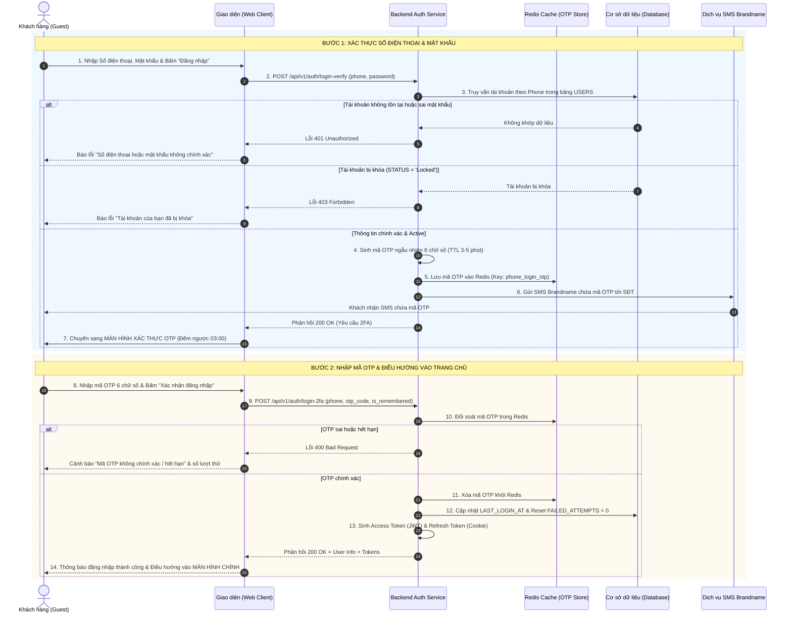

| Module | modules\authentication\guest\login |
| ------ | --------------------------------- |
| Menu   | Trang chủ / Đăng nhập (Guest / Customer Login) |
| Mô tả  | Dùng để cho phép đối tượng **Khách hàng (Guest / Customer)** thực hiện đăng nhập vào hệ thống bằng **Số điện thoại** và **Mật khẩu**. Sau khi thẩm định thông tin tài khoản hợp lệ và đang ở trạng thái **Active**, hệ thống tự động kích hoạt cơ chế **Xác thực 2 bước (Two-Factor Authentication - 2FA)** để nâng cao an toàn bảo mật, sinh mã **OTP gồm 6 chữ số** gửi qua tin nhắn SMS tới Số điện thoại của khách hàng. Giao diện chuyển tiếp sang màn hình/trang **Xác thực OTP**. Sau khi khách hàng nhập chính xác mã OTP còn hiệu lực (3–5 phút), hệ thống cấp phát cặp Access Token (JWT) và Refresh Token an toàn, cập nhật lịch sử đăng nhập và điều hướng người dùng thẳng vào **Màn hình chính (Trang chủ / Customer Dashboard)**. Áp dụng style UI, layout, component theo **style chung của project**. |

**Tổng quan màn Đăng nhập tài khoản Customer (UC-01.02):**
- A. Màn hình Đăng nhập (Form đăng nhập chính)
  - A.1. Header form đăng nhập
  - A.2. Thông tin các trường dữ liệu trên form
  - A.3. Button và liên kết điều hướng
- B. Màn hình / Trang Xác thực OTP đăng nhập (2FA Login Verification)
  - B.1. Thông tin giao diện nhập mã OTP
  - B.2. Button và thao tác màn OTP
- C. Quy tắc nghiệp vụ (Business Rules)
  - BR-01: Thẩm định thông tin đăng nhập (Phone & Password Validation)
  - BR-02: Kiểm tra trạng thái tài khoản (Account Status Check)
  - BR-03: Khóa tài khoản tạm thời khi nhập sai mật khẩu (Failed Password Attempts Rate Limiting)
  - BR-04: Cơ chế xác thực 2 bước bắt buộc bằng OTP qua SMS (Mandatory 2FA SMS OTP)
  - BR-05: Chống Spam & Giới hạn gửi lại mã OTP đăng nhập (Anti-Spam & OTP Rate Limiting)
  - BR-06: Giới hạn số lần nhập sai mã OTP (OTP Retry Limit)
  - BR-07: Quản lý phiên làm việc & Điều hướng vào màn hình chính (Session Management & Redirection)
- D. Luồng nghiệp vụ chi tiết (Workflows)
  - D.1. Luồng chính (Main Flow - Happy Path)
  - D.2. Luồng ngoại lệ & Luồng thay thế (Alternative & Exception Flows)
  - D.3. Sơ đồ tuần tự nghiệp vụ (Sequence Diagram)
- E. Danh mục thông báo / Cảnh báo hệ thống (System Messages)

---

# A. Màn hình Đăng nhập (Form đăng nhập chính)

Giao diện đăng nhập được thiết kế dạng khối thẻ trung tâm (Card Layout) trên nền trang xác thực chuẩn. Thiết kế tinh gọn, tập trung và đồng bộ phong cách với màn hình Đăng ký.

## A.1. Header form đăng nhập

| Tên | Loại dữ liệu | Bắt buộc | Mô tả |
| --- | ------------ | -------- | ----- |
| Tiêu đề Form | Title | | Nằm ở góc trên bên trái form. Text: **"Đăng nhập"** (font size lớn, in đậm, màu chữ chính). |
| Liên kết Đăng ký | Hyperlink | | Nằm ở góc trên bên phải form, ngang hàng với tiêu đề. Text màu cam/đỏ thương hiệu: **"Đăng ký"**.<br><br>Thao tác: Nhấp vào sẽ điều hướng sang màn hình Đăng ký tài khoản `docs/Fe-01/Common/Register.md`. |

## A.2. Thông tin các trường dữ liệu trên form

| Tên | Loại dữ liệu | Bắt buộc | Mô tả | Mô tả Database | Độ dài |
| --- | ------------ | -------- | ----- | -------------- | ------ |
| Số điện thoại | TextInput | x | Ô nhập số điện thoại di động đã đăng ký tài khoản của khách hàng. Không sử dụng mã quốc gia, áp dụng trực tiếp đầu số Việt Nam.<br><br>Placeholder: **"Nhập số điện thoại"**.<br><br>Quy tắc kiểm tra (Validate):<br>- Không được để trống.<br>- Chỉ chấp nhận ký tự số (`0-9`), tự động chặn nhập chữ và ký tự đặc biệt.<br>- Đúng định dạng 10 chữ số, bắt đầu bằng các đầu số nhà mạng di động hợp lệ tại Việt Nam: `03`, `05`, `07`, `08`, `09` (Regex: `^(03\|05\|07\|08\|09)[0-9]{8}$`).<br>- Tự động trim khoảng trắng.<br><br>Cảnh báo lỗi inline:<br>- Để trống: *Vui lòng nhập số điện thoại.*<br>- Sai định dạng: *Số điện thoại không hợp lệ (gồm 10 chữ số, bắt đầu bằng 03, 05, 07, 08, 09).* | PHONE_NUMBER | 15 |
| Mật khẩu | PasswordInput | x | Ô nhập mật khẩu bảo mật của tài khoản.<br><br>Placeholder: **"Nhập mật khẩu"**.<br><br>Mặc định ẩn dưới dạng ký tự chấm tròn bảo mật (`••••••••`). Có icon hình con mắt ở góc phải ô nhập để bật/tắt hiển thị mật khẩu rõ.<br><br>Quy tắc kiểm tra (Validate):<br>- Không được để trống.<br>- Độ dài **tối thiểu 8 ký tự trở lên**.<br><br>Cảnh báo lỗi inline:<br>- Để trống: *Vui lòng nhập mật khẩu.*<br>- Sai mật khẩu: Xem quy tắc **BR-01** và **BR-03**. | PASSWORD_HASH (Đối soát qua thuật toán băm BCrypt / Argon2id) | 255 |
| Ghi nhớ đăng nhập | Checkbox | | Checkbox lưu trạng thái phiên đăng nhập dài hạn.<br><br>Label: *"Ghi nhớ đăng nhập"*.<br><br>Mặc định: **Chưa tích chọn (Unchecked)**.<br><br>Xử lý:<br>- Nếu tích chọn: Kéo dài thời gian hiệu lực của Refresh Token (ví dụ: 30 ngày) trên thiết bị hiện tại.<br>- Nếu không tích chọn: Phiên làm việc kết thúc khi đóng trình duyệt hoặc hết hạn phiên tiêu chuẩn (ví dụ: 24 giờ). | IS_REMEMBERED (Client Session Cookie Configuration) | 1 |
| Quên mật khẩu? | Hyperlink | | Đoạn text liên kết nằm cùng hàng bên phải với checkbox Ghi nhớ đăng nhập: *"Quên mật khẩu?"*.<br><br>Thao tác: Nhấp vào sẽ điều hướng sang màn hình Khôi phục mật khẩu `docs/Fe-01/Common/ForgotPassword.md`. | | |

## A.3. Button và liên kết điều hướng

| Tên | Loại dữ liệu | Bắt buộc | Mô tả |
| --- | ------------ | -------- | ----- |
| Đăng nhập | Button | | Button chính (Primary Button), full-width, đặt ở cuối form, label: **"Đăng nhập"**.<br><br>Điều kiện & Xử lý:<br>- Khi bấm: Hệ thống kiểm tra validate cú pháp Số điện thoại và Mật khẩu tại Client.<br>- Nếu có trường lỗi: Dừng luồng, hiển thị chữ đỏ cảnh báo inline dưới trường vi phạm.<br>- Nếu dữ liệu hợp lệ: Nút chuyển sang trạng thái Loading (spinner + disable để chống bấm liên tiếp). Hệ thống gửi request lên Server để thẩm định tài khoản (theo **BR-01**, **BR-02**, **BR-03**).<br>- Nếu thông tin tài khoản hợp lệ: Hệ thống tự động sinh mã OTP 6 chữ số, gửi SMS tới Số điện thoại và chuyển giao diện sang **Màn hình Xác thực OTP (Mục B)**. |
| Ẩn / Hiện mật khẩu | Button icon | | Icon hình con mắt nằm bên trong góc phải ô Mật khẩu.<br><br>Thao tác: Nhấp vào để chuyển đổi qua lại giữa dạng ký tự ẩn `••••••` và dạng văn bản rõ để người dùng kiểm tra mật khẩu đã gõ. |
| Đăng ký tài khoản mới | Hyperlink | | Dòng liên kết chân trang: *"Bạn chưa có tài khoản? **Đăng ký ngay**".*<br><br>Thao tác: Nhấp vào sẽ điều hướng sang màn hình Đăng ký `docs/Fe-01/Common/Register.md`. |

---

# B. Màn hình / Trang Xác thực OTP đăng nhập (2FA Login Verification)

Sau khi khách hàng nhập đúng Số điện thoại và Mật khẩu ở Bước A, hệ thống chuyển tiếp giao diện sang màn hình Xác thực 2 bước (hoặc hiển thị Modal Overlay khóa màn hình) mang tên **"Xác thực OTP đăng nhập"**.

## B.1. Thông tin giao diện nhập mã OTP

| Tên | Loại dữ liệu | Bắt buộc | Mô tả | Mô tả Database | Độ dài |
| --- | ------------ | -------- | ----- | -------------- | ------ |
| Tiêu đề bước | Title | | Tiêu đề: **"Xác thực đăng nhập (2FA)"**. Kèm icon khiên bảo mật an toàn. | | |
| Thông tin nhận mã | FormedText | | Đoạn văn bản hướng dẫn: *"Để bảo mật tài khoản, mã xác thực OTP gồm 6 chữ số đã được gửi qua tin nhắn SMS tới số điện thoại **0987\*\*\*321**."* (Số điện thoại được che giấu các số giữa để bảo mật). | | |
| Ô nhập mã OTP | NumberInput (PIN Box) | x | Gồm **6 ô nhập số riêng biệt** (Single-digit input boxes).<br><br>Quy tắc tương tác:<br>- Chỉ chấp nhận ký tự số (`0-9`).<br>- Tự động nhảy con trỏ sang ô tiếp theo sau khi nhập xong 1 số.<br>- Khi nhấn Backspace: Xóa số hiện tại và lùi về ô trước.<br>- Hỗ trợ tự động dán (Auto-paste) 6 chữ số từ Clipboard hoặc tự động điền SMS OTP trên điện thoại (WebOTP API).<br>- Khi cả 6 ô đã được điền đủ: Hệ thống tự động kích hoạt tiến trình kiểm tra mã OTP (tương đương nhấn nút **Xác nhận**).<br><br>Cảnh báo lỗi inline:<br>- Chưa đủ 6 số: *Vui lòng nhập đủ mã OTP gồm 6 chữ số.*<br>- Mã không đúng: *Mã xác minh không chính xác. Bạn còn [X] lần thử.*<br>- Mã hết hạn: *Mã xác minh đã hết hiệu lực. Vui lòng bấm "Gửi lại mã".* | OTP_CODE (Lưu trữ tạm thời trong Redis/Cache kèm TTL) | 6 |
| Đồng hồ đếm ngược | Timer / Text | | Đồng hồ đếm ngược thời gian hiệu lực của mã OTP: **"Mã có hiệu lực trong: mm:ss"** (Thời gian chạy từ 03:00 hoặc 05:00 về 00:00).<br><br>Khi về 00:00: Mã OTP tự động bị hủy khỏi cache, đồng hồ hiển thị: *"Mã OTP đã hết hạn"*, nút **Gửi lại mã OTP** được kích hoạt sáng lên. | OTP_EXPIRED_AT | DATETIME |
| Bộ đếm lượt gửi lại | Text | | Dòng text phụ: *"Số lượt gửi lại mã còn lại trong 10 phút: [3 - Y] lần"*. | RESEND_COUNT | 2 |

## B.2. Button và thao tác màn OTP

| Tên | Loại dữ liệu | Bắt buộc | Mô tả |
| --- | ------------ | -------- | ----- |
| Xác nhận | Button | | Button chính (Primary Button), full-width, label: **"Xác nhận đăng nhập"**.<br><br>Điều kiện & Xử lý:<br>- Chỉ sáng (active) khi đã nhập đủ 6 chữ số OTP.<br>- Khi bấm: Gửi request xác thực OTP lên hệ thống.<br>- Nếu đúng mã OTP & còn hạn: Cấp token phiên đăng nhập (JWT Access & Refresh Token), lưu trữ thông tin phiên và điều hướng thẳng vào **Màn hình chính (Trang chủ)**.<br>- Nếu sai mã OTP: Trừ 1 lượt thử. Nếu sai quá 5 lần (theo **BR-06**), hủy mã OTP hiện tại và yêu cầu gửi mã mới.<br>- Nếu mã hết hạn: Báo lỗi mã hết hạn và yêu cầu nhấn gửi lại mã. |
| Gửi lại mã OTP | Button / Link | | Dạng liên kết / Outline button: **"Gửi lại mã OTP"**.<br><br>Quy tắc kiểm soát theo **BR-05**:<br>- Bị vô hiệu hóa (disabled) trong thời gian đồng hồ đếm ngược đang chạy hoặc khi chưa hết thời gian nghỉ Cooldown 60 giây.<br>- Khi nhấn: Kiểm tra nếu chưa vượt quá 3 lần/10 phút $\rightarrow$ Sinh mã mới, gửi lại qua SMS, reset đồng hồ về 03:00 và tăng biến đếm `RESEND_COUNT`.<br>- Nếu vượt quá 3 lần/10 phút: Disable nút hoàn toàn, báo lỗi: *Bạn đã yêu cầu gửi mã quá 3 lần trong 10 phút. Vui lòng thử lại sau [Z] phút.* |
| Quay lại Đăng nhập | Hyperlink | | Text link: *"← Quay lại đăng nhập bằng tài khoản khác"*. Nhấn vào sẽ hủy phiên OTP hiện tại, quay lại form đăng nhập ban đầu để người dùng chỉnh sửa SĐT/Mật khẩu. |

---

# C. Quy tắc nghiệp vụ (Business Rules)

## BR-01: Thẩm định thông tin đăng nhập (Phone & Password Validation)
1. **Tra cứu tài khoản:** Hệ thống tìm kiếm bản ghi người dùng trong bảng `USERS` theo `PHONE_NUMBER`.
2. **Kiểm tra mật khẩu:**
   - Đối soát chuỗi mật khẩu người dùng nhập vào với chuỗi băm `PASSWORD_HASH` đã lưu trong CSDL bằng hàm kiểm tra an toàn (BCrypt `compare` hoặc Argon2id `verify`).
3. **Nguyên tắc bảo mật thông báo lỗi (Security Best Practice):**
   - Nếu Số điện thoại không tồn tại trong hệ thống **HOẶC** Mật khẩu không chính xác: Hệ thống hiển thị một thông báo chung: *"Số điện thoại hoặc mật khẩu không chính xác."*
   - Tuyệt đối không thông báo riêng rẽ *"Số điện thoại không tồn tại"* để ngăn chặn kẻ tấn công dò tìm danh sách người dùng (Account Enumeration Attack).

## BR-02: Kiểm tra trạng thái tài khoản (Account Status Check)
Sau khi đối soát đúng Số điện thoại và Mật khẩu, hệ thống kiểm tra trường `STATUS` của tài khoản:
1. **Trạng thái `Active`:** Tài khoản hợp lệ, cho phép tiếp tục chuyển sang bước gửi mã OTP (2FA).
2. **Trạng thái `Locked` (Bị khóa):** Chặn đăng nhập ngay lập tức, hiển thị thông báo lỗi: *"Tài khoản của bạn đã bị khóa. Vui lòng liên hệ bộ phận hỗ trợ khách hàng để được mở khóa."*
3. **Trạng thái `Inactive` (Ngừng hoạt động):** Chặn đăng nhập, thông báo: *"Tài khoản này hiện đang tạm ngừng hoạt động."*

## BR-03: Khóa tài khoản tạm thời khi nhập sai mật khẩu (Failed Password Attempts Rate Limiting)
Nhằm ngăn chặn tấn công vét cạn mật khẩu (Brute-Force Attack):
1. Hệ thống duy trì biến đếm `FAILED_LOGIN_ATTEMPTS` đối với mỗi Số điện thoại.
2. Mỗi lần nhập sai mật khẩu: Tăng bộ đếm lên 1 đơn vị.
3. Nếu nhập sai liên tiếp **5 lần**:
   - Hệ thống tự động khóa tạm thời tính năng đăng nhập của tài khoản trong **15 đến 30 phút**.
   - Cập nhật thời điểm khóa: `LOCKED_UNTIL = CURRENT_TIMESTAMP + 15 MINUTES`.
   - Thông báo lỗi cho người dùng: *"Bạn đã nhập sai mật khẩu quá 5 lần. Để bảo vệ tài khoản, chức năng đăng nhập tạm khóa trong 15 phút. Vui lòng thử lại sau hoặc sử dụng Quên mật khẩu."*
4. Nếu đăng nhập thành công: Reset biến đếm `FAILED_LOGIN_ATTEMPTS = 0`.

## BR-04: Cơ chế xác thực 2 bước bắt buộc bằng OTP qua SMS (Mandatory 2FA SMS OTP)
1. **Kích hoạt 2FA:** Để đảm bảo an toàn tuyệt đối cho tài khoản Customer, mọi yêu cầu đăng nhập hợp lệ ở form chính bắt buộc phải vượt qua bước xác thực mã OTP gửi về SMS chính chủ.
2. **Sinh và quản lý mã OTP:**
   - Mã OTP là chuỗi ngẫu nhiên gồm đúng **6 chữ số** (`0-9`) sinh bởi thuật toán ngẫu nhiên bảo mật (CSPRNG).
   - Lưu trữ mã OTP trong bộ nhớ đệm (Redis) gắn liền với `PHONE_NUMBER` cùng thời gian sống (TTL): **3 đến 5 phút** (mặc định 180 giây).
   - Mỗi mã OTP chỉ có giá trị xác thực thành công duy nhất **1 lần (One-Time Use)**. Sau khi xác thực thành công, mã lập tức bị hủy.

## BR-05: Chống Spam & Giới hạn gửi lại mã OTP đăng nhập (Anti-Spam & OTP Rate Limiting)
1. **Giới hạn số lần gửi lại (Resend Limit):**
   - Giới hạn tối đa **3 lần nhấn "Gửi lại mã OTP" trong vòng 10 phút** cho cùng một Số điện thoại.
   - Thời gian chờ giữa 2 lần gửi liên tiếp (Cooldown) tối thiểu là **60 giây**. Nút gửi lại mã bị disable trong suốt 60 giây này.
   - Nếu vượt quá 3 lần/10 phút: Khóa tính năng gửi mã của SĐT đó trong vòng 10 phút, thông báo: *"Bạn đã yêu cầu gửi mã quá 3 lần trong 10 phút. Vui lòng thử lại sau ít phút."*
2. **Chặn IP bất thường:** Nếu 1 địa chỉ IP gửi liên tiếp > 10 requests đăng nhập/OTP trong vòng 5 phút, chặn tạm thời IP trong 15–30 phút với mã lỗi HTTP `429 Too Many Requests`.

## BR-06: Giới hạn số lần nhập sai mã OTP (OTP Retry Limit)
1. Khách hàng được phép nhập sai mã OTP tối đa **5 lần**.
2. Mỗi lần nhập sai: Hệ thống giảm số lượt thử còn lại và cảnh báo inline: *"Mã xác minh không chính xác. Bạn còn [5 - X] lần thử."*
3. Nếu nhập sai lần thứ 5: Hệ thống hủy ngay mã OTP hiện tại trong cache, vô hiệu hóa nút Xác nhận và yêu cầu người dùng phải bấm "Gửi lại mã OTP" để nhận mã mới.

## BR-07: Quản lý phiên làm việc & Điều hướng vào màn hình chính (Session Management & Redirection)
Ngay sau khi xác thực mã OTP thành công:
1. **Cấp phát Token đăng nhập:**
   - **Access Token:** JWT Token có thời hạn ngắn (15–60 phút), lưu thông tin định danh `user_id`, `role: customer`, `phone`.
   - **Refresh Token:** Mã token an toàn lưu dưới dạng HTTP-Only Secure Cookie để chống tấn công XSS, có thời hạn theo cấu hình (24 giờ nếu không tích Ghi nhớ, hoặc 30 ngày nếu có tích Ghi nhớ đăng nhập).
2. **Cập nhật dữ liệu hệ thống:**
   - Cập nhật thời điểm đăng nhập gần nhất: `LAST_LOGIN_AT = CURRENT_TIMESTAMP`.
   - Ghi log bảo mật: Địa chỉ IP, User-Agent trình duyệt/thiết bị.
   - Reset bộ đếm số lần sai mật khẩu và sai OTP về 0.
3. **Điều hướng (Redirection):**
   - Nếu trước đó người dùng truy cập một URL được bảo vệ và bị chuyển hướng về trang Login: Hệ thống tự động chuyển tiếp người dùng về đúng trang mục tiêu ban đầu (`redirect_url`).
   - Nếu không có URL mục tiêu: Chuyển hướng người dùng thẳng vào **Màn hình chính (Trang chủ / Customer Dashboard)** kèm thông báo toast: *"Đăng nhập thành công! Chào mừng bạn quay trở lại."*

---

# D. Luồng nghiệp vụ chi tiết (Workflows)

## D.1. Luồng chính (Main Flow - Happy Path)

```
[BƯỚC 1: NHẬP SĐT & MẬT KHẨU]           [BƯỚC 2: XÁC THỰC 2FA OTP]             [BƯỚC 3: MÀN HÌNH CHÍNH]
  Khách nhập SĐT & Mật khẩu                 Khách nhận SMS & nhập OTP 6 số         Đăng nhập thành công
              │                                           │                                   │
              ▼                                           ▼                                   ▼
  Kiểm tra Format & Thẩm định                Đối soát mã OTP trong Redis             Cấp JWT Access Token
     SĐT/Mật khẩu trong CSDL                 (Kiểm tra đúng & còn hạn)              & HTTP-Only Cookie
              │                                           │                                   │
              ▼ (Chính xác)                               ▼ (Chính xác)                       ▼
    Gửi mã OTP 6 số qua SMS     ────────────►       Hủy mã OTP trong Cache     ────────────►  Điều hướng thẳng vào
& Chuyển sang màn hình xác thực                       Cập nhật LAST_LOGIN_AT                    TRANG CHỦ HỆ THỐNG
```

- **Bước 1:** Khách hàng (Guest) truy cập trang web, chọn chức năng **"Đăng nhập"**. Giao diện hiển thị form đăng nhập chính (Mục A).
- **Bước 2:** Khách hàng điền Số điện thoại (10 chữ số), Mật khẩu, có thể tích chọn "Ghi nhớ đăng nhập" và nhấn nút **"Đăng nhập"**.
- **Bước 3:** Hệ thống kiểm tra format, truy vấn CSDL kiểm tra Số điện thoại tồn tại, đối soát mật khẩu hash trùng khớp và tài khoản đang ở trạng thái `Active`.
- **Bước 4:** Hệ thống kích hoạt cơ chế 2FA: Sinh mã OTP ngẫu nhiên 6 chữ số (hiệu lực 3–5 phút), lưu vào Redis Cache, đồng thời gửi tin nhắn SMS Brandname tới Số điện thoại của khách hàng.
- **Bước 5:** Giao diện tự động chuyển tiếp sang **Màn hình Xác thực OTP (Mục B)**, khởi chạy đồng hồ đếm ngược 03:00 và hiển thị số điện thoại nhận mã dạng che số `0987***321`.
- **Bước 6:** Khách hàng kiểm tra tin nhắn trên điện thoại, nhập chính xác mã OTP 6 chữ số vào 6 ô PIN.
- **Bước 7:** Hệ thống đối chiếu mã OTP trong Redis: Mã chính xác và còn trong thời hạn hiệu lực.
- **Bước 8:** Hệ thống xóa mã OTP khỏi Redis, tạo cặp Access Token (JWT) và Refresh Token, cập nhật `LAST_LOGIN_AT` vào CSDL, hiển thị thông báo toast thành công và chuyển hướng người dùng vào **Màn hình chính (Trang chủ)**.

## D.2. Luồng ngoại lệ & Luồng thay thế (Alternative & Exception Flows)

### A1. Để trống thông tin hoặc nhập sai định dạng ở form đăng nhập
- **Điều kiện:** Ô Số điện thoại hoặc Mật khẩu bị để trống, hoặc SĐT không đúng 10 số, sai đầu số nhà mạng VN.
- **Xử lý:** Dừng xử lý tại Client, hiển thị chữ đỏ cảnh báo lỗi inline ngay dưới trường vi phạm và focus con trỏ vào ô lỗi đầu tiên.

### A2. Số điện thoại không tồn tại hoặc Mật khẩu không chính xác (BR-01, BR-03)
- **Điều kiện:** SĐT chưa từng đăng ký trong CSDL hoặc mật khẩu hash không khớp.
- **Xử lý:** 
  - Tăng biến đếm `FAILED_LOGIN_ATTEMPTS`.
  - Hiển thị thông báo lỗi chung: *"Số điện thoại hoặc mật khẩu không chính xác. Bạn còn [5 - X] lần thử trước khi tài khoản bị tạm khóa."*
  - Nếu nhập sai liên tiếp 5 lần: Khóa chức năng đăng nhập của tài khoản trong 15 phút theo **BR-03**.

### A3. Tài khoản đang ở trạng thái bị khóa hoặc ngừng hoạt động (BR-02)
- **Điều kiện:** Tài khoản có `STATUS = 'Locked'` hoặc `Inactive`.
- **Xử lý:** Chặn đăng nhập ngay tại bước 1, hiển thị thông báo lỗi: *"Tài khoản của bạn đã bị khóa. Vui lòng liên hệ quản trị viên để được hỗ trợ."*

### A4. Khách hàng bấm quay lại từ màn hình nhập OTP
- **Điều kiện:** Khách hàng nhận ra nhập nhầm số điện thoại hoặc muốn đổi tài khoản khác khi đang ở màn hình OTP.
- **Xử lý:** Nhấn link *"← Quay lại đăng nhập bằng tài khoản khác"*. Hệ thống hủy phiên OTP hiện tại và chuyển màn hình trở lại Form đăng nhập ban đầu.

### A5. Nhập sai mã OTP (Dưới 5 lần)
- **Điều kiện:** Mã OTP người dùng nhập không khớp với mã hệ thống đã sinh trong Redis.
- **Xử lý:** Rung nhẹ 6 ô nhập mã OTP (shake effect), hiển thị cảnh báo chữ đỏ: *"Mã xác minh không chính xác. Bạn còn [5 - X] lần thử."*

### A6. Nhập sai mã OTP quá 5 lần (BR-06)
- **Điều kiện:** Khách hàng nhập sai mã OTP liên tiếp 5 lần.
- **Xử lý:** Hệ thống lập tức hủy mã OTP hiện tại trong Redis, khóa nút Xác nhận và thông báo: *"Bạn đã nhập sai mã OTP quá 5 lần. Mã xác minh đã bị hủy. Vui lòng nhấn 'Gửi lại mã OTP' để nhận mã mới."*

### A7. Mã OTP hết thời hạn hiệu lực (Sau 3–5 phút)
- **Điều kiện:** Khách hàng nhập OTP khi đồng hồ đếm ngược đã về `00:00`.
- **Xử lý:** Hệ thống báo lỗi: *"Mã xác minh đã hết hiệu lực. Vui lòng bấm 'Gửi lại mã OTP' để nhận mã mới."* Nút Gửi lại mã sáng lên cho phép click.

### A8. Spam bấm gửi lại OTP quá 3 lần / 10 phút (BR-05)
- **Điều kiện:** Người dùng cố tình yêu cầu gửi lại OTP lần thứ 4 trong khoảng thời gian 10 phút.
- **Xử lý:** Vô hiệu hóa nút gửi lại, hiển thị thông báo toast: *"Bạn đã yêu cầu gửi mã quá 3 lần trong 10 phút. Vui lòng thử lại sau [Z] phút."*

### A9. Khách hàng quên mật khẩu
- **Điều kiện:** Khách hàng không nhớ mật khẩu đăng nhập.
- **Xử lý:** Nhấn vào liên kết *"Quên mật khẩu?"* ở form đăng nhập $\rightarrow$ Điều hướng sang màn hình Quên mật khẩu `docs/Fe-01/Guest/ForgotPassword.md` để xác thực lại qua SĐT/OTP và đặt lại mật khẩu mới.

## D.3. Sơ đồ tuần tự nghiệp vụ (Sequence Diagram)



---

# E. Danh mục thông báo / Cảnh báo hệ thống (System Messages)

| Mã thông báo | Loại hiển thị | Nội dung thông báo | Điều kiện xuất hiện |
| ------------ | ------------- | ------------------ | ------------------- |
| `MSG_LOG_01` | Inline Error | *Vui lòng nhập số điện thoại.* | Để trống trường Số điện thoại khi bấm Đăng nhập. |
| `MSG_LOG_02` | Inline Error | *Số điện thoại không hợp lệ (gồm 10 chữ số, bắt đầu bằng 03, 05, 07, 08, 09).* | Nhập SĐT sai độ dài hoặc sai đầu số nhà mạng VN. |
| `MSG_LOG_03` | Inline Error | *Vui lòng nhập mật khẩu.* | Để trống trường Mật khẩu khi bấm Đăng nhập. |
| `MSG_LOG_04` | Inline / Toast | *Số điện thoại hoặc mật khẩu không chính xác. Bạn còn [5 - X] lần thử.* | Nhập sai mật khẩu hoặc số điện thoại chưa đăng ký (BR-01). |
| `MSG_LOG_05` | Popup Warning| *Bạn đã nhập sai mật khẩu quá 5 lần. Chức năng đăng nhập tạm thời bị khóa trong 15 phút.* | Kích hoạt khóa tạm thời tài khoản do sai mật khẩu 5 lần (BR-03). |
| `MSG_LOG_06` | Inline / Toast | *Tài khoản của bạn đã bị khóa. Vui lòng liên hệ bộ phận hỗ trợ khách hàng.* | Tài khoản có `STATUS = 'Locked'` khi đăng nhập (BR-02). |
| `MSG_LOG_07` | Toast Info | *Mã xác thực OTP gồm 6 chữ số đã được gửi qua tin nhắn SMS tới số điện thoại của bạn.* | Gửi thành công mã OTP đăng nhập lần đầu hoặc khi bấm gửi lại. |
| `MSG_LOG_08` | Inline Error | *Vui lòng nhập đầy đủ mã OTP gồm 6 chữ số.* | Để trống hoặc nhập thiếu ký tự tại ô nhập OTP. |
| `MSG_LOG_09` | Inline Error | *Mã xác minh không chính xác. Bạn còn [X] lần thử.* | Nhập sai mã OTP ở màn hình 2FA (số lần sai < 5). |
| `MSG_LOG_10` | Inline Error | *Mã xác minh đã hết hiệu lực. Vui lòng bấm "Gửi lại mã OTP" để nhận mã mới.* | Nhập mã OTP khi thời gian đếm ngược 03:00 đã về 00:00. |
| `MSG_LOG_11` | Modal Warning| *Bạn đã nhập sai mã OTP quá 5 lần. Mã xác minh đã bị hủy. Vui lòng gửi lại mã mới.* | Nhập sai mã OTP liên tiếp 5 lần tại màn hình 2FA (BR-06). |
| `MSG_LOG_12` | Toast Warning| *Bạn đã yêu cầu gửi mã quá 3 lần trong 10 phút. Vui lòng thử lại sau [Z] phút.* | Bấm gửi lại mã vượt quá định mức quy định (BR-05). |
| `MSG_LOG_13` | Popup Alert | *Hệ thống phát hiện lượt truy cập bất thường từ thiết bị/IP của bạn. Quyền gửi yêu cầu tạm khóa trong 15 phút.* | Kích hoạt cơ chế chặn IP do nghi vấn spam/tấn công (BR-05). |
| `MSG_LOG_14` | Toast Success| *Đăng nhập thành công! Đang chuyển hướng vào hệ thống...* | Xác thực OTP 2FA thành công, điều hướng vào màn hình chính (BR-07). |
| `MSG_LOG_15` | Inline / Toast | *Tài khoản này hiện đang tạm ngừng hoạt động. Vui lòng liên hệ bộ phận hỗ trợ khách hàng.* | Tài khoản có `STATUS = 'Inactive'` khi đăng nhập (BR-02). |
