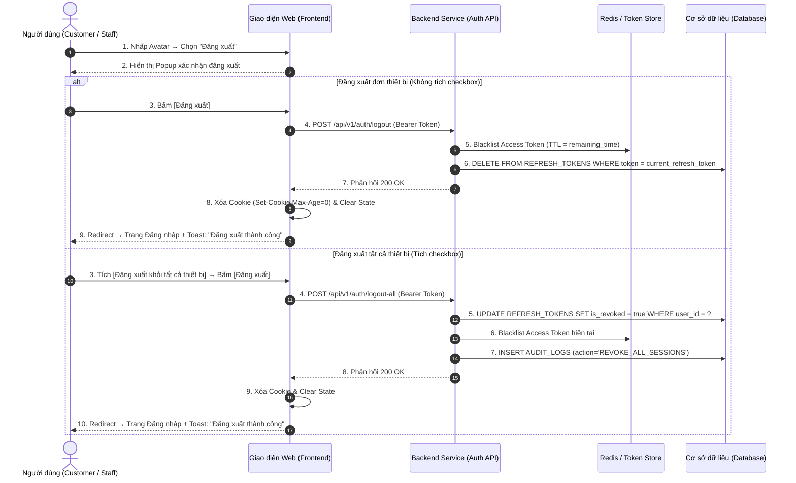

| Module | modules\authentication\common\logout |
| ------ | ------------------------------------ |
| Menu   | Header / Avatar Dropdown / Đăng xuất (Common / Logout) |
| Mô tả  | Dùng để cho phép đối tượng **Người dùng đã đăng nhập (Customer / Staff / Admin)** thực hiện đăng xuất khỏi hệ thống một cách an toàn. Nút Đăng xuất nằm trong **Dropdown Menu Avatar** ở góc trên bên phải thanh Header. Khi bấm, hệ thống hiển thị Popup xác nhận, sau đó hủy Access Token & Refresh Token hiện tại, xóa HTTP-Only Secure Cookie phiên đăng nhập và điều hướng người dùng quay về **Màn hình Đăng nhập** tương ứng. Hệ thống cũng hỗ trợ tùy chọn **"Đăng xuất khỏi tất cả thiết bị"** giúp người dùng thu hồi toàn bộ phiên đang mở trên các trình duyệt/thiết bị khác để bảo vệ tài khoản khi nghi ngờ bị lộ thông tin. Áp dụng style UI, layout, component theo **style chung của project**. |

**Tổng quan chức năng Đăng xuất (UC-01.07):**
- A. Vị trí nút Đăng xuất trên giao diện
  - A.1. Dropdown Menu Avatar trên Header
- B. Popup Xác nhận Đăng xuất
  - B.1. Thành phần và giao diện Popup
- C. Quy tắc nghiệp vụ (Business Rules)
  - BR-01: Hủy phiên đăng nhập & Thu hồi Token (Session Termination)
  - BR-02: Đăng xuất khỏi tất cả thiết bị (Revoke All Sessions)
  - BR-03: Điều hướng sau khi đăng xuất (Post-Logout Redirection)
  - BR-04: Xử lý phiên hết hạn tự động (Auto Session Expiry)
- D. Luồng nghiệp vụ chi tiết (Workflows)
  - D.1. Luồng đăng xuất đơn thiết bị (Main Flow - Happy Path)
  - D.2. Luồng đăng xuất khỏi tất cả thiết bị
  - D.3. Sơ đồ tuần tự nghiệp vụ (Sequence Diagram)
- E. Danh mục thông báo / Cảnh báo hệ thống (System Messages)

---

# A. Vị trí nút Đăng xuất trên giao diện

## A.1. Dropdown Menu Avatar trên Header

Nút Đăng xuất nằm ở **mục cuối cùng** trong Dropdown Menu khi người dùng nhấp vào Avatar / Tên người dùng ở góc trên bên phải Header toàn trang:

| Tên Menu Item | Icon | Mô tả |
| ------------- | ---- | ----- |
| Hồ sơ của tôi | Icon User | Chuyển đến trang [Profile.md](file:///E:/FA26/Capstone/Aqs-ba/docs/Fe-01/Common/Profile/Profile.md) (Chỉ hiển thị với Customer). |
| Tài khoản của tôi | Icon Setting | Chuyển đến trang Quản lý tài khoản (Sidebar Hồ sơ / Địa chỉ / Đổi mật khẩu). |
| Đường kẻ phân cách | Divider | Đường kẻ ngang mảnh phân tách giữa nhóm menu chức năng và nút Đăng xuất. |
| **Đăng xuất** | Icon Logout (mũi tên ra cửa) | Nhấp vào sẽ mở **Popup xác nhận đăng xuất** (Mục B). Màu chữ: Đỏ nhẹ / Xám đậm để phân biệt với các mục menu khác. |

---

# B. Popup Xác nhận Đăng xuất

## B.1. Thành phần và giao diện Popup

Popup nhỏ gọn hiển thị dạng Modal Dialog căn giữa màn hình khi người dùng bấm nút **"Đăng xuất"**:

| Tên | Loại thành phần | Mô tả chi tiết |
| --- | --------------- | -------------- |
| Tiêu đề Popup | Modal Title | **"Đăng xuất khỏi hệ thống"** (font-size 18px, chữ đậm). |
| Nội dung xác nhận | Modal Body Text | *"Bạn có chắc chắn muốn đăng xuất khỏi tài khoản hiện tại?"* |
| Checkbox tùy chọn | Checkbox | Label: **"Đăng xuất khỏi tất cả thiết bị"**.  Mặc định: Không tích.  Khi tích: Hệ thống sẽ thu hồi toàn bộ Refresh Token trên mọi trình duyệt và thiết bị đang đăng nhập cùng tài khoản (theo **BR-02**).  Khi không tích: Chỉ đăng xuất phiên hiện tại trên thiết bị/trình duyệt đang dùng. |
| Ghi chú bảo mật | Text (nhỏ, xám) | *"Tích chọn nếu bạn nghi ngờ tài khoản đang bị truy cập trái phép trên thiết bị khác."* |
| Nút Hủy | Button (Secondary) | Label **"Hủy"** — Đóng popup, quay lại giao diện hiện tại, không thực hiện đăng xuất. |
| Nút Đăng xuất | Button (Danger / Primary) | Label **"Đăng xuất"** — Thực hiện hủy phiên đăng nhập theo quy tắc BR-01 (hoặc BR-02 nếu tích checkbox). |

---

# C. Quy tắc nghiệp vụ (Business Rules)

## BR-01: Hủy phiên đăng nhập & Thu hồi Token (Session Termination)
Khi người dùng xác nhận Đăng xuất (không tích checkbox "tất cả thiết bị"):
1. **Hủy Access Token hiện tại:** Đưa Access Token vào danh sách đen (Token Blacklist) trong Redis với TTL bằng thời gian còn lại của token.
2. **Hủy Refresh Token hiện tại:** Xóa bản ghi Refresh Token tương ứng với phiên hiện tại khỏi bảng `REFRESH_TOKENS` trong CSDL hoặc Redis.
3. **Xóa Cookie phía Client:** Gửi lệnh xóa HTTP-Only Secure Cookie chứa Refresh Token trên trình duyệt hiện tại (Set-Cookie với `Max-Age=0`).
4. **Xóa State Frontend:** Xóa toàn bộ dữ liệu phiên người dùng khỏi bộ nhớ Client (LocalStorage, SessionStorage, Redux/Zustand Store).

## BR-02: Đăng xuất khỏi tất cả thiết bị (Revoke All Sessions)
Khi người dùng tích checkbox **"Đăng xuất khỏi tất cả thiết bị"** và xác nhận:
1. Hệ thống thu hồi (Revoke) **toàn bộ** Refresh Token đang active của tài khoản đó trong bảng `REFRESH_TOKENS`: `UPDATE REFRESH_TOKENS SET IS_REVOKED = true WHERE USER_ID = ?`.
2. Tại các thiết bị/trình duyệt khác đang mở: Khi Access Token hết hạn và request Refresh Token → API trả về lỗi `401 Unauthorized` → Tự động buộc đăng xuất và chuyển về màn hình Đăng nhập.
3. Ghi log bảo mật: `AUDIT_LOGS (action='REVOKE_ALL_SESSIONS', user_id, ip, user_agent, timestamp)`.

## BR-03: Điều hướng sau khi đăng xuất (Post-Logout Redirection)
Sau khi hoàn tất hủy phiên:
1. **Đối với Customer:** Điều hướng về màn hình [Đăng nhập Customer](file:///E:/FA26/Capstone/Aqs-ba/docs/Fe-01/Common/Account/Login.md) (`/login`).
2. **Đối với Staff / Admin:** Điều hướng về màn hình [Đăng nhập Staff](file:///E:/FA26/Capstone/Aqs-ba/docs/Fe-01/Admin/Account/StaffLogin.md) (`/admin/login`).
3. Hiển thị Toast thông báo trên màn hình Đăng nhập: *"Bạn đã đăng xuất thành công."*

## BR-04: Xử lý phiên hết hạn tự động (Auto Session Expiry)
Trong trường hợp người dùng không chủ động bấm Đăng xuất:
1. **Access Token hết hạn:** Client tự động gọi API Refresh Token.
2. **Refresh Token cũng hết hạn (24h hoặc 30 ngày):** API trả về `401 Unauthorized`. Client tự động xóa dữ liệu phiên và điều hướng người dùng về trang Đăng nhập kèm thông báo: *"Phiên đăng nhập của bạn đã hết hạn. Vui lòng đăng nhập lại."*

---

# D. Luồng nghiệp vụ chi tiết (Workflows)

## D.1. Luồng đăng xuất đơn thiết bị (Main Flow - Happy Path)

- **Bước 1:** Người dùng nhấp vào Avatar ở góc trên phải Header → Dropdown Menu mở ra.
- **Bước 2:** Người dùng chọn mục **"Đăng xuất"**.
- **Bước 3:** Hệ thống hiển thị Popup xác nhận đăng xuất (Mục B).
- **Bước 4:** Người dùng nhấn nút **"Đăng xuất"** (không tích checkbox).
- **Bước 5:** Client gọi API `POST /api/v1/auth/logout` kèm Access Token trong Header Authorization.
- **Bước 6:** Backend hủy phiên hiện tại (blacklist Access Token, xóa Refresh Token).
- **Bước 7:** Backend trả về HTTP 200 OK. Client xóa Cookie, xóa State Frontend.
- **Bước 8:** Giao diện điều hướng về trang Đăng nhập tương ứng kèm Toast: *"Bạn đã đăng xuất thành công."*

## D.2. Luồng đăng xuất khỏi tất cả thiết bị

- **Bước 1–3:** Giống luồng D.1.
- **Bước 4:** Người dùng **tích checkbox "Đăng xuất khỏi tất cả thiết bị"** rồi nhấn nút **"Đăng xuất"**.
- **Bước 5:** Client gọi API `POST /api/v1/auth/logout-all` kèm Access Token.
- **Bước 6:** Backend thu hồi toàn bộ Refresh Token của tài khoản, ghi Audit Log.
- **Bước 7:** Trả về 200 OK. Client xóa Cookie & State. Điều hướng về Đăng nhập.

## D.3. Sơ đồ tuần tự nghiệp vụ (Sequence Diagram)

---

# E. Danh mục thông báo / Cảnh báo hệ thống (System Messages)

| Mã thông báo | Loại hiển thị | Nội dung thông báo | Điều kiện xuất hiện |
| ------------ | ------------- | ------------------ | ------------------- |
| `MSG_LGOUT_01` | Toast Success | *Bạn đã đăng xuất thành công.* | Đăng xuất đơn thiết bị hoặc tất cả thiết bị thành công. |
| `MSG_LGOUT_02` | Toast Info | *Phiên đăng nhập của bạn đã hết hạn. Vui lòng đăng nhập lại.* | Access Token & Refresh Token đều hết hạn (Auto Session Expiry). |
| `MSG_LGOUT_03` | Toast Warning | *Quyền hạn của bạn đã được quản trị viên cập nhật. Vui lòng đăng nhập lại.* | Token bị thu hồi do Admin đổi quyền hoặc khóa tài khoản. |
| `MSG_LGOUT_04` | Toast Error | *Có lỗi xảy ra khi đăng xuất. Vui lòng thử lại.* | Lỗi mạng hoặc Server khi gọi API logout. |
