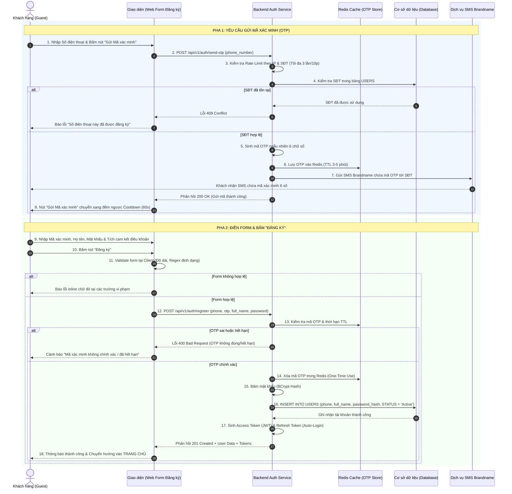

| Module | modules\authentication\guest\register |
| ------ | ------------------------------------ |
| Menu   | Trang chủ / Đăng ký tài khoản (Guest / Customer Registration) |
| Mô tả  | Dùng để cho phép đối tượng **Khách hàng chưa đăng nhập (Guest)** tự đăng ký tài khoản **Customer** mới trên hệ thống trên **một form duy nhất (Single-Form Registration)** theo thiết kế chuẩn. Form bao gồm: (1) Ô nhập Số điện thoại tích hợp nút **"Gửi Mã xác minh"** trực tiếp trên cùng hàng; (2) Ô nhập **Mã xác minh (OTP)** 6 chữ số; (3) Ô nhập **Họ và tên**; (4) Ô nhập **Mật khẩu** (chỉ nhập 1 lần kèm ẩn/hiện, Email được liên kết sau trong Profile). Hệ thống tích hợp cơ chế chống spam nghiêm ngặt (giới hạn gửi lại mã tối đa 3 lần/10 phút, khóa IP tạm thời khi vượt ngưỡng). Khi người dùng hoàn tất điền form và bấm **"Đăng ký"**, hệ thống kiểm tra toàn bộ thông tin, tạo ngay tài khoản ở trạng thái **Active** (không sinh tài khoản rác Pending) và tự động đăng nhập đưa người dùng vào hệ thống. Áp dụng style UI, layout, component theo **style chung của project**. |

**Tổng quan màn Đăng ký tài khoản Customer (UC-01.01):**
- A. Giao diện Màn hình Đăng ký tài khoản (Form đăng ký chính)
  - A.1. Header form đăng ký
  - A.2. Thông tin các trường dữ liệu trên form
  - A.3. Button và liên kết điều hướng
- B. Quy tắc nghiệp vụ (Business Rules)
  - BR-01: Ràng buộc duy nhất của Số điện thoại (Phone Uniqueness)
  - BR-02: Cơ chế nút "Gửi Mã xác minh" & Xác thực mã OTP (SMS Verification)
  - BR-03: Cơ chế chống Spam & Giới hạn tần suất (Anti-Spam & Rate Limiting)
  - BR-04: Quy chuẩn Mật khẩu & Chính sách nhập 1 lần (Single Password Policy)
  - BR-05: Khởi tạo tài khoản Active trực tiếp (Zero-Pending Clean DB)
  - BR-06: Quy tắc liên kết Email bổ sung sau (Deferred Email Linking)
  - BR-07: Cơ chế tự động đăng nhập (Auto-Login Mechanism)
- C. Luồng nghiệp vụ chi tiết (Workflows)
  - C.1. Luồng chính (Main Flow - Happy Path)
  - C.2. Luồng ngoại lệ & Luồng thay thế (Alternative & Exception Flows)
  - C.3. Sơ đồ tuần tự nghiệp vụ (Sequence Diagram)
- D. Danh mục thông báo / Cảnh báo hệ thống (System Messages)

---

# A. Giao diện Màn hình Đăng ký tài khoản

Form đăng ký được thiết kế dạng khối thẻ trung tâm (Card Layout) gọn gàng trên nền trang xác thực chuẩn. Toàn bộ thông tin đăng ký và xác thực mã OTP được tích hợp trực quan trên cùng một giao diện form duy nhất.

## A.1. Header form đăng ký

| Tên | Loại dữ liệu | Bắt buộc | Mô tả |
| --- | ------------ | -------- | ----- |
| Tiêu đề Form | Title | | Nằm ở góc trên bên trái form. Text: **"Đăng ký"** (font size lớn, in đậm, màu chữ chính). |
| Liên kết Đăng nhập | Hyperlink | | Nằm ở góc trên bên phải form, ngang hàng với tiêu đề. Text màu cam/đỏ thương hiệu: **"Đăng nhập"**.<br><br>Thao tác: Nhấp vào sẽ điều hướng sang màn hình Đăng nhập `docs/Fe-01/Common/Login.md` (kèm tham số redirect nếu có). |

## A.2. Thông tin các trường dữ liệu trên form

| Tên | Loại dữ liệu | Bắt buộc | Mô tả | Mô tả Database | Độ dài |
| --- | ------------ | -------- | ----- | -------------- | ------ |
| Số điện thoại | TextInput | x | Ô nhập số điện thoại di động của khách hàng. Không sử dụng ô chọn mã quốc gia, mặc định áp dụng đầu số di động Việt Nam.<br><br>Placeholder: **"Nhập số điện thoại"**.<br><br>Quy tắc kiểm tra (Validate):<br>- Không được để trống.<br>- Chỉ chấp nhận ký tự số (`0-9`), tự động chặn nhập chữ và ký tự đặc biệt.<br>- Đúng định dạng 10 chữ số, bắt đầu bằng các đầu số nhà mạng di động hợp lệ tại Việt Nam: `03`, `05`, `07`, `08`, `09` (Regex: `^(03\|05\|07\|08\|09)[0-9]{8}$`).<br>- Tự động trim khoảng trắng.<br>- Kiểm tra trùng lặp CSDL theo quy tắc **BR-01** khi bấm nút "Gửi Mã xác minh" hoặc khi bấm nút "Đăng ký".<br><br>Cảnh báo lỗi inline dưới ô nhập:<br>- Để trống: *Vui lòng nhập số điện thoại.*<br>- Sai định dạng: *Số điện thoại không hợp lệ (gồm 10 chữ số, bắt đầu bằng 03, 05, 07, 08, 09).*<br>- Đã tồn tại: *Số điện thoại này đã được đăng ký tài khoản. Vui lòng đăng nhập hoặc dùng chức năng Quên mật khẩu.* | PHONE_NUMBER | 15 |
| Nút Gửi Mã xác minh | Button (Inline) | x | Nút bấm được nhúng tích hợp nằm ở cạnh phải bên trong/cùng hàng với ô nhập **Số điện thoại**.<br><br>Label mặc định: **"Gửi Mã xác minh"**.<br><br>Trạng thái & Xử lý:<br>- Disabled nếu ô Số điện thoại chưa nhập đủ 10 số hợp lệ.<br>- Khi bấm: Validate SĐT $\rightarrow$ Kiểm tra trùng lặp CSDL $\rightarrow$ Kiểm tra rate limit IP/SĐT theo **BR-03**.<br>- Nếu thỏa mãn: Gửi mã OTP 6 số qua SMS Brandname. Nút chuyển sang trạng thái đếm ngược: **"Gửi lại sau (X)s"** (với X đếm ngược từ 60 về 0) và tạm thời bị vô hiệu hóa cho đến khi hết 60s cooldown. | Không lưu DB (Chỉ trigger API gửi SMS OTP) | |
| Mã xác minh | NumberInput | x | Ô nhập mã OTP gồm 6 chữ số mà khách hàng nhận được từ tin nhắn SMS.<br><br>Placeholder: **"Mã xác minh"**.<br><br>Quy tắc kiểm tra (Validate):<br>- Không được để trống.<br>- Chỉ chấp nhận ký tự số (`0-9`), độ dài đúng 6 ký tự số.<br>- Hỗ trợ tự động dán (Auto-paste) 6 chữ số từ Clipboard.<br>- Kiểm tra mã khớp với mã OTP đã sinh và còn thời gian hiệu lực (3–5 phút) theo quy tắc **BR-02**.<br><br>Cảnh báo lỗi inline dưới ô nhập:<br>- Để trống: *Vui lòng nhập mã xác minh.*<br>- Chưa đủ 6 số: *Mã xác minh phải gồm 6 chữ số.*<br>- Mã không đúng: *Mã xác minh không chính xác. Bạn còn [X] lần thử.*<br>- Mã hết hạn: *Mã xác minh đã hết hiệu lực. Vui lòng bấm "Gửi Mã xác minh" để nhận mã mới.* | OTP_CODE (Lưu trữ tạm thời trong Redis/Cache kèm TTL) | 6 |
| Họ và tên | TextInput | x | Ô nhập họ và tên của khách hàng.<br><br>Placeholder: **"Nhập họ và tên"**.<br><br>Quy tắc kiểm tra (Validate):<br>- Không được để trống.<br>- Độ dài từ 2 đến 100 ký tự.<br>- Chỉ chấp nhận chữ cái tiếng Việt có dấu, không dấu và khoảng trắng; không chứa số hoặc ký tự đặc biệt (Regex: `^[\p{L}\s]{2,100}$`).<br>- Tự động trim khoảng trắng thừa.<br><br>Cảnh báo lỗi inline dưới ô nhập:<br>- Để trống: *Vui lòng nhập họ và tên.*<br>- Vi phạm định dạng/độ dài: *Họ và tên không hợp lệ (từ 2 đến 100 ký tự, không chứa số và ký tự đặc biệt).* | FULL_NAME | 100 |
| Mật khẩu | PasswordInput | x | Ô thiết lập mật khẩu cho tài khoản. **Chỉ nhập 1 lần duy nhất** (không có ô xác nhận lại).<br><br>Placeholder: **"Nhập mật khẩu"**.<br><br>Mặc định ẩn dưới dạng ký tự chấm đen (`••••••••`). Có icon mắt ở góc phải để bật/tắt hiển thị mật khẩu rõ.<br><br>Quy tắc kiểm tra (Validate) theo **BR-04**:<br>- Không được để trống.<br>- Độ dài **tối thiểu 8 ký tự trở lên** (chuẩn hóa toàn hệ thống).<br>- Phải bao gồm đồng thời ít nhất: 1 chữ viết hoa (`A-Z`), 1 chữ viết thường (`a-z`), 1 chữ số (`0-9`) và 1 ký tự đặc biệt (`!@#$%^&*...`).<br>- Không chứa khoảng trắng.<br><br>Cảnh báo lỗi inline dưới ô nhập:<br>- Để trống: *Vui lòng nhập mật khẩu.*<br>- Không đủ chuẩn: *Mật khẩu phải dài từ 8 ký tự trở lên, bao gồm 1 chữ viết hoa, 1 chữ viết thường, số và ký tự đặc biệt.* | PASSWORD_HASH (Băm bằng thuật toán BCrypt hoặc Argon2id) | 255 |
| Ghi chú Email | FormedText / Hint | | Text hướng dẫn nhỏ nằm dưới form: *"Email có thể liên kết bổ sung sau trong mục Thông tin tài khoản để nhận hóa đơn và thông báo."* | EMAIL (Khởi tạo giá trị NULL trong CSDL) | 255 |
| Đồng ý Điều khoản | Checkbox | x | Checkbox xác nhận: *"Tôi đồng ý với [Điều khoản dịch vụ] và [Chính sách bảo mật]"*.<br><br>Mặc định: Unchecked. Bắt buộc tích chọn trước khi bấm Đăng ký. | TERMS_ACCEPTED | 1 |

## A.3. Button và liên kết điều hướng

| Tên | Loại dữ liệu | Bắt buộc | Mô tả |
| --- | ------------ | -------- | ----- |
| Đăng ký | Button | | Button chính (Primary Button) kích thước lớn, full-width, đặt ở cuối form, label: **"Đăng ký"**.<br><br>Điều kiện & Xử lý:<br>- Khi bấm: Hệ thống kích hoạt kiểm tra tính hợp lệ của toàn bộ các trường trên form (Số điện thoại, Mã xác minh, Họ tên, Mật khẩu, Checkbox điều khoản).<br>- Nếu có trường lỗi: Dừng luồng, hiển thị chữ đỏ cảnh báo inline dưới trường vi phạm và focus con trỏ vào ô lỗi đầu tiên.<br>- Nếu toàn bộ dữ liệu hợp lệ: Nút chuyển sang trạng thái Loading (spinner + disable để chống bấm đúp). Hệ thống gửi request tạo tài khoản lên Server $\rightarrow$ Khởi tạo bản ghi với trạng thái **Active** (theo **BR-05**) $\rightarrow$ Tự động đăng nhập (theo **BR-07**) và chuyển hướng về Trang chủ. |
| Ẩn / Hiện mật khẩu | Button icon | | Icon hình con mắt nằm bên trong góc phải ô Mật khẩu.<br><br>Thao tác: Nhấp vào để chuyển đổi qua lại giữa hiển thị dạng văn bản rõ và dạng ẩn ký tự chấm `••••••`, hỗ trợ khách hàng kiểm tra lại mật khẩu vừa gõ một cách thuận tiện. |
| Đăng nhập | Hyperlink | | Liên kết nằm ở góc phải tiêu đề màn hình. Nhấn vào điều hướng tức thì sang màn hình Đăng nhập. |

---

# B. Quy tắc nghiệp vụ (Business Rules)

## BR-01: Ràng buộc duy nhất của Số điện thoại (Phone Uniqueness)
1. **Tiêu chí kiểm tra:** Số điện thoại là trường định danh duy nhất của tài khoản Customer trong bảng `USERS`.
2. **Thời điểm kiểm tra:** Được thực hiện tại 2 thời điểm:
   - Khi người dùng bấm nút **"Gửi Mã xác minh"**: Kiểm tra nếu SĐT đã tồn tại ở trạng thái `Active`, lập tức báo lỗi và không gửi OTP để tiết kiệm chi phí SMS.
   - Khi người dùng bấm nút **"Đăng ký"**: Đối soát lại lần cuối trước khi tạo bản ghi vào CSDL.
3. **Thông báo lỗi trùng lặp:** *"Số điện thoại này đã được đăng ký tài khoản. Vui lòng đăng nhập hoặc sử dụng chức năng Quên mật khẩu."*

## BR-02: Cơ chế nút "Gửi Mã xác minh" & Xác thực mã OTP (SMS Verification)
1. **Quy trình gửi mã:**
   - Khi khách hàng nhập xong số điện thoại và bấm **"Gửi Mã xác minh"**:
     + Hệ thống sinh mã OTP ngẫu nhiên gồm đúng **6 chữ số** (`0-9`).
     + Gửi mã OTP qua dịch vụ SMS Brandname đến số điện thoại người dùng.
     + Lưu mã OTP vào hệ thống bộ nhớ đệm (Redis/Cache) với thời hạn sống (TTL): **3 đến 5 phút** (mặc định 180 giây).
   - Nút **"Gửi Mã xác minh"** lập tức chuyển sang trạng thái đếm ngược thời gian hồi (Cooldown) 60 giây: `Gửi lại sau (60s)`. Trong thời gian này, nút bị disable không cho bấm tiếp.
2. **Quy trình xác thực mã OTP khi bấm "Đăng ký":**
   - Mã xác minh phải khớp 100% với mã OTP đang có hiệu lực trong cache gắn với Số điện thoại đó.
   - Cho phép nhập sai tối đa **5 lần**. Nếu nhập sai lần thứ 5, mã OTP hiện tại bị hủy ngay lập tức để chống dò mã (Brute-Force Attack), yêu cầu người dùng phải bấm "Gửi Mã xác minh" lại từ đầu.
   - Khi mã đã hết hạn (> 3–5 phút): Báo lỗi mã hết hạn và yêu cầu gửi mã mới.
   - Mỗi mã OTP chỉ có giá trị xác thực thành công duy nhất **1 lần (One-Time)**. Ngay sau khi bấm Đăng ký thành công, mã OTP trong cache bị xóa ngay lập tức.

## BR-03: Cơ chế chống Spam & Giới hạn tần suất (Anti-Spam & Rate Limiting)
Nhằm ngăn chặn hành vi spam phá hoại và lãng phí chi phí SMS viễn thông:
1. **Giới hạn gửi lại mã OTP (Resend Rate Limit):**
   - Giới hạn tối đa **3 lần nhấn "Gửi Mã xác minh" trong vòng 10 phút** cho cùng một Số điện thoại.
   - Thời gian chờ giữa 2 lần gửi liên tiếp (Cooldown) bắt buộc tối thiểu là **60 giây**.
   - Nếu vượt quá 3 lần/10 phút: Khóa chức năng gửi mã của SĐT đó trong vòng 10 phút tiếp theo, hiển thị cảnh báo: *"Bạn đã yêu cầu gửi mã quá 3 lần trong 10 phút. Vui lòng thử lại sau [Z] phút."*
2. **Khóa tạm thời theo địa chỉ IP (IP Rate Limiting):**
   - Giám sát tần suất gửi yêu cầu từ mỗi địa chỉ IP của Client.
   - Nếu 1 địa chỉ IP gửi vượt quá **10 yêu cầu gửi mã/đăng ký trong vòng 5 phút**: Hệ thống tự động chặn toàn bộ request từ IP đó trong thời gian **15–30 phút**.
   - Trả về mã lỗi HTTP `429 Too Many Requests` và ghi nhận vào nhật ký bảo mật (`SECURITY_AUDIT_LOGS`).

## BR-04: Quy chuẩn Mật khẩu & Chính sách nhập 1 lần (Single Password Policy)
1. **Quy chuẩn an toàn (Chuẩn hóa toàn hệ thống):** Độ dài **tối thiểu 8 ký tự trở lên** (không giới hạn tối đa cứng, khuyến nghị ≤ 128 ký tự), bắt buộc chứa ít nhất: 1 chữ cái in hoa (`A-Z`), 1 chữ cái in thường (`a-z`), 1 chữ số (`0-9`) và 1 ký tự đặc biệt (`!@#$%^&*()_+-=[]{}|;:,.<>?/~`). Không chứa khoảng trắng. Regex kiểm tra: `^(?=.*[a-z])(?=.*[A-Z])(?=.*\d)(?=.*[@#$%^&*!()_+\-=\[\]{}|;':",.<>?/~]).{8,}$`.
2. **Chính sách nhập 1 lần:** Nhằm tối giản thao tác theo giao diện thiết kế, form không bắt buộc nhập lại trường "Xác nhận mật khẩu". Thay vào đó, trường Mật khẩu bắt buộc trang bị nút icon **Ẩn/Hiện mật khẩu** ở góc phải để người dùng chủ động kiểm tra lại chuỗi ký tự đã nhập.
3. **Mã hóa:** Mật khẩu bắt buộc được băm (hash) bằng thuật toán mã hóa một chiều an toàn (BCrypt với salt rounds >= 10 hoặc Argon2id) trước khi lưu vào cơ sở dữ liệu. Tuyệt đối không lưu plain-text.

## BR-05: Khởi tạo tài khoản Active trực tiếp (Zero-Pending Clean DB)
1. **Khắc phục tài khoản rác:** Do mã OTP được xác thực đồng thời tại thời điểm bấm nút "Đăng ký", tài khoản được khởi tạo trực tiếp ở trạng thái hoạt động:
   - `STATUS = 'Active'`.
   - `IS_ACTIVE = true`.
   - `PHONE_VERIFIED = true`.
   - `CREATED_AT = CURRENT_TIMESTAMP`.
2. **Lợi ích:** Hệ thống **không cần lưu tài khoản ở trạng thái `Pending`**, giúp cơ sở dữ liệu luôn sạch sẽ, không có rác dữ liệu từ các phiên đăng ký dở dang.

## BR-06: Quy tắc liên kết Email bổ sung sau (Deferred Email Linking)
1. Trường Email hoàn toàn được miễn giảm trên form đăng ký để giảm bớt số lượng ô nhập, giúp khách hàng đăng ký nhanh nhất.
2. Cột `EMAIL` trong bảng `USERS` được khởi tạo giá trị ban đầu là `NULL`.
3. Sau khi đăng nhập, khách hàng có thể vào trang **"Hồ sơ cá nhân" (Profile Settings)** để nhập và xác thực liên kết Email khi có nhu cầu nhận hóa đơn điện tử hoặc nhận thông báo hệ thống.

## BR-07: Cơ chế tự động đăng nhập (Auto-Login Mechanism)
Ngay sau khi hệ thống lưu tài khoản thành công tại thao tác bấm nút "Đăng ký":
1. Hệ thống tự động tạo phiên làm việc hợp lệ cho Customer:
   - Cấp phát cặp Access Token (JWT) và Refresh Token (HTTP-Only Secure Cookie).
   - Lưu thông tin phiên đăng nhập đầu tiên (IP, thiết bị, thời gian).
2. Người dùng không cần phải nhập lại tài khoản/mật khẩu ở màn Đăng nhập.
3. Hệ thống hiển thị thông báo Toast chào mừng: *"Đăng ký tài khoản thành công! Đang chuyển hướng..."* và tự động điều hướng người dùng vào Trang chủ (Home Page).

## BR-08: Quy tắc tự động sinh Mã khách hàng (Auto-Generated Customer Code)
1. **Cơ chế sinh tự động:** Ngay khi hệ thống tạo mới tài khoản Customer thành công, hệ thống tự động sinh ra một Mã định danh khách hàng duy nhất (`CUSTOMER_CODE`).
2. **Cấu trúc mã chuẩn:** Tiền tố `KH` kết hợp chuỗi 6 chữ số tự động tăng dần (Zero-padded), ví dụ: `KH000001`, `KH000002`, ..., `KH000152`.
3. **Tính toàn vẹn:** Lưu vào cột `CUSTOMER_CODE` trong bảng `USERS`, là duy nhất trên toàn hệ thống (Unique Constraint) và ở trạng thái Chỉ đọc (Read-only), không bao giờ cho phép người dùng hay nhân viên chỉnh sửa.

---

# C. Luồng nghiệp vụ chi tiết (Workflows)

## C.1. Luồng chính (Main Flow - Happy Path)

```
[Khách hàng tại Form Đăng ký]
            │
            ├─► (1) Nhập Số điện thoại ──► Bấm nút [Gửi Mã xác minh]
            │                                     │
            │                                     ▼
            │                        Hệ thống kiểm tra SĐT & Rate limit
            │                                     │ (Hợp lệ)
            │                                     ▼
            │                        Gửi mã OTP 6 số qua SMS (Hiệu lực 3-5p)
            │                        Nút bắt đầu đếm ngược Cooldown 60s
            │                                     │
            ├─► (2) Nhập [Mã xác minh] (6 số) ◄───┘
            │
            ├─► (3) Nhập [Họ và tên]
            │
            ├─► (4) Nhập [Mật khẩu] (1 lần, có icon mắt kiểm tra)
            │
            ├─► (5) Tích chọn [Đồng ý Điều khoản]
            │
            ▼
    Bấm nút [ĐĂNG KÝ]
            │
            ▼
   Hệ thống kiểm tra toàn diện:
   - Validate định dạng các trường
   - Đối soát mã OTP (Đúng & Còn hạn)
   - Băm mật khẩu (Hash)
            │
            ▼ (Hợp lệ)
   Tạo tài khoản với STATUS = 'ACTIVE'
            │
            ▼
   Cấp JWT Token & Tự động đăng nhập
            │
            ▼
   Điều hướng thẳng vào TRANG CHỦ
```

- **Bước 1:** Khách hàng (Guest) truy cập trang web, chọn chức năng **"Đăng ký"**. Giao diện hiển thị Form đăng ký duy nhất (Mục A).
- **Bước 2:** Khách hàng nhập Số điện thoại 10 số và bấm nút **"Gửi Mã xác minh"**.
- **Bước 3:** Hệ thống kiểm tra format, kiểm tra SĐT chưa có trong CSDL, kiểm tra chống spam IP $\rightarrow$ Sinh mã OTP 6 số, gửi qua tin nhắn SMS tới SĐT của khách, đồng thời nút gửi mã chuyển sang đếm ngược cooldown 60s.
- **Bước 4:** Khách hàng kiểm tra tin nhắn điện thoại, lấy mã OTP 6 chữ số và nhập vào ô **"Mã xác minh"**.
- **Bước 5:** Khách hàng nhập tiếp **"Họ và tên"** và thiết lập **"Mật khẩu"** (có thể bấm icon mắt để xem lại mật khẩu đã gõ).
- **Bước 6:** Khách hàng tích chọn **"Tôi đồng ý với Điều khoản dịch vụ và Chính sách bảo mật"** và nhấn nút **"Đăng ký"**.
- **Bước 7:** Hệ thống tiếp nhận request, tiến hành validate toàn bộ dữ liệu, đối chiếu mã OTP trong cache:
  + Mã OTP chính xác và còn trong thời hạn 3–5 phút.
  + Mật khẩu đạt độ mạnh quy định.
- **Bước 8:** Hệ thống lưu thông tin tài khoản vào bảng `USERS` với trạng thái `Active`, hủy mã OTP trong cache, tự động cấp JWT Token đăng nhập và điều hướng khách hàng thẳng vào Trang chủ kèm thông báo thành công.

## C.2. Luồng ngoại lệ & Luồng thay thế (Alternative & Exception Flows)

### A1. Bấm "Gửi Mã xác minh" khi SĐT để trống hoặc sai định dạng
- **Điều kiện:** Người dùng chưa nhập SĐT hoặc nhập ít hơn 10 chữ số, chứa chữ cái, sai đầu số nhà mạng VN.
- **Xử lý:** Nút "Gửi Mã xác minh" bị disable; hoặc nếu click thì hiển thị cảnh báo chữ đỏ ngay dưới ô SĐT: *"Số điện thoại không hợp lệ (gồm 10 chữ số, bắt đầu bằng 03, 05, 07, 08, 09)."* và không gửi SMS.

### A2. Số điện thoại đã được đăng ký tài khoản (BR-01)
- **Điều kiện:** SĐT nhập vào đã tồn tại trong CSDL với trạng thái `Active`.
- **Xử lý:** Hệ thống dừng gửi SMS và hiển thị lỗi chữ đỏ dưới ô SĐT: *"Số điện thoại này đã được đăng ký tài khoản. Vui lòng đăng nhập hoặc sử dụng chức năng Quên mật khẩu."*

### A3. Spam bấm "Gửi Mã xác minh" quá 3 lần / 10 phút (BR-03)
- **Điều kiện:** Người dùng cố tình bấm gửi lại mã lần thứ 4 trong khoảng thời gian 10 phút.
- **Xử lý:** Hệ thống vô hiệu hóa nút gửi mã, hiển thị thông báo toast cảnh báo: *"Bạn đã gửi mã quá 3 lần trong 10 phút. Vui lòng thử lại sau [Z] phút."*

### A4. Chặn địa chỉ IP do phát hiện hành vi tấn công/Spam (BR-03)
- **Điều kiện:** Một địa chỉ IP gửi vượt quá 10 requests gửi mã/đăng ký trong vòng 5 phút.
- **Xử lý:** Hệ thống từ chối yêu cầu, trả về HTTP status `429 Too Many Requests`, hiển thị popup cảnh báo bảo mật và tạm thời khóa quyền gửi request của IP trong 15–30 phút.

### A5. Bấm "Đăng ký" khi chưa nhập mã xác minh hoặc mã chưa đủ 6 số
- **Điều kiện:** Ô Mã xác minh bị để trống hoặc chỉ mới gõ 1-5 số khi bấm nút Đăng ký.
- **Xử lý:** Hệ thống dừng xử lý, hiển thị lỗi chữ đỏ ngay dưới ô Mã xác minh: *"Mã xác minh phải gồm 6 chữ số."* và focus con trỏ vào ô nhập.

### A6. Nhập sai mã xác minh OTP (Dưới 5 lần)
- **Điều kiện:** Mã OTP người dùng nhập vào không khớp với mã hệ thống đã sinh và gửi qua SMS.
- **Xử lý:** Hệ thống hiển thị lỗi chữ đỏ dưới ô nhập: *"Mã xác minh không chính xác. Bạn còn [5 - X] lần thử."*

### A7. Nhập sai mã xác minh quá 5 lần (BR-02)
- **Điều kiện:** Khách hàng nhập sai mã OTP liên tiếp 5 lần khi submit.
- **Xử lý:** Hệ thống lập tức hủy mã OTP hiện tại trong cache và hiển thị cảnh báo: *"Bạn đã nhập sai mã xác minh quá 5 lần. Mã đã bị hủy. Vui lòng bấm 'Gửi Mã xác minh' để nhận mã mới."*

### A8. Mã xác minh OTP hết thời hạn hiệu lực (Sau 3–5 phút)
- **Điều kiện:** Người dùng điền form và bấm Đăng ký sau khi mã OTP đã hết hạn (quá 3–5 phút).
- **Xử lý:** Hệ thống báo lỗi chữ đỏ: *"Mã xác minh đã hết hiệu lực. Vui lòng bấm 'Gửi Mã xác minh' để nhận mã mới."*

### A9. Mật khẩu không đạt quy chuẩn an toàn (BR-04)
- **Điều kiện:** Mật khẩu chưa đủ 8 ký tự, hoặc thiếu chữ hoa, chữ thường, số, ký tự đặc biệt.
- **Xử lý:** Hiển thị lỗi chữ đỏ ngay dưới ô Mật khẩu: *"Mật khẩu phải dài từ 8 ký tự trở lên, bao gồm 1 chữ viết hoa, 1 chữ viết thường, số và ký tự đặc biệt."*

### A10. Chưa tích chọn cam kết Điều khoản
- **Điều kiện:** Người dùng chưa tích checkbox Điều khoản khi bấm Đăng ký.
- **Xử lý:** Hiển thị cảnh báo inline: *"Vui lòng đồng ý với Điều khoản dịch vụ và Chính sách bảo mật để tiếp tục."*

## C.3. Sơ đồ tuần tự nghiệp vụ (Sequence Diagram)



---

# D. Danh mục thông báo / Cảnh báo hệ thống (System Messages)

| Mã thông báo | Loại hiển thị | Nội dung thông báo | Điều kiện xuất hiện |
| ------------ | ------------- | ------------------ | ------------------- |
| `MSG_REG_01` | Inline Error | *Vui lòng nhập số điện thoại.* | Để trống trường Số điện thoại khi bấm gửi mã hoặc bấm đăng ký. |
| `MSG_REG_02` | Inline Error | *Số điện thoại không hợp lệ (gồm 10 chữ số, bắt đầu bằng 03, 05, 07, 08, 09).* | Nhập SĐT sai số lượng chữ số hoặc sai đầu số nhà mạng VN. |
| `MSG_REG_03` | Inline Error | *Số điện thoại này đã được đăng ký tài khoản. Vui lòng đăng nhập hoặc sử dụng chức năng Quên mật khẩu.* | Kiểm tra trong CSDL thấy SĐT đã tồn tại ở trạng thái Active (BR-01). |
| `MSG_REG_04` | Toast Info | *Mã xác minh gồm 6 chữ số đã được gửi qua tin nhắn SMS tới số điện thoại của bạn.* | Gửi thành công mã OTP khi bấm nút "Gửi Mã xác minh". |
| `MSG_REG_05` | Inline Error | *Vui lòng nhập mã xác minh.* | Để trống ô Mã xác minh khi bấm nút Đăng ký. |
| `MSG_REG_06` | Inline Error | *Mã xác minh phải gồm 6 chữ số.* | Nhập thiếu ký tự số ở ô Mã xác minh (dưới 6 số). |
| `MSG_REG_07` | Inline Error | *Mã xác minh không chính xác. Bạn còn [X] lần thử.* | Nhập sai mã OTP (số lần sai < 5). |
| `MSG_REG_08` | Inline Error | *Mã xác minh đã hết hiệu lực. Vui lòng bấm "Gửi Mã xác minh" để nhận mã mới.* | Nhập OTP khi thời gian hiệu lực 3–5 phút đã kết thúc. |
| `MSG_REG_09` | Modal Warning| *Bạn đã nhập sai mã xác minh quá 5 lần. Mã xác minh đã bị hủy. Vui lòng gửi lại mã mới.* | Nhập sai mã OTP liên tiếp 5 lần (BR-02). |
| `MSG_REG_10` | Toast Warning| *Bạn đã yêu cầu gửi mã quá 3 lần trong 10 phút. Vui lòng thử lại sau [Z] phút.* | Nhấn gửi mã vượt quá định mức cho phép (BR-03). |
| `MSG_REG_11` | Popup Alert | *Hệ thống phát hiện lượt truy cập bất thường từ thiết bị/IP của bạn. Quyền gửi yêu cầu tạm khóa trong 15 phút.* | Kích hoạt cơ chế chặn IP do nghi vấn spam/DDoS (BR-03). |
| `MSG_REG_12` | Inline Error | *Vui lòng nhập họ và tên.* | Để trống trường Họ và tên khi bấm nút Đăng ký. |
| `MSG_REG_13` | Inline Error | *Họ và tên không hợp lệ (từ 2 đến 100 ký tự, không chứa số và ký tự đặc biệt).* | Họ và tên vi phạm định dạng độ dài hoặc chứa ký tự đặc biệt/số. |
| `MSG_REG_14` | Inline Error | *Vui lòng nhập mật khẩu.* | Để trống trường Mật khẩu khi bấm nút Đăng ký. |
| `MSG_REG_15` | Inline Error | *Mật khẩu phải dài từ 8 ký tự trở lên, bao gồm 1 chữ viết hoa, 1 chữ viết thường, số và ký tự đặc biệt.* | Mật khẩu chưa đạt tiêu chuẩn bảo mật (BR-04). |
| `MSG_REG_16` | Inline Error | *Vui lòng đồng ý với Điều khoản dịch vụ và Chính sách bảo mật để tiếp tục.* | Chưa tích chọn checkbox cam kết điều khoản khi bấm Đăng ký. |
| `MSG_REG_17` | Toast Success| *Đăng ký tài khoản thành công! Hệ thống đang tự động đăng nhập...* | Tạo tài khoản Active thành công, kích hoạt Auto-login (BR-07). |
