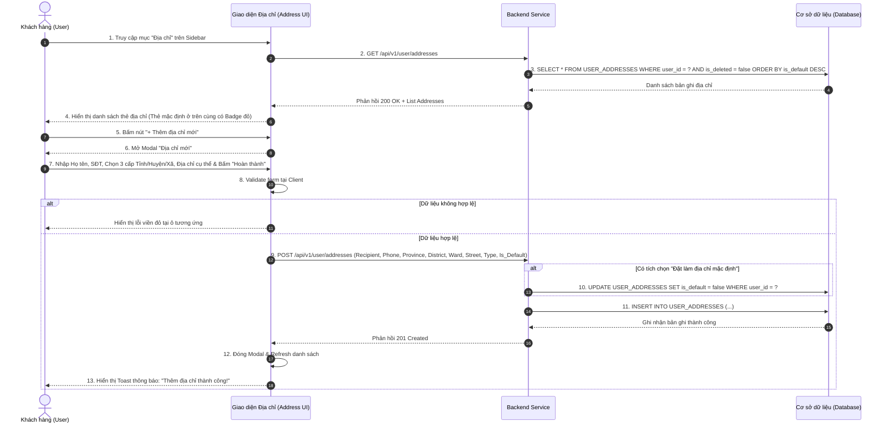

| Module | modules\account\common\address |
| ------ | ------------------------------- |
| Menu   | Trang chủ / Tài khoản của tôi / Địa chỉ (Common / Address Book) |
| Mô tả  | Dùng để cho phép đối tượng **Khách hàng / Người dùng đã đăng nhập (Customer / User)** quản lý toàn bộ danh sách địa chỉ nhận hàng (Sổ địa chỉ cá nhân). Mỗi người dùng có thể lưu trữ nhiều địa chỉ khác nhau phục vụ quá trình đặt hàng và giao vận. Giao diện được thiết kế chuẩn xác theo mẫu thực tế: Danh sách địa chỉ hiển thị rõ ràng thông tin người nhận, số điện thoại, địa chỉ chi tiết, phân cấp hành chính, loại địa chỉ và huy hiệu **Mặc định**. Hệ thống hỗ trợ các thao tác nghiệp vụ hoàn chỉnh: Xem danh sách, Thêm mới địa chỉ (qua Modal popup có tích hợp chọn vị trí bản đồ và phân loại Nhà Riêng / Văn Phòng), Cập nhật thông tin địa chỉ, Xóa địa chỉ phụ và Thiết lập địa chỉ mặc định. Áp dụng style UI, layout, component theo **style chung của project**. |

**Tổng quan màn Quản lý Sổ địa chỉ (UC-01.05):**
- A. Màn hình Danh sách Địa chỉ (Main Address List Area)
  - A.1. Header danh sách địa chỉ
  - A.2. Bảng thông tin thẻ địa chỉ hiển thị (Address Card Items)
  - A.3. Button và thao tác trên danh sách địa chỉ
- B. Modal / Popup "Địa chỉ mới" & "Cập nhật địa chỉ" (Address Modal)
  - B.1. Header và tiêu đề Modal
  - B.2. Thông tin các trường dữ liệu trên form Modal
  - B.3. Button và thao tác chân trang Modal
- C. Popup Xác nhận Xóa địa chỉ (Delete Confirmation Modal)
- D. Quy tắc nghiệp vụ (Business Rules)
  - BR-01: Số lượng địa chỉ tối đa của người dùng
  - BR-02: Quy tắc quản lý Địa chỉ mặc định (Default Address Policy)
  - BR-03: Thẩm định thông tin người nhận & Địa chỉ hành chính (Validation Rules)
  - BR-04: Quy tắc xóa địa chỉ & Ràng buộc toàn vẹn dữ liệu
  - BR-05: Cấu trúc lưu trữ CSDL (Data Model `USER_ADDRESSES`)
- E. Luồng nghiệp vụ chi tiết (Workflows)
  - E.1. Luồng xem và thêm địa chỉ mới (Happy Path)
  - E.2. Luồng cập nhật địa chỉ
  - E.3. Luồng thiết lập địa chỉ mặc định
  - E.4. Luồng xóa địa chỉ
  - E.5. Sơ đồ tuần tự nghiệp vụ (Sequence Diagram)
- F. Danh mục thông báo / Cảnh báo hệ thống (System Messages)

---

# A. Màn hình Danh sách Địa chỉ (Main Address List Area)

Nằm trong khung nội dung bên phải của phân hệ "Tài khoản của tôi" (bên cạnh Sidebar điều hướng `Profile.md`, `Address.md`, `ChangePassword.md`).

## A.1. Header danh sách địa chỉ

| Tên | Loại dữ liệu | Bắt buộc | Mô tả |
| --- | ------------ | -------- | ----- |
| Tiêu đề trang | Title | | Tiêu đề lớn: **"Địa chỉ của tôi"** (font size 20px, bold). |
| Nút Thêm địa chỉ mới | Button | | Button chính (Primary Button), màu cam/đỏ thương hiệu, label: **"+ Thêm địa chỉ mới"** nằm ở góc trên bên phải header.<br><br>Thao tác: Nhấp vào sẽ mở Modal popup **"Địa chỉ mới" (Mục B)**. |
| Đường kẻ ngăn cách | Divider | | Đường kẻ ngang mảnh (`border-bottom`) ngăn cách giữa header và danh sách thẻ địa chỉ bên dưới. |

## A.2. Bảng thông tin thẻ địa chỉ hiển thị (Address Card Items)

Mỗi địa chỉ được hiển thị thành một khối thẻ (Card Item) phân cách nhau bằng đường kẻ ngang mảnh, cấu trúc gồm 3 dòng và các nút thao tác góc phải (khớp 100% hình ảnh thực tế):

| Tên thành phần | Loại dữ liệu | Vị trí | Mô tả | Mô tả Database |
| -------------- | ------------ | ------ | ----- | -------------- |
| Họ và tên người nhận | Text (Bold) | Dòng 1 (Trái) | Hiển thị họ và tên người nhận hàng (ví dụ: `Giang Trung Hiếu`, `Hieu Trung`). In đậm rõ nét. | RECIPIENT_NAME |
| Ký tự phân cách | Text | Dòng 1 (Trái) | Dấu gạch đứng phân cách: `\|` màu xám nhạt nằm giữa Họ tên và Số điện thoại. | |
| Số điện thoại người nhận | Text | Dòng 1 (Trái) | Hiển thị số điện thoại nhận hàng kèm mã vùng hoặc đầu số: `(+84) 966 875 204` hoặc `0966 875 204`. Màu chữ xám vừa. | PHONE_NUMBER |
| Địa chỉ cụ thể | Text | Dòng 2 (Trái) | Hiển thị số nhà, ngõ/ngách, tên đường, thôn/xóm, tên tòa nhà (ví dụ: `Xóm 1 Thôn Đa Hoà`, `Nhà Trọ Xanh Lá Hường`, `Trọ Mạnh Hưng, Thôn 3`). | STREET_ADDRESS |
| Địa chỉ hành chính 3 cấp | Text | Dòng 3 (Trái) | Hiển thị phân cấp hành chính đầy đủ: Xã/Phường, Quận/Huyện, Tỉnh/Thành phố (ví dụ: `Xã Mễ Sở, Tỉnh Hưng Yên`, `Xã Hòa Lạc, Thành phố Hà Nội`). | WARD_NAME, DISTRICT_NAME, PROVINCE_NAME |
| Huy hiệu Mặc định | Tag / Badge | Dòng 4 (Trái) | Khung viền chữ nhật màu đỏ/cam, text: **"Mặc định"**. Chỉ hiển thị ở thẻ địa chỉ đang được đặt làm mặc định (`IS_DEFAULT = true`). | IS_DEFAULT |
| Nhãn loại địa chỉ | Tag / Badge | Dòng 4 (Trái) | Huy hiệu nhỏ màu xám/xanh hiển thị loại địa chỉ: `[Nhà Riêng]` hoặc `[Văn Phòng]` (tùy cấu hình). | ADDRESS_TYPE |

## A.3. Button và thao tác trên danh sách địa chỉ

Nằm ở góc trên bên phải của từng thẻ địa chỉ:

| Tên thao tác | Loại dữ liệu | Điều kiện hiển thị | Mô tả |
| ------------ | ------------ | ------------------ | ----- |
| Cập nhật | Hyperlink | Luôn hiển thị | Text link màu xanh dương: **"Cập nhật"**.<br><br>Thao tác: Nhấp vào sẽ mở Modal popup **"Cập nhật địa chỉ" (Mục B)** với toàn bộ dữ liệu của bản ghi được điền sẵn vào các ô tương ứng. |
| Xóa | Hyperlink | **Chỉ hiển thị khi địa chỉ KHÔNG PHẢI là Mặc định** (`IS_DEFAULT = false`) | Text link màu xanh dương: **"Xóa"** (nằm sau dấu `\|` cạnh chữ Cập nhật).<br><br>Thao tác: Nhấp vào sẽ mở Popup xác nhận xóa **(Mục C)**.<br><br>*Lưu ý:* Đối với địa chỉ đang là Mặc định, nút **Xóa** hoàn toàn bị ẩn để tránh tình trạng tài khoản không có địa chỉ mặc định. |
| Thiết lập mặc định | Button | Luôn hiển thị | Button hình chữ nhật outline (viền xám nhạt), label: **"Thiết lập mặc định"** nằm ở góc dưới bên phải thẻ.<br><br>Trạng thái:<br>- Nếu thẻ đã là Mặc định: Nút bị **Disabled (mờ)** không cho nhấn.<br>- Nếu thẻ chưa phải là Mặc định: Nút Active sáng rõ. Nhấp vào sẽ gửi request đặt bản ghi này làm địa chỉ mặc định duy nhất của tài khoản. |

---

# B. Modal / Popup "Địa chỉ mới" & "Cập nhật địa chỉ" (Address Modal)

Khi người dùng nhấn nút **"+ Thêm địa chỉ mới"** hoặc nhấn **"Cập nhật"** tại bất kỳ thẻ địa chỉ nào, hệ thống hiển thị cửa sổ Modal popup khóa màn hình nền (Modal Overlay / Backdrop) theo đúng thiết kế trong ảnh.

## B.1. Header và tiêu đề Modal

| Tên | Loại dữ liệu | Bắt buộc | Mô tả |
| --- | ------------ | -------- | ----- |
| Tiêu đề Modal | Title | | Text lớn: **"Địa chỉ mới"** (khi thêm) hoặc **"Cập nhật địa chỉ"** (khi sửa). |

## B.2. Thông tin các trường dữ liệu trên form Modal

| Tên trường | Loại dữ liệu | Bắt buộc | Vị trí layout | Mô tả | Mô tả Database | Độ dài |
| ---------- | ------------ | -------- | ------------- | ----- | -------------- | ------ |
| Họ và tên | TextInput | x | Hàng 1 (Cột trái) | Ô nhập họ và tên của người nhận hàng.<br><br>Placeholder: **"Họ và tên"**.<br><br>Quy tắc kiểm tra (Validate):<br>- Không được để trống.<br>- Độ dài từ 2 đến 100 ký tự.<br>- Không chứa số và ký tự đặc biệt.<br>- Tự động trim khoảng trắng.<br><br>Cảnh báo lỗi: *Vui lòng nhập họ và tên người nhận.* | RECIPIENT_NAME | 100 |
| Số điện thoại | TextInput | x | Hàng 1 (Cột phải) | Ô nhập số điện thoại người nhận hàng.<br><br>Placeholder: **"Số điện thoại"**.<br><br>Quy tắc kiểm tra (Validate):<br>- Không được để trống.<br>- Đúng 10 chữ số di động Việt Nam (`03, 05, 07, 08, 09`).<br>- Chỉ chấp nhận số (`0-9`).<br><br>Cảnh báo lỗi: *Số điện thoại người nhận không hợp lệ.* | PHONE_NUMBER | 15 |
| Phân cấp hành chính | Cascader / Select | x | Hàng 2 (Full-width) | Hộp chọn liên hoàn 3 cấp (Dropdown) chọn địa giới hành chính Việt Nam.<br><br>Placeholder: **"Tỉnh/Thành Phố, Quận/Huyện, Phường/Xã"**.<br><br>Quy tắc chọn:<br>- Bước 1: Chọn Tỉnh/Thành phố.<br>- Bước 2: Hệ thống load danh sách Quận/Huyện tương ứng.<br>- Bước 3: Hệ thống load danh sách Phường/Xã/Thị trấn tương ứng.<br>- Bắt buộc phải chọn đủ cả 3 cấp hành chính.<br><br>Cảnh báo lỗi: *Vui lòng chọn đầy đủ Tỉnh/Thành phố, Quận/Huyện, Phường/Xã.* | PROVINCE_ID, DISTRICT_ID, WARD_CODE (kèm NAME tương ứng) | 50 |
| Địa chỉ cụ thể | TextInput / Textarea | x | Hàng 3 (Full-width) | Ô nhập số nhà, ngõ ngách, tên đường, khu dân cư, thôn/xóm hoặc tên tòa nhà/phòng.<br><br>Placeholder: **"Địa chỉ cụ thể"**.<br><br>Quy tắc kiểm tra (Validate):<br>- Không được để trống.<br>- Độ dài từ 5 đến 255 ký tự.<br><br>Cảnh báo lỗi: *Vui lòng nhập địa chỉ cụ thể.* | STREET_ADDRESS | 255 |
| Bản đồ vị trí | MapPicker / Block | | Hàng 4 (Full-width) | Khung bản đồ hình chữ nhật xám mờ minh họa vị trí địa lý kèm nút bấm ở giữa: **"+ Thêm vị trí"**.<br><br>Thao tác: Nhấp vào sẽ mở bản đồ số (Google Maps / OpenStreetMap) để người dùng ghim vị trí tọa độ GPS chính xác (Latitude, Longitude), hỗ trợ tài xế giao hàng tìm đường nhanh chóng. Không bắt buộc ghim. | LATITUDE, LONGITUDE | DECIMAL(10,8) |
| Loại địa chỉ | RadioButton Group | x | Hàng 5 (Full-width) | Tiêu đề nhãn: **"Loại địa chỉ:"**.<br><br>Gồm 2 nút lựa chọn đơn (Button-style Radio):<br>- **Nhà Riêng** (Giao mọi thời điểm trong tuần).<br>- **Văn Phòng** (Chỉ giao giờ hành chính).<br><br>Mặc định chọn: **"Nhà Riêng"**. Bắt buộc chọn 1 trong 2. | ADDRESS_TYPE ('HOME', 'OFFICE') | 20 |
| Đặt làm địa chỉ mặc định | Checkbox | | Hàng 6 (Full-width) | Checkbox nhãn: **"Đặt làm địa chỉ mặc định"**.<br><br>Quy tắc xử lý (theo **BR-02**):<br>- Nếu đây là địa chỉ đầu tiên của tài khoản: Hệ thống tự động tích chọn và khóa mờ (Disabled - bắt buộc là mặc định).<br>- Nếu là địa chỉ thứ 2 trở đi (khi thêm mới): Mặc định chưa tích. Cho phép người dùng tích chọn nếu muốn đổi thành địa chỉ mặc định mới.<br>- Khi cập nhật bản ghi đang là mặc định: Tích chọn sẵn và Disabled (không cho phép bỏ tích trực tiếp; muốn đổi mặc định thì phải gán địa chỉ khác). | IS_DEFAULT (BOOLEAN) | 1 |

## B.3. Button và thao tác chân trang Modal

| Tên | Loại dữ liệu | Bắt buộc | Mô tả |
| --- | ------------ | -------- | ----- |
| Trở Lại | Button | | Button phụ (Outline / Ghost Button), label: **"Trở Lại"**.<br><br>Thao tác: Nhấn vào sẽ đóng Modal popup ngay lập tức, hủy bỏ mọi thông tin đang nhập dở và giữ nguyên danh sách địa chỉ hiện tại. Không thay đổi CSDL. |
| Hoàn thành | Button | | Button chính (Primary Button), màu cam/đỏ thương hiệu, label: **"Hoàn thành"**.<br><br>Điều kiện & Xử lý:<br>- Khi bấm: Validate toàn bộ các trường bắt buộc trên modal (Họ tên, SĐT, Phân cấp 3 cấp, Địa chỉ cụ thể, Loại địa chỉ).<br>- Nếu có trường lỗi: Dừng luồng, viền đỏ ô lỗi và hiển thị cảnh báo.<br>- Nếu hợp lệ: Gửi request lưu dữ liệu (Thêm mới `POST` hoặc Cập nhật `PUT`) $\rightarrow$ Lưu vào CSDL $\rightarrow$ Đóng modal $\rightarrow$ Tải lại danh sách địa chỉ $\rightarrow$ Hiển thị Toast thông báo thành công. |

---

# C. Popup Xác nhận Xóa địa chỉ (Delete Confirmation Modal)

Khi người dùng nhấn chữ **"Xóa"** tại một thẻ địa chỉ phụ (không phải mặc định), hệ thống mở dialog xác nhận:

| Tên | Loại dữ liệu | Bắt buộc | Mô tả |
| --- | ------------ | -------- | ----- |
| Tiêu đề Popup | Title | | Text in đậm: **"Xóa địa chỉ"**. |
| Nội dung thông báo | Text | | *"Bạn có chắc chắn muốn xóa địa chỉ nhận hàng này không?"* |
| Nút Hủy | Button | | Label: **"Hủy"** (Outline button). Nhấn vào đóng popup, không thực hiện xóa. |
| Nút Xóa | Button | | Label: **"Xóa"** (Danger Button màu đỏ). Nhấn vào gửi request `DELETE /api/v1/user/addresses/{id}` $\rightarrow$ Xóa bản ghi trong CSDL $\rightarrow$ Đóng popup $\rightarrow$ Cập nhật lại danh sách $\rightarrow$ Hiển thị Toast: *"Xóa địa chỉ thành công!"*. |

---

# D. Quy tắc nghiệp vụ (Business Rules)

## BR-01: Số lượng địa chỉ tối đa của người dùng
1. Nhằm tối ưu hóa tài nguyên và chống spam dữ liệu, mỗi tài khoản Customer được phép lưu trữ tối đa **10 địa chỉ nhận hàng**.
2. Khi người dùng đã có đủ 10 địa chỉ: Nút **"+ Thêm địa chỉ mới"** trên Header sẽ bị vô hiệu hóa (disabled), hiển thị tooltip: *"Bạn đã đạt giới hạn tối đa 10 địa chỉ. Vui lòng xóa bớt địa chỉ cũ để thêm mới."*

## BR-02: Quy tắc quản lý Địa chỉ mặc định (Default Address Policy)
1. **Tính duy nhất:** Trong danh sách địa chỉ của mỗi người dùng, **luôn luôn có duy nhất 1 địa chỉ được đánh dấu là Mặc định (`IS_DEFAULT = true`)**.
2. **Khởi tạo địa chỉ đầu tiên:** Khi người dùng tạo địa chỉ nhận hàng đầu tiên cho tài khoản, hệ thống **tự động gán `IS_DEFAULT = true`** mà người dùng không thể bỏ chọn.
3. **Chuyển giao quyền mặc định:** Khi người dùng tạo mới hoặc cập nhật một địa chỉ và tích chọn *"Đặt làm địa chỉ mặc định"*, hoặc nhấn nút *"Thiết lập mặc định"* trên thẻ:
   - Hệ thống tự động chuyển địa chỉ hiện tại thành: `IS_DEFAULT = true`.
   - Đồng thời tự động cập nhật địa chỉ mặc định cũ về: `IS_DEFAULT = false` (trong cùng một transaction CSDL).
4. **Bảo vệ địa chỉ mặc định:**
   - Tuyệt đối **không cho phép xóa địa chỉ đang là Mặc định**. Muốn xóa, người dùng bắt buộc phải chuyển quyền mặc định sang một địa chỉ khác trước.

## BR-03: Thẩm định thông tin người nhận & Địa chỉ hành chính (Validation Rules)
1. **Họ và tên:** Tối thiểu 2 ký tự, tối đa 100 ký tự. Không chứa số hoặc ký tự đặc biệt vô lý.
2. **Số điện thoại:** Bắt buộc 10 chữ số di động hợp lệ của Việt Nam.
3. **Phân cấp hành chính:** Bắt buộc phải chọn đủ 3 cấp từ danh mục quốc gia: Tỉnh/Thành phố $\rightarrow$ Quận/Huyện $\rightarrow$ Phường/Xã/Thị trấn. Nếu người dùng đổi Tỉnh/TP thì Quận/Huyện và Phường/Xã tự động reset về rỗng.
4. **Địa chỉ cụ thể:** Tối thiểu 5 ký tự, tối đa 255 ký tự. Không được để trống.

## BR-04: Quy tắc xóa địa chỉ & Ràng buộc toàn vẹn dữ liệu
1. **Không xóa cứng nếu đã có đơn hàng liên kết:** Nếu địa chỉ đã từng được sử dụng trong các đơn hàng đã đặt (`ORDERS`), hệ thống thực hiện cơ chế **Xóa mềm (Soft Delete: `IS_DELETED = true`)** để bảo toàn lịch sử hóa đơn và chứng từ vận chuyển, chỉ ẩn khỏi danh sách hiển thị của khách hàng.
2. Nếu địa chỉ chưa từng phát sinh đơn hàng, cho phép xóa bản ghi khỏi bảng `USER_ADDRESSES`.

## BR-05: Cấu trúc lưu trữ CSDL (Data Model `USER_ADDRESSES`)
Bảng CSDL lưu trữ thông tin địa chỉ:
- `ID`: BIGINT, Primary Key, Auto Increment.
- `USER_ID`: BIGINT, Foreign Key trỏ tới bảng `USERS`.
- `RECIPIENT_NAME`: VARCHAR(100), NOT NULL.
- `PHONE_NUMBER`: VARCHAR(15), NOT NULL.
- `PROVINCE_ID`: VARCHAR(20), NOT NULL.
- `PROVINCE_NAME`: VARCHAR(100), NOT NULL.
- `DISTRICT_ID`: VARCHAR(20), NOT NULL.
- `DISTRICT_NAME`: VARCHAR(100), NOT NULL.
- `WARD_CODE`: VARCHAR(20), NOT NULL.
- `WARD_NAME`: VARCHAR(100), NOT NULL.
- `STREET_ADDRESS`: VARCHAR(255), NOT NULL.
- `LATITUDE`: DECIMAL(10, 8), NULLABLE.
- `LONGITUDE`: DECIMAL(11, 8), NULLABLE.
- `ADDRESS_TYPE`: ENUM('HOME', 'OFFICE'), DEFAULT 'HOME'.
- `IS_DEFAULT`: BOOLEAN, DEFAULT FALSE.
- `IS_DELETED`: BOOLEAN, DEFAULT FALSE.
- `CREATED_AT`, `UPDATED_AT`: TIMESTAMP.

---

# E. Luồng nghiệp vụ chi tiết (Workflows)

## E.1. Luồng xem và thêm địa chỉ mới (Happy Path)

```
[Khách hàng] ──► Nhấp menu "Địa chỉ" trên Sidebar
                     │
                     ▼
          Hệ thống truy vấn danh sách địa chỉ từ CSDL
          Hiển thị các thẻ địa chỉ (Thẻ Mặc định có badge đỏ, nút Thiết lập mặc định bị disable)
                     │
                     ▼
          Khách hàng nhấp nút [+ Thêm địa chỉ mới]
                     │
                     ▼
          Mở Modal "Địa chỉ mới" (Khớp ảnh mẫu)
          Khách hàng điền: Họ tên, SĐT, Chọn 3 cấp Tỉnh/Huyện/Xã, Địa chỉ cụ thể, Chọn Nhà Riêng/Văn Phòng
                     │
                     ▼
          Khách hàng bấm [Hoàn thành]
                     │
                     ▼
          Hệ thống kiểm tra validate dữ liệu $\rightarrow$ INSERT vào bảng USER_ADDRESSES
          (Nếu tích làm mặc định $\rightarrow$ Cập nhật các bản ghi khác về IS_DEFAULT = false)
                     │
                     ▼
          Đóng Modal, tải lại danh sách thẻ địa chỉ
          Hiển thị Toast: "Thêm địa chỉ thành công!"
```

## E.2. Luồng cập nhật địa chỉ
1. Khách hàng nhấp vào chữ **"Cập nhật"** tại một thẻ địa chỉ.
2. Hệ thống mở Modal popup với tiêu đề: **"Cập nhật địa chỉ"**, tự động load thông tin cũ vào các ô: Họ tên, SĐT, Tỉnh/Huyện/Xã, Địa chỉ cụ thể, Loại địa chỉ và Checkbox Mặc định.
3. Khách hàng chỉnh sửa thông tin cần thay đổi và bấm **"Hoàn thành"**.
4. Hệ thống validate và gửi lệnh `PUT /api/v1/user/addresses/{id}` cập nhật CSDL.
5. Đóng modal, cập nhật lại giao diện danh sách và hiển thị thông báo Toast thành công.

## E.3. Luồng thiết lập địa chỉ mặc định
1. Khách hàng tìm thẻ địa chỉ mong muốn (thẻ chưa phải là mặc định).
2. Khách hàng bấm nút **"Thiết lập mặc định"** trên thẻ đó.
3. Hệ thống gửi request `PATCH /api/v1/user/addresses/{id}/set-default`.
4. Backend kích hoạt Transaction CSDL:
   - Cập nhật địa chỉ được chọn: `IS_DEFAULT = true`.
   - Cập nhật địa chỉ mặc định cũ: `IS_DEFAULT = false`.
5. Frontend cập nhật lại giao diện: Gắn badge đỏ `[Mặc định]` vào thẻ mới, ẩn nút Xóa của thẻ đó, nút "Thiết lập mặc định" chuyển sang trạng thái disabled; thẻ cũ mất badge đỏ và sáng lại nút Xóa.

## E.4. Luồng xóa địa chỉ
1. Khách hàng nhấp vào chữ **"Xóa"** tại một thẻ địa chỉ phụ.
2. Hệ thống mở dialog popup: *"Bạn có chắc chắn muốn xóa địa chỉ nhận hàng này không?"*.
3. Khách hàng nhấp nút **"Xóa"** (màu đỏ).
4. Hệ thống gọi API `DELETE /api/v1/user/addresses/{id}` xóa bản ghi (hoặc soft-delete).
5. Đóng popup, gỡ bỏ thẻ khỏi danh sách và hiển thị Toast: *"Xóa địa chỉ thành công!"*.

## E.5. Sơ đồ tuần tự nghiệp vụ (Sequence Diagram)



---

# F. Danh mục thông báo / Cảnh báo hệ thống (System Messages)

| Mã thông báo | Loại hiển thị | Nội dung thông báo | Điều kiện xuất hiện |
| ------------ | ------------- | ------------------ | ------------------- |
| `MSG_ADR_01` | Inline Error | *Vui lòng nhập họ và tên người nhận.* | Để trống ô Họ và tên trên Modal địa chỉ. |
| `MSG_ADR_02` | Inline Error | *Số điện thoại người nhận không hợp lệ.* | Để trống hoặc nhập sai định dạng 10 số di động VN. |
| `MSG_ADR_03` | Inline Error | *Vui lòng chọn đầy đủ Tỉnh/Thành phố, Quận/Huyện, Phường/Xã.* | Chưa chọn đủ 3 cấp hành chính. |
| `MSG_ADR_04` | Inline Error | *Vui lòng nhập địa chỉ cụ thể.* | Để trống ô Địa chỉ cụ thể. |
| `MSG_ADR_05` | Toast Warning| *Bạn đã lưu tối đa 10 địa chỉ. Vui lòng xóa bớt địa chỉ cũ để thêm mới.* | Bấm thêm mới khi tài khoản đã có 10 địa chỉ (BR-01). |
| `MSG_ADR_06` | Toast Success| *Thêm địa chỉ nhận hàng thành công!* | Thêm mới địa chỉ thành công. |
| `MSG_ADR_07` | Toast Success| *Cập nhật địa chỉ thành công!* | Chỉnh sửa và lưu thông tin địa chỉ thành công. |
| `MSG_ADR_08` | Toast Success| *Xóa địa chỉ thành công!* | Xóa địa chỉ phụ thành công. |
| `MSG_ADR_09` | Toast Success| *Thiết lập địa chỉ mặc định thành công!* | Đổi địa chỉ mặc định thành công. |
| `MSG_ADR_10` | Toast Error  | *Không thể xóa địa chỉ mặc định.* | Cố tình gọi lệnh xóa bản ghi đang có `IS_DEFAULT = true` (BR-02). |
