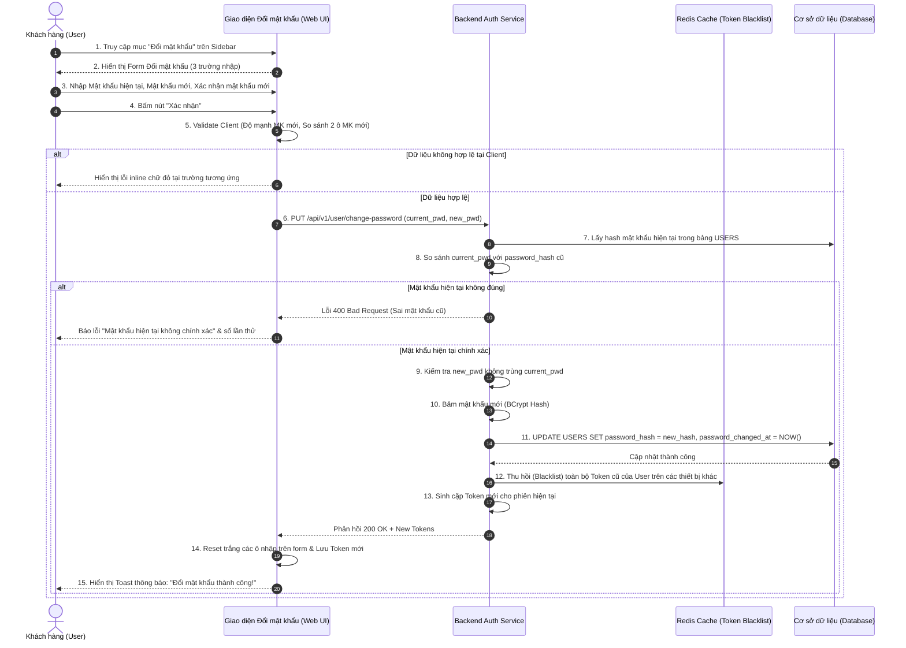

| Module | modules\account\common\change-password |
| ------ | --------------------------------------- |
| Menu   | Trang chủ / Tài khoản của tôi / Đổi mật khẩu (Common / Change Password) |
| Mô tả  | Dùng để cho phép đối tượng **Khách hàng / Người dùng đã đăng nhập (Customer / User)** chủ động thay đổi mật khẩu đăng nhập của tài khoản định kỳ hoặc khi nghi ngờ mật khẩu cũ bị lộ. Màn hình nằm trong cụm phân hệ **"Tài khoản của tôi"** với thanh điều hướng Sidebar bên trái (mục "Đổi mật khẩu" active). Người dùng thực hiện khai báo Mật khẩu hiện tại, thiết lập Mật khẩu mới đạt chuẩn bảo mật và nhập Xác nhận mật khẩu mới. Hệ thống kiểm tra đối soát mật khẩu cũ, ràng buộc không trùng mật khẩu cũ và băm mật khẩu mới an toàn vào CSDL `USERS`. Đồng thời, hệ thống tự động thu hồi (revoke) các phiên đăng nhập cũ trên các thiết bị khác để bảo đảm an toàn thông tin tối đa. Áp dụng style UI, layout, component theo **style chung của project**. |

**Tổng quan màn Đổi mật khẩu (UC-01.06):**
- A. Bố cục chung & Thanh điều hướng Sidebar
  - A.1. Sidebar điều hướng phân hệ Tài khoản
- B. Màn hình Đổi mật khẩu (Main Change Password Content Area)
  - B.1. Header khu vực đổi mật khẩu
  - B.2. Thông tin các trường dữ liệu trên form đổi mật khẩu
  - B.3. Button và thao tác hoàn tất
- C. Quy tắc nghiệp vụ (Business Rules)
  - BR-01: Thẩm định Mật khẩu hiện tại & Chống Brute-force
  - BR-02: Quy chuẩn Mật khẩu mới & Chống trùng mật khẩu cũ
  - BR-03: Ràng buộc đối soát Xác nhận mật khẩu mới
  - BR-04: Vô hiệu hóa phiên đăng nhập cũ trên thiết bị khác (Session Revocation)
  - BR-05: Giữ phiên đăng nhập hiện tại & Cập nhật CSDL
- D. Luồng nghiệp vụ chi tiết (Workflows)
  - D.1. Luồng chính (Main Flow - Happy Path)
  - D.2. Luồng ngoại lệ & Luồng thay thế (Alternative & Exception Flows)
  - D.3. Sơ đồ tuần tự nghiệp vụ (Sequence Diagram)
- E. Danh mục thông báo / Cảnh báo hệ thống (System Messages)

---

# A. Bố cục chung & Thanh điều hướng Sidebar

Trang dùng chung bố cục 2 cột tiêu chuẩn của phân hệ "Tài khoản của tôi":
- **Cột trái (25% chiều rộng):** Thanh điều hướng Sidebar tài khoản cá nhân.
- **Cột phải (75% chiều rộng):** Khung form Đổi mật khẩu.

## A.1. Sidebar điều hướng phân hệ Tài khoản

| Tên Menu | Trạng thái | Điều hướng | Mô tả |
| -------- | ---------- | ---------- | ----- |
| **Tài khoản của tôi** | Nhóm Menu cha | | Menu accordion mở rộng mặc định |
| ↳ **Hồ sơ** | Inactive | `docs/Fe-01/Common/Profile/Profile.md` | Xem và chỉnh sửa thông tin cá nhân. |
| ↳ **Địa chỉ** | Inactive | `docs/Fe-01/Common/Profile/Address.md` | Quản lý sổ địa chỉ nhận hàng. |
| ↳ **Đổi mật khẩu** | **Active** (Chữ cam/đỏ) | `docs/Fe-01/Common/Profile/ChangePassword.md` | Màn hình hiện tại. |
| **Đơn mua (Lịch sử Order)** | Inactive | Sắp ra mắt | Quản lý lịch sử đơn hàng (triển khai sau). |

---

# B. Màn hình Đổi mật khẩu (Main Change Password Content Area)

Khung nội dung bên phải hiển thị form đổi mật khẩu được thiết kế trang nhã, bảo mật và thân thiện.

## B.1. Header khu vực đổi mật khẩu

| Tên | Loại dữ liệu | Bắt buộc | Mô tả |
| --- | ------------ | -------- | ----- |
| Tiêu đề trang | Title | | Tiêu đề lớn: **"Đổi mật khẩu"** (font size 20px, bold). |
| Phụ đề mô tả | Text | | Dòng text phụ màu xám bên dưới: *"Để bảo mật tài khoản, vui lòng không chia sẻ mật khẩu cho người khác"*. |
| Đường kẻ ngăn cách | Divider | | Đường kẻ ngang mảnh (`border-bottom`) ngăn cách giữa header và form chi tiết. |

## B.2. Thông tin các trường dữ liệu trên form đổi mật khẩu

| Tên | Loại dữ liệu | Bắt buộc | Mô tả | Mô tả Database | Độ dài |
| --- | ------------ | -------- | ----- | -------------- | ------ |
| Mật khẩu hiện tại | PasswordInput | x | Ô nhập mật khẩu người dùng đang sử dụng để đăng nhập.<br><br>Placeholder: **"Nhập mật khẩu hiện tại"**.<br><br>Mặc định ẩn dạng ký tự chấm tròn (`••••••••`). Có icon mắt bật/tắt hiển thị rõ mật khẩu.<br><br>Kèm liên kết text nhỏ màu xanh/cam bên dưới hoặc bên phải: *"Quên mật khẩu?"* (nhấp vào điều hướng sang màn `docs/Fe-01/Common/Account/ForgotPassword.md`).<br><br>Quy tắc kiểm tra (Validate):<br>- Không được để trống.<br>- Phải trùng khớp với mật khẩu băm lưu trong CSDL theo **BR-01**.<br><br>Cảnh báo lỗi inline:<br>- Để trống: *Vui lòng nhập mật khẩu hiện tại.*<br>- Không chính xác: *Mật khẩu hiện tại không chính xác. Bạn còn [5 - X] lần thử.* | PASSWORD_HASH (Đối soát băm BCrypt / Argon2id) | 255 |
| Mật khẩu mới | PasswordInput | x | Ô thiết lập mật khẩu mới cho tài khoản.<br><br>Placeholder: **"Nhập mật khẩu mới"**.<br><br>Mặc định ẩn ký tự; có icon mắt bật/tắt hiển thị mật khẩu rõ.<br><br>Quy tắc kiểm tra (Validate) theo **BR-02**:<br>- Không được để trống.<br>- Độ dài **tối thiểu 8 ký tự trở lên** (chuẩn hóa toàn hệ thống).<br>- Phải bao gồm đồng thời ít nhất: 1 chữ cái in hoa (`A-Z`), 1 chữ cái in thường (`a-z`), 1 chữ số (`0-9`) và 1 ký tự đặc biệt (`!@#$%^&*()_+-=[]{}|;:,.<>?`).<br>- Không chứa khoảng trắng.<br>- Không được trùng khớp với Mật khẩu hiện tại.<br>- Hiển thị thanh đo độ mạnh mật khẩu (Yếu / Trung bình / Mạnh) kèm checklist tiêu chuẩn trực quan.<br><br>Cảnh báo lỗi inline:<br>- Để trống: *Vui lòng nhập mật khẩu mới.*<br>- Không đủ chuẩn: *Mật khẩu phải dài từ 8 ký tự trở lên, bao gồm 1 chữ viết hoa, 1 chữ viết thường, số và ký tự đặc biệt.*<br>- Trùng mật khẩu cũ: *Mật khẩu mới không được trùng với mật khẩu hiện tại.* | PASSWORD_HASH (Băm trước khi lưu) | 255 |
| Xác nhận mật khẩu mới | PasswordInput | x | Ô nhập lại mật khẩu mới để xác nhận tính chính xác.<br><br>Placeholder: **"Nhập lại mật khẩu mới"**.<br><br>Mặc định ẩn ký tự; có icon mắt bật/tắt hiển thị mật khẩu.<br><br>Quy tắc kiểm tra (Validate) theo **BR-03**:<br>- Không được để trống.<br>- Phải trùng khớp 100% với giá trị đã nhập tại trường **Mật khẩu mới**.<br><br>Cảnh báo lỗi inline:<br>- Để trống: *Vui lòng xác nhận mật khẩu mới.*<br>- Không trùng khớp: *Mật khẩu xác nhận không khớp với mật khẩu mới.* | Không lưu CSDL (Chỉ dùng kiểm tra tại Client/API) | 32 |

## B.3. Button và thao tác hoàn tất

| Tên | Loại dữ liệu | Bắt buộc | Mô tả |
| --- | ------------ | -------- | ----- |
| Xác nhận | Button | | Button chính (Primary Button), màu cam/đỏ thương hiệu, label: **"Xác nhận"**.<br><br>Điều kiện & Xử lý:<br>- Khi bấm: Validate cú pháp toàn bộ 3 trường mật khẩu.<br>- Nếu có trường lỗi: Dừng luồng, báo lỗi inline dưới ô tương ứng.<br>- Nếu hợp lệ: Nút chuyển sang trạng thái Loading (spinner + disable). Gửi request `POST /api/v1/user/change-password` lên Server $\rightarrow$ Kiểm tra mật khẩu hiện tại trong CSDL $\rightarrow$ Băm mật khẩu mới và cập nhật `PASSWORD_HASH` $\rightarrow$ Thu hồi các phiên đăng nhập cũ trên thiết bị khác (theo **BR-04**) $\rightarrow$ Xóa trắng các ô nhập trên form $\rightarrow$ Hiển thị Toast thông báo: *"Đổi mật khẩu thành công!"*. |
| Ẩn / Hiện mật khẩu | Button icon | | Icon hình con mắt nằm bên trong góc phải ở cả 3 ô nhập mật khẩu. Cho phép người dùng chuyển đổi hiển thị văn bản rõ/ẩn độc lập trên từng ô. |

---

# C. Quy tắc nghiệp vụ (Business Rules)

## BR-01: Thẩm định Mật khẩu hiện tại & Chống Brute-force
1. Hệ thống đối soát chuỗi người dùng nhập tại ô "Mật khẩu hiện tại" với chuỗi băm `PASSWORD_HASH` trong CSDL bằng thuật toán an toàn (BCrypt / Argon2id).
2. **Kiểm soát brute-force:**
   - Hệ thống đếm số lần nhập sai mật khẩu hiện tại trong phiên làm việc.
   - Nếu nhập sai liên tiếp **5 lần**: Hệ thống tạm thời khóa tính năng đổi mật khẩu của tài khoản trong **15–30 phút**, trả về lỗi: *"Bạn đã nhập sai mật khẩu hiện tại quá 5 lần. Tính năng đổi mật khẩu tạm khóa trong 15 phút để bảo vệ tài khoản."*

## BR-02: Quy chuẩn Mật khẩu mới & Chống trùng mật khẩu cũ
1. **Quy chuẩn độ mạnh (Chuẩn hóa toàn hệ thống):** Mật khẩu mới bắt buộc phải tuân thủ nghiêm ngặt chính sách bảo mật hệ thống: Độ dài **tối thiểu 8 ký tự trở lên** (không giới hạn tối đa cứng, khuyến nghị ≤ 128 ký tự), bao gồm đồng thời ít nhất: 1 chữ cái in hoa (`A-Z`), 1 chữ cái in thường (`a-z`), 1 chữ số (`0-9`) và 1 ký tự đặc biệt (`!@#$%^&*()_+-=[]{}|;:,.<>?/~`). Không chứa khoảng trắng. Regex kiểm tra: `^(?=.*[a-z])(?=.*[A-Z])(?=.*\d)(?=.*[@#$%^&*!()_+\-=\[\]{}|;':",.<>?/~]).{8,}$`.
2. **Chống trùng mật khẩu cũ:** Mật khẩu mới sau khi băm không được trùng khớp với `PASSWORD_HASH` hiện tại. Nếu trùng, hệ thống từ chối cập nhật và báo lỗi: *"Mật khẩu mới không được trùng với mật khẩu hiện tại của bạn."*

## BR-03: Ràng buộc đối soát Xác nhận mật khẩu mới
1. Chuỗi ký tự tại ô "Xác nhận mật khẩu mới" phải trùng khớp 100% (có phân biệt hoa/thường) với chuỗi ký tự tại ô "Mật khẩu mới".
2. Thao tác đối soát được thực hiện ngay tại Client khi người dùng gõ (onBlur / onChange) và được đối soát lại lần thứ hai tại Server trước khi lưu.

## BR-04: Vô hiệu hóa phiên đăng nhập cũ trên thiết bị khác (Session Revocation)
Nhằm bảo vệ an toàn tối đa cho người dùng trong tình huống nghi ngờ tài khoản bị người khác đăng nhập trái phép:
1. Ngay khi đổi mật khẩu thành công, hệ thống tự động **thu hồi (Revoke / Invalidate) toàn bộ Refresh Token** của người dùng trên tất cả các trình duyệt, ứng dụng di động và thiết bị khác.
2. Các thiết bị khác khi gửi request tiếp theo sẽ nhận mã lỗi HTTP `401 Unauthorized` và bị buộc phải đăng xuất ra màn hình Đăng nhập.

## BR-05: Giữ phiên đăng nhập hiện tại & Cập nhật CSDL
1. **Duy trì phiên hiện tại:** Để không làm gián đoạn trải nghiệm người dùng, hệ thống **cấp lại (Refresh) một cặp Access Token & Refresh Token mới** cho chính trình duyệt vừa thực hiện đổi mật khẩu thành công, giúp người dùng tiếp tục sử dụng hệ thống mà không bị bắt đăng nhập lại.
2. **Cập nhật dữ liệu CSDL:**
   - `UPDATE USERS SET PASSWORD_HASH = ?, PASSWORD_CHANGED_AT = CURRENT_TIMESTAMP, FAILED_LOGIN_ATTEMPTS = 0 WHERE ID = ?`.
3. Xóa trắng nội dung 3 ô nhập mật khẩu trên form để bảo đảm an toàn thị giác.

---

# D. Luồng nghiệp vụ chi tiết (Workflows)

## D.1. Luồng chính (Main Flow - Happy Path)

```
[Khách hàng] ──► Chọn menu "Đổi mật khẩu" trên Sidebar
                     │
                     ▼
          Hiển thị form gồm 3 ô nhập:
          [Mật khẩu hiện tại], [Mật khẩu mới], [Xác nhận mật khẩu mới]
                     │
                     ▼
          Khách hàng điền đầy đủ 3 trường & Bấm [XÁC NHẬN]
                     │
                     ▼
          Validate Client (Độ mạnh MK mới, Trùng khớp xác nhận)
                     │ (Hợp lệ)
                     ▼
          Gửi API PUT /api/v1/user/change-password
          Backend kiểm tra Mật khẩu hiện tại trong CSDL
                     │ (Chính xác)
                     ▼
          Kiểm tra Mật khẩu mới không trùng Mật khẩu hiện tại
          Băm mật khẩu mới (BCrypt Hash) $\rightarrow$ Cập nhật vào CSDL
                     │
                     ▼
          Thu hồi toàn bộ Token cũ trên các thiết bị khác
          Cấp lại Token mới cho phiên hiện tại
                     │
                     ▼
          Xóa trắng form, hiển thị Toast: "Đổi mật khẩu thành công!"
```

## D.2. Luồng ngoại lệ & Luồng thay thế (Alternative & Exception Flows)

### A1. Để trống bất kỳ trường mật khẩu nào
- **Điều kiện:** Người dùng bấm "Xác nhận" khi có 1 trong 3 ô mật khẩu bị để trống.
- **Xử lý:** Hiển thị cảnh báo inline màu đỏ dưới trường bị bỏ trống và focus con trỏ vào ô lỗi đầu tiên.

### A2. Mật khẩu hiện tại không chính xác (BR-01)
- **Điều kiện:** Mật khẩu hiện tại người dùng nhập không khớp với CSDL.
- **Xử lý:** Tăng biến đếm số lần sai. Báo lỗi chữ đỏ: *"Mật khẩu hiện tại không chính xác. Bạn còn [5 - X] lần thử."*

### A3. Nhập sai mật khẩu hiện tại quá 5 lần (BR-01)
- **Điều kiện:** Nhập sai mật khẩu hiện tại liên tiếp 5 lần.
- **Xử lý:** Khóa nút Xác nhận và hiển thị cảnh báo: *"Bạn đã nhập sai quá 5 lần. Tính năng đổi mật khẩu tạm thời bị khóa trong 15 phút."*

### A4. Mật khẩu mới không đủ độ mạnh (BR-02)
- **Điều kiện:** Mật khẩu mới chưa đủ 8 ký tự hoặc thiếu chữ hoa, chữ thường, số, ký tự đặc biệt.
- **Xử lý:** Hiển thị lỗi chữ đỏ: *"Mật khẩu phải dài từ 8 ký tự trở lên, bao gồm 1 chữ viết hoa, 1 chữ viết thường, số và ký tự đặc biệt."*

### A5. Mật khẩu mới trùng với mật khẩu hiện tại (BR-02)
- **Điều kiện:** Người dùng nhập Mật khẩu mới giống hệt Mật khẩu hiện tại.
- **Xử lý:** Báo lỗi inline: *"Mật khẩu mới không được trùng với mật khẩu hiện tại."*

### A6. Xác nhận mật khẩu mới không trùng khớp (BR-03)
- **Điều kiện:** Ký tự tại ô Xác nhận khác với ô Mật khẩu mới.
- **Xử lý:** Báo lỗi inline: *"Mật khẩu xác nhận không khớp với mật khẩu mới."*

### A7. Người dùng quên mật khẩu hiện tại
- **Điều kiện:** Người dùng không nhớ mật khẩu hiện tại để nhập vào ô 1.
- **Xử lý:** Nhấp vào liên kết *"Quên mật khẩu?"* ngay dưới ô nhập $\rightarrow$ Hệ thống điều hướng sang màn hình Quên mật khẩu `docs/Fe-01/Common/Account/ForgotPassword.md` để xác thực qua OTP số điện thoại.

## D.3. Sơ đồ tuần tự nghiệp vụ (Sequence Diagram)



---

# E. Danh mục thông báo / Cảnh báo hệ thống (System Messages)

| Mã thông báo | Loại hiển thị | Nội dung thông báo | Điều kiện xuất hiện |
| ------------ | ------------- | ------------------ | ------------------- |
| `MSG_PWD_01` | Inline Error | *Vui lòng nhập mật khẩu hiện tại.* | Để trống trường Mật khẩu hiện tại khi bấm Xác nhận. |
| `MSG_PWD_02` | Inline Error | *Mật khẩu hiện tại không chính xác. Bạn còn [5 - X] lần thử.* | Nhập sai mật khẩu hiện tại (số lần sai < 5). |
| `MSG_PWD_03` | Popup Warning| *Bạn đã nhập sai mật khẩu quá 5 lần. Chức năng đổi mật khẩu tạm khóa trong 15 phút.* | Nhập sai mật khẩu hiện tại liên tiếp 5 lần (BR-01). |
| `MSG_PWD_04` | Inline Error | *Vui lòng nhập mật khẩu mới.* | Để trống trường Mật khẩu mới. |
| `MSG_PWD_05` | Inline Error | *Mật khẩu phải dài từ 8 ký tự trở lên, bao gồm 1 chữ viết hoa, 1 chữ viết thường, số và ký tự đặc biệt.* | Mật khẩu mới không đạt chuẩn bảo mật (BR-02). |
| `MSG_PWD_06` | Inline Error | *Mật khẩu mới không được trùng với mật khẩu hiện tại.* | Mật khẩu mới trùng với mật khẩu cũ (BR-02). |
| `MSG_PWD_07` | Inline Error | *Vui lòng xác nhận mật khẩu mới.* | Để trống trường Xác nhận mật khẩu mới. |
| `MSG_PWD_08` | Inline Error | *Mật khẩu xác nhận không khớp với mật khẩu mới.* | Giá trị Xác nhận mật khẩu khác Mật khẩu mới (BR-03). |
| `MSG_PWD_09` | Toast Success| *Đổi mật khẩu thành công!* | Cập nhật mật khẩu mới thành công vào CSDL. |
| `MSG_PWD_10` | Toast Error  | *Có lỗi xảy ra trong quá trình cập nhật. Vui lòng thử lại sau.* | Lỗi Server hoặc CSDL khi thực hiện đổi mật khẩu. |
