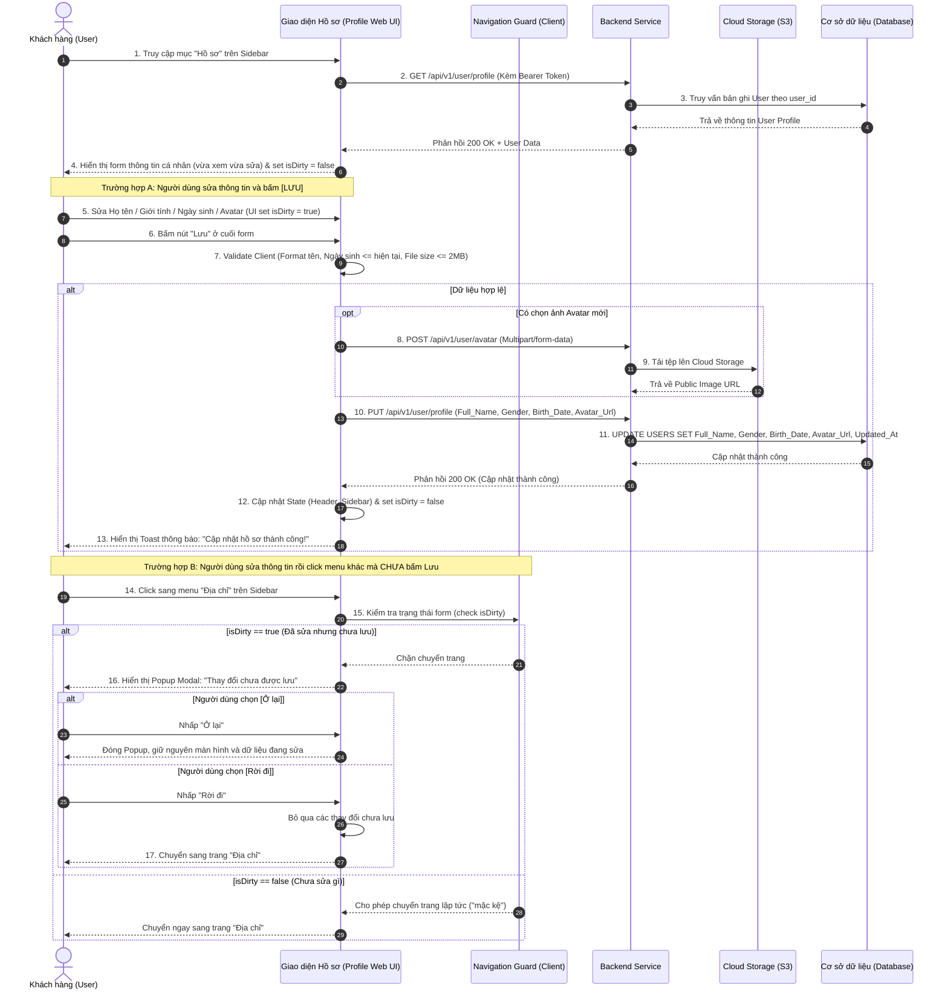

| Module | modules\account\common\profile |
| ------ | ------------------------------ |
| Menu   | Trang chủ / Tài khoản của tôi / Hồ sơ (Common / Profile) |
| Mô tả  | Dùng để cho phép đối tượng **Khách hàng / Người dùng đã đăng nhập (Customer / User)** xem và cập nhật thông tin hồ sơ cá nhân của mình. Màn hình nằm trong cụm phân hệ **"Tài khoản của tôi"** với bố cục tích hợp thanh điều hướng bên trái (Sidebar Navigation) và khung nội dung quản lý hồ sơ bên phải. Giao diện được thiết kế theo cơ chế **vừa xem vừa chỉnh sửa trực tiếp (Inline Editing)**: toàn bộ thông tin hiển thị sẵn trong các ô nhập liệu, người dùng có thể nhấp vào chỉnh sửa bất kỳ lúc nào và bấm nút **"Lưu"** ở dưới cùng form. Hệ thống tích hợp cơ chế **Kiểm soát thay đổi chưa lưu (Dirty Checking & Navigation Guard)**: nếu người dùng đã chỉnh sửa dữ liệu mà điều hướng rời đi (chuyển menu Sidebar, back trang) khi chưa bấm Lưu, hệ thống sẽ bật Popup cảnh báo xác nhận; ngược lại nếu chưa chỉnh sửa gì thì cho phép chuyển trang bình thường. Áp dụng style UI, layout, component theo **style chung của project**. |

**Tổng quan màn Quản lý Hồ sơ cá nhân (UC-01.04):**
- A. Bố cục chung & Thanh điều hướng Sidebar (Account Sidebar Navigation)
  - A.1. Thông tin tài khoản tóm tắt trên Sidebar
  - A.2. Danh mục Menu điều hướng Sidebar
- B. Màn hình Quản lý Hồ sơ cá nhân - Vừa xem vừa sửa trực tiếp (Main Profile Area)
  - B.1. Header khu vực hồ sơ
  - B.2. Thông tin các trường dữ liệu trên form hồ sơ (Inline Editing)
  - B.3. Khu vực cập nhật Ảnh đại diện (Avatar Upload)
  - B.4. Button và thao tác form hồ sơ (Nút Lưu)
- C. Popup Xác nhận Rời trang khi chưa lưu thay đổi (Unsaved Changes Modal)
  - C.1. Thành phần và giao diện Popup cảnh báo
  - C.2. Quy tắc kích hoạt Popup & Hành vi nút bấm
- D. Quy tắc nghiệp vụ (Business Rules)
  - BR-01: Quy tắc quản lý Tên đăng nhập & Số điện thoại (Phone Readonly)
  - BR-02: Quy tắc liên kết & Cập nhật Email (Email Linking & Verification)
  - BR-03: Thẩm định Họ tên & Ngày tháng năm sinh (Validation Rules)
  - BR-04: Quy chuẩn Ảnh đại diện (Avatar File Constraints)
  - BR-05: Cập nhật CSDL và đồng bộ dữ liệu phiên làm việc (State Sync)
  - BR-06: Cơ chế phát hiện thay đổi và chặn rời trang (Dirty Checking & Navigation Guard)
- E. Luồng nghiệp vụ chi tiết (Workflows)
  - E.1. Luồng xem, chỉnh sửa trực tiếp và lưu hồ sơ (Main Flow - Happy Path)
  - E.2. Luồng ngoại lệ & Luồng thay thế (Alternative & Exception Flows)
    - A1: Để trống trường Họ và tên
    - A2: Chọn ngày sinh lớn hơn ngày hiện tại
    - A3: Tải lên tệp ảnh sai định dạng hoặc quá dung lượng
    - A4: Khách hàng nhấp vào "Thay đổi" Email / Số điện thoại
    - A5: Người dùng điều hướng rời trang khi có thay đổi chưa lưu (Dirty = true)
    - A6: Người dùng điều hướng rời trang khi chưa sửa gì (Pristine = true, Mặc kệ cho đi)
  - E.3. Sơ đồ tuần tự nghiệp vụ (Sequence Diagram)
- F. Danh mục thông báo / Cảnh báo hệ thống (System Messages)

---

# A. Bố cục chung & Thanh điều hướng Sidebar (Account Sidebar Navigation)

Toàn bộ các trang trong phân hệ Quản lý tài khoản (`Profile.md`, `Address.md`, `ChangePassword.md`) dùng chung cấu trúc bố cục 2 cột (Master-Detail / Layout with Sidebar) tiêu chuẩn:
- **Cột trái (25% chiều rộng):** Thanh điều hướng Sidebar tài khoản cá nhân.
- **Cột phải (75% chiều rộng):** Khung nội dung chi tiết tương ứng với chức năng đang được chọn.

## A.1. Thông tin tài khoản tóm tắt trên Sidebar

| Tên | Loại dữ liệu | Bắt buộc | Mô tả | Mô tả Database | Độ dài |
| --- | ------------ | -------- | ----- | -------------- | ------ |
| Avatar tóm tắt | Image / Avatar | | Ảnh đại diện thu nhỏ hình tròn (kích thước 50x50px) của người dùng đang đăng nhập. Nếu chưa có ảnh thì hiển thị avatar chữ cái đầu hoặc icon mặc định. | AVATAR_URL | 500 |
| Tên hiển thị tóm tắt | Text | | Hiển thị Họ và tên của người dùng (chữ in đậm). Kèm icon cây bút nhỏ và text liên kết: *"Sửa hồ sơ"*. | FULL_NAME | 100 |

## A.2. Danh mục Menu điều hướng Sidebar

| Tên Menu | Icon | Trạng thái | Điều hướng | Mô tả |
| -------- | ---- | ---------- | ---------- | ----- |
| **Tài khoản của tôi** | Icon User | Nhóm Menu cha | | Menu accordion cấp 1 mở rộng mặc định, chứa 3 mục con bên dưới: |
| ↳ **Hồ sơ** | | **Active** (Chữ cam/đỏ) | `docs/Fe-01/Common/Profile/Profile.md` | Xem và chỉnh sửa thông tin cá nhân cơ bản (chế độ inline editing). |
| ↳ **Địa chỉ** | | Inactive | `docs/Fe-01/Common/Profile/Address.md` | Quản lý sổ địa chỉ nhận hàng (thêm, sửa, xóa, mặc định). |
| ↳ **Đổi mật khẩu** | | Inactive | `docs/Fe-01/Common/Profile/ChangePassword.md` | Thay đổi mật khẩu đăng nhập tài khoản. |
| **Đơn mua (Lịch sử Order)** | Icon Bag | Inactive | Sắp ra mắt (Tạm thời chưa triển khai) | Menu quản lý lịch sử đơn hàng (được bổ sung ở phân hệ sau theo yêu cầu). |

> **Lưu ý tương tác Sidebar:** Khi người dùng click vào bất kỳ mục menu nào khác ("Địa chỉ", "Đổi mật khẩu", v.v.) từ màn hình Hồ sơ, hệ thống luôn kiểm tra trạng thái form theo **BR-06**:
> - Nếu form đã bị chỉnh sửa mà chưa bấm "Lưu" $\rightarrow$ Giữ nguyên vị trí, kích hoạt Popup hỏi xác nhận (mục **C**).
> - Nếu form chưa bị chỉnh sửa (giữ nguyên gốc) $\rightarrow$ Chuyển trang ngay mà không hỏi gì.

---

# B. Màn hình Quản lý Hồ sơ cá nhân - Vừa xem vừa sửa trực tiếp (Main Profile Area)

Khung nội dung chính bên phải gồm 2 phân vùng: Form nhập liệu thông tin cá nhân (bên trái) và Khung tải lên Ảnh đại diện (bên phải).

> **Cơ chế tương tác:** Giao diện cho phép **"Vừa nhìn vừa sửa trực tiếp"** (Direct Inline Form). Khi mở màn hình, toàn bộ dữ liệu người dùng được load sẵn vào các ô nhập. Người dùng có thể click vào bất kỳ ô nào để sửa trực tiếp mà không cần bấm nút "Chuyển sang chế độ sửa".

## B.1. Header khu vực hồ sơ

| Tên | Loại dữ liệu | Bắt buộc | Mô tả |
| --- | ------------ | -------- | ----- |
| Tiêu đề trang | Title | | Tiêu đề lớn: **"Hồ sơ của tôi"** (font size 20px, bold). |
| Phụ đề mô tả | Text | | Dòng text phụ màu xám bên dưới: *"Quản lý thông tin hồ sơ để bảo mật tài khoản"*. |
| Đường kẻ ngăn cách | Divider | | Đường kẻ ngang mảnh (`border-bottom`) ngăn cách giữa header và form chi tiết. |

## B.2. Thông tin các trường dữ liệu trên form hồ sơ (Inline Editing)

| Tên | Loại dữ liệu | Bắt buộc | Mô tả | Mô tả Database | Độ dài |
| --- | ------------ | -------- | ----- | -------------- | ------ |
| Tên đăng nhập | TextInput / Text | | Tên định danh tài khoản, dẫn xuất từ Số điện thoại đã đăng ký.<br><br>Trạng thái: **Readonly (Chỉ đọc)**, nền xám nhạt (`background: #f5f5f5`). Không cho phép người dùng sửa trực tiếp. | USERNAME | 50 |
| Tên (Họ và tên) | TextInput | x | Họ và tên đầy đủ của người dùng.<br><br>Hiển thị sẵn tên hiện tại. Người dùng có thể **sửa trực tiếp** bất kỳ lúc nào.<br><br>Placeholder: **"Nhập họ và tên"**.<br><br>Quy tắc kiểm tra (Validate):<br>- Không được để trống.<br>- Độ dài từ 2 đến 100 ký tự.<br>- Chỉ chấp nhận chữ cái tiếng Việt có dấu, không dấu và khoảng trắng; không chứa số hoặc ký tự đặc biệt (Regex: `^[\p{L}\s]{2,100}$`).<br>- Tự động trim khoảng trắng thừa ở hai đầu.<br><br>Cảnh báo lỗi inline:<br>- Để trống: *Vui lòng nhập họ và tên.*<br>- Sai định dạng: *Họ và tên không hợp lệ (từ 2 đến 100 ký tự, không chứa số và ký tự đặc biệt).* | FULL_NAME | 100 |
| Email | TextInput / FormedText | | Hiển thị địa chỉ Email liên kết của tài khoản.<br><br>Trường hợp 1 (Đã có Email): Hiển thị email đã được che giấu bảo mật (masking: `us***@gmail.com`) kèm liên kết text màu xanh/cam: **"Thay đổi"** (nhấp vào sẽ kích hoạt popup liên kết/thay đổi email xác thực qua OTP).<br><br>Trường hợp 2 (Chưa có Email): Hiển thị text: *"Chưa liên kết"* kèm nút text: **"Thêm Email"**.<br><br>Trạng thái trên form chính: Readonly (việc sửa đổi phải qua luồng xác thực bảo mật riêng theo **BR-02**). | EMAIL | 255 |
| Số điện thoại | TextInput / FormedText | | Hiển thị số điện thoại chính chủ đã được xác thực ở khâu đăng ký.<br><br>Định dạng che số bảo mật: `(+84) 966 875 204` hoặc `0967***204` kèm nút liên kết: **"Thay đổi"**.<br><br>Trạng thái trên form chính: **Readonly (Chỉ đọc)**. Việc đổi SĐT bắt buộc qua luồng OTP riêng theo **BR-01**. | PHONE_NUMBER | 15 |
| Giới tính | RadioGroup | x | Cho phép người dùng lựa chọn giới tính cá nhân trực tiếp.<br><br>Gồm 3 Radio button lựa chọn đơn:<br>- **Nam**<br>- **Nữ**<br>- **Khác**<br><br>Mặc định: Tích chọn sẵn giới tính hiện tại đã lưu của người dùng. Người dùng click chọn trực tiếp option khác để đổi. | GENDER | 10 |
| Ngày sinh | DatePicker / 3 Selects | | Cho phép xem và chọn lại ngày tháng năm sinh trực tiếp.<br><br>Giao diện: Hộp chọn ngày chuẩn (DatePicker) hoặc 3 ô dropdown (Ngày, Tháng, Năm) được điền sẵn ngày sinh hiện tại.<br><br>Quy tắc kiểm tra (Validate):<br>- Ngày sinh phải là ngày hợp lệ theo lịch dương.<br>- Ngày sinh không được lớn hơn ngày hiện tại (không cho phép chọn ngày tương lai).<br>- Độ tuổi người dùng hợp lệ: Từ 10 đến 120 tuổi.<br><br>Cảnh báo lỗi inline:<br>- Ngày sinh không hợp lệ: *Ngày tháng năm sinh không hợp lệ hoặc lớn hơn ngày hiện tại.* | BIRTH_DATE | DATE |

## B.3. Khu vực cập nhật Ảnh đại diện (Avatar Upload)

Khu vực nằm ở cột bên phải của form hồ sơ, cách biệt bởi đường kẻ dọc mảnh.

| Tên | Loại dữ liệu | Bắt buộc | Mô tả | Mô tả Database | Độ dài |
| --- | ------------ | -------- | ----- | -------------- | ------ |
| Xem trước Avatar | Image / Preview | | Khung tròn lớn hiển thị ảnh đại diện hiện tại của người dùng (kích thước 100x100px). Có hiệu ứng hover mờ nhẹ. Nếu người dùng chọn file mới, khung tròn cập nhật hiển thị ngay ảnh xem trước (Local preview). | AVATAR_URL | 500 |
| Nút Chọn ảnh | Button | | Button outline dạng: **"Chọn ảnh"**.<br><br>Thao tác: Nhấp vào sẽ mở cửa sổ File Picker của hệ điều hành để người dùng chọn tệp ảnh mới.<br><br>Quy tắc kiểm tra tệp (theo **BR-04**):<br>- Định dạng tệp cho phép: `.jpg`, `.jpeg`, `.png`.<br>- Dung lượng tệp tối đa: **2.0 MB**.<br>- Nếu tệp hợp lệ: Đổi preview ảnh đại diện, đánh dấu trạng thái form là đã chỉnh sửa (`isDirty = true`).<br>- Nếu tệp không hợp lệ: Báo lỗi toast cảnh báo và giữ nguyên ảnh cũ. | | |
| Ghi chú định dạng | Text | | Dòng văn bản ghi chú màu xám dưới nút chọn ảnh:<br>*"Dung lượng file tối đa 2 MB"*<br>*"Định dạng: .JPEG, .PNG"* | | |

## B.4. Button và thao tác form hồ sơ (Nút Lưu)

Nằm ở hàng dưới cùng của khu vực thông tin cá nhân.

| Tên | Loại dữ liệu | Bắt buộc | Mô tả |
| --- | ------------ | -------- | ----- |
| Lưu | Button | | Nút hành động chính (Primary Button), màu cam/đỏ thương hiệu, label: **"Lưu"**.<br><br>Vị trí: Cố định ở dưới cùng của form nhập liệu.<br><br>Điều kiện & Xử lý khi bấm:<br>1. Hệ thống validate toàn bộ các trường nhập trên form (Họ tên, Giới tính, Ngày sinh).<br>2. Nếu có trường lỗi: Dừng luồng, hiển thị lỗi inline dưới trường tương ứng, cuộn màn hình đến trường lỗi đầu tiên.<br>3. Nếu hợp lệ: Nút chuyển sang trạng thái Loading (spinner + disabled).<br>4. Tiến hành tải ảnh đại diện lên Cloud Storage (nếu có chọn file ảnh mới).<br>5. Gửi request cập nhật thông tin vào CSDL `USERS` (theo **BR-05**).<br>6. Cập nhật thành công: Đặt lại trạng thái gốc (`isDirty = false`), đồng bộ thông tin Header/Sidebar, hiển thị Toast xanh: *"Cập nhật hồ sơ thành công!"*. |

---

# C. Popup Xác nhận Rời trang khi chưa lưu thay đổi (Unsaved Changes Modal)

Modal pop up này được kích hoạt tự động theo cơ chế **Navigation Guard** khi người dùng đã chỉnh sửa bất kỳ thông tin nào trên form (form dirty) mà có hành động rời khỏi trang Hồ sơ mà **chưa bấm nút "Lưu"**.

## C.1. Thành phần và giao diện Popup cảnh báo

Popup được thiết kế dạng Modal Dialog căn giữa màn hình, có lớp phủ mờ (backdrop/overlay), nội dung ngắn gọn, rõ ràng:

| Tên | Loại thành phần | Mô tả chi tiết |
| --- | --------------- | -------------- |
| Icon cảnh báo | Icon | Icon cảnh báo hình tam giác màu vàng cam (Warning Icon) phía trên tiêu đề. |
| Tiêu đề Popup | Modal Title | Tiêu đề: **"Thay đổi chưa được lưu"** (chữ đậm, font-size 18px). |
| Nội dung cảnh báo | Modal Body Text | Lời nhắc xác nhận: *"Bạn có những thay đổi chưa được lưu. Rời khỏi trang này sẽ hủy toàn bộ các thông tin bạn vừa chỉnh sửa. Bạn có chắc chắn muốn rời đi?"* |
| Nút "Ở lại" | Button (Secondary) | Nút phụ viền xám hoặc nền xám, nhãn: **"Ở lại"** (hoặc *"Tiếp tục chỉnh sửa"*).<br><br>Hành vi: Đóng popup, hủy thao tác chuyển trang, giữ nguyên màn hình Hồ sơ và toàn bộ dữ liệu người dùng đang nhập dở. |
| Nút "Rời đi" | Button (Danger / Primary) | Nút màu cam/đỏ cảnh báo, nhãn: **"Rời đi"** (hoặc *"Hủy thay đổi & Rời đi"*).<br><br>Hành vi: Đóng popup, hủy bỏ các thay đổi tạm thời, giải phóng Navigation Guard và tiếp tục thực hiện điều hướng đến trang/menu người dùng vừa chọn. |
| Nút Đóng (X) | Icon Button | Icon dấu "X" ở góc trên bên phải popup. Nhấp vào có tác dụng tương đương bấm nút **"Ở lại"** (đóng popup và ở lại trang). |

## C.2. Quy tắc kích hoạt Popup & Hành vi nút bấm

1. **Điều kiện kích hoạt Popup:**
   - Cờ trạng thái `isDirty == true` (đã chỉnh sửa Họ tên, Giới tính, Ngày sinh hoặc chọn Avatar mới).
   - VÀ người dùng thực hiện một trong các hành vi sau khi **CHƯA bấm nút "Lưu"**:
     - Nhấp vào bất kỳ mục menu nào khác trên Sidebar (Ví dụ: *"Địa chỉ"*, *"Đổi mật khẩu"*).
     - Nhấp vào logo hệ thống hoặc menu điều hướng trên Header (Trang chủ, Giỏ hàng, v.v.).
     - Bấm nút Quay lại (Back button) hoặc Tiến tới (Forward button) của trình duyệt web.
     - Tải lại trang (F5 / Refresh) hoặc tắt tab/đóng trình duyệt (kích hoạt cảnh báo mặc định của trình duyệt qua `window.onbeforeunload`).
2. **Trường hợp KHÔNG kích hoạt Popup ("Mặc kệ"):**
   - Khi `isDirty == false` (người dùng vừa vào trang chỉ xem thông tin, không gõ sửa gì, hoặc đã bấm "Lưu" thành công).
   - Khi người dùng click chuyển sang menu khác $\rightarrow$ Hệ thống lập tức chuyển hướng bình thường, mượt mà, tuyệt đối không làm phiền người dùng bằng popup.

---

# D. Quy tắc nghiệp vụ (Business Rules)

## BR-01: Quy tắc quản lý Tên đăng nhập & Số điện thoại (Phone Readonly)
1. **Bảo vệ tài khoản:** Tên đăng nhập và Số điện thoại là các trường định danh cấp cao gắn liền với bảo mật và xác thực 2FA của tài khoản.
2. **Khóa chỉnh sửa trực tiếp:** Không cho phép sửa đổi trực tiếp Số điện thoại trên form hồ sơ thông thường (luôn để chế độ `Readonly`).
3. Trường hợp người dùng có nhu cầu đổi Số điện thoại: Phải nhấp vào nút "Thay đổi" để đi qua luồng xác thực bảo mật riêng (nhập mật khẩu hiện tại $\rightarrow$ nhập SĐT mới $\rightarrow$ xác thực mã OTP gửi về SĐT mới).

## BR-02: Quy tắc liên kết & Cập nhật Email (Email Linking & Verification)
1. **Tính duy nhất:** Mỗi địa chỉ Email chỉ được liên kết với duy nhất một tài khoản trong hệ thống.
2. **Luồng liên kết Email mới:**
   - Người dùng nhấp "Thêm Email" hoặc "Thay đổi": Mở popup nhập địa chỉ Email mới.
   - Hệ thống kiểm tra format RFC 5322 và kiểm tra Email chưa tồn tại trong CSDL.
   - Hệ thống gửi mã OTP xác nhận (hoặc liên kết kích hoạt) tới địa chỉ Email đó (hiệu lực 10–15 phút).
   - Nhập đúng mã OTP: Cập nhật trường `EMAIL` trong bảng `USERS`, đánh dấu `EMAIL_VERIFIED = true`.

## BR-03: Thẩm định Họ tên & Ngày tháng năm sinh (Validation Rules)
1. **Họ và tên:** Tối thiểu 2 ký tự, tối đa 100 ký tự. Chỉ cho phép các ký tự chữ cái tiếng Việt và khoảng trắng, không chứa số và ký tự đặc biệt vô nghĩa.
2. **Ngày tháng năm sinh:**
   - Ngày sinh phải là ngày hợp lệ (xử lý chính xác các tháng có 28, 29, 30, 31 ngày và năm nhuận).
   - `BIRTH_DATE <= CURRENT_DATE`. Tuyệt đối không cho phép chọn ngày trong tương lai.
   - Giới hạn năm sinh hợp lý: `CURRENT_YEAR - 120 <= YEAR(BIRTH_DATE) <= CURRENT_YEAR - 10`.

## BR-04: Quy chuẩn Ảnh đại diện (Avatar File Constraints)
1. **Định dạng cho phép:** Chỉ chấp nhận các định dạng ảnh raster phổ biến: `image/jpeg`, `image/png`, `image/jpg`. Không chấp nhận định dạng GIF động, SVG hay tệp thực thi.
2. **Kích thước & Dung lượng:**
   - Dung lượng tối đa: $\le 2\text{ MB}$ (2.097.152 bytes).
   - Khuyến nghị kích thước ảnh vuông tỉ lệ 1:1, tối thiểu 200x200px. Hệ thống tự động crop/resize theo khung tròn để đảm bảo giao diện đẹp mắt.
3. **Lưu trữ:** Tệp ảnh được tải lên dịch vụ lưu trữ đám mây an toàn (S3 / Cloud Storage / CDN). CSDL chỉ lưu chuỗi URL đường dẫn ảnh trong cột `AVATAR_URL`.

## BR-05: Cập nhật CSDL và đồng bộ dữ liệu phiên làm việc (State Sync)
Ngay sau khi người dùng bấm nút "Lưu" thành công:
1. Hệ thống thực hiện câu lệnh `UPDATE USERS SET FULL_NAME = ?, GENDER = ?, BIRTH_DATE = ?, AVATAR_URL = ?, UPDATED_AT = CURRENT_TIMESTAMP WHERE ID = ?`.
2. Hệ thống cập nhật lại State/Context phía Frontend để hiển thị ngay Họ tên và Avatar mới lên thanh Header trang web và Avatar tóm tắt ở Sidebar mà không cần tải lại toàn bộ trang (F5).
3. Đặt lại trạng thái `isDirty = false` và lưu mốc dữ liệu mới làm `initialValues`.
4. Hiển thị thông báo Toast xanh: *"Cập nhật thông tin hồ sơ thành công!"*.

## BR-06: Cơ chế phát hiện thay đổi và chặn rời trang (Dirty Checking & Navigation Guard)
1. **Khởi tạo dữ liệu gốc (`initialValues`):**
   - Khi truy cập màn hình Hồ sơ, hệ thống lưu bản sao dữ liệu ban đầu:
     `initialValues = { fullName, gender, birthDate, avatarFile: null }`.
   - Trạng thái bẩn ban đầu: `isDirty = false`.
2. **Kiểm tra thay đổi theo thời gian thực (Realtime Dirty Checking):**
   - Bất cứ khi nào người dùng gõ vào ô Họ tên, chọn lại Giới tính, chọn Ngày sinh hoặc chọn tệp Avatar mới:
     - Hệ thống so sánh giá trị hiện tại (`currentValues`) với `initialValues`.
     - Nếu có bất kỳ trường nào khác biệt: Đánh dấu `isDirty = true`.
     - Nếu người dùng nhập lại hoặc đổi lại đúng các giá trị ban đầu: Tự động đưa về `isDirty = false`.
3. **Chặn điều hướng (Navigation Guard):**
   - **Với chuyển trang nội bộ (Router Navigation - click menu Sidebar "Địa chỉ", "Đổi mật khẩu", click Header):**
     - Nếu `isDirty == true`: Chặn chuyển route (`router.beforeEach` / `useBlocker`), kích hoạt hiển thị **Modal cảnh báo thay đổi chưa lưu (Mục C)**.
     - Nếu `isDirty == false`: Cho phép chuyển route lập tức mà không hiển thị cảnh báo ("mặc kệ").
   - **Với thao tác trình duyệt (F5, đóng tab, đóng trình duyệt):**
     - Đăng ký sự kiện `window.addEventListener('beforeunload', handler)`.
     - Nếu `isDirty == true`: Kích hoạt popup cảnh báo mặc định của trình duyệt để ngăn người dùng vô tình làm mất dữ liệu.

---

# E. Luồng nghiệp vụ chi tiết (Workflows)

## E.1. Luồng xem, chỉnh sửa trực tiếp và lưu hồ sơ (Main Flow - Happy Path)

```
[KHÁCH HÀNG] ──► Chọn menu "Hồ sơ" trên Sidebar
                     │
                     ▼
          Hệ thống truy vấn thông tin User từ API/DB
          Hiển thị form với các trường đã điền sẵn dữ liệu (isDirty = false)
                     │
                     ▼
          Khách hàng nhấp vào sửa trực tiếp (Đổi Họ tên, Giới tính, Ngày sinh, Chọn ảnh mới)
          (Hệ thống tự động phát hiện thay đổi -> set isDirty = true)
                     │
                     ▼
          Khách hàng bấm nút [LƯU] ở dưới cùng form
                     │
                     ▼
          Hệ thống kiểm tra tính hợp lệ dữ liệu (Format tên, Ngày sinh <= hiện tại, File ảnh <= 2MB)
                     │ (Hợp lệ)
                     ▼
          Upload ảnh lên Cloud Storage (nếu có ảnh mới)
          UPDATE dữ liệu vào CSDL bảng USERS
                     │
                     ▼
          Đồng bộ State Frontend (Cập nhật Avatar & Tên trên Header/Sidebar)
          Đặt lại trạng thái form (isDirty = false)
          Hiển thị Toast thông báo: "Cập nhật hồ sơ thành công!"
```

- **Bước 1:** Khách hàng đã đăng nhập truy cập vào trang cá nhân, nhấp chọn mục **"Hồ sơ"** trên Sidebar điều hướng.
- **Bước 2:** Hệ thống gửi request `GET /api/v1/user/profile`, lấy dữ liệu từ CSDL và điền sẵn vào các ô tương ứng trên form. Lưu bản sao dữ liệu ban đầu (`isDirty = false`).
- **Bước 3:** Khách hàng chỉnh sửa trực tiếp các trường mong muốn (nhập lại Họ tên, chọn lại Giới tính, chọn Ngày sinh hoặc nhấp nút *"Chọn ảnh"* để tải lên avatar mới). Hệ thống nhận diện form đã bị thay đổi (`isDirty = true`).
- **Bước 4:** Khách hàng nhấn nút **"Lưu"** ở cuối form.
- **Bước 5:** Hệ thống validate dữ liệu Client, gửi request `PUT /api/v1/user/profile` lên Backend.
- **Bước 6:** Backend kiểm tra tính toàn vẹn dữ liệu, lưu trữ ảnh vào Cloud Storage, cập nhật bản ghi vào bảng `USERS` và phản hồi HTTP 200 OK.
- **Bước 7:** Giao diện hiển thị thông báo Toast thành công, cập nhật ngay tên và ảnh đại diện mới trên thanh Header và Sidebar, đưa cờ `isDirty` về `false`.

## E.2. Luồng ngoại lệ & Luồng thay thế (Alternative & Exception Flows)

### A1. Để trống trường Họ và tên
- **Điều kiện:** Người dùng xóa trắng ô Họ và tên rồi nhấn nút "Lưu".
- **Xử lý:** Dừng luồng, hiển thị chữ đỏ cảnh báo inline dưới ô nhập: *"Vui lòng nhập họ và tên."* và focus con trỏ vào ô lỗi.

### A2. Chọn ngày sinh lớn hơn ngày hiện tại
- **Điều kiện:** Người dùng chọn ngày sinh ở tương lai so với ngày hệ thống.
- **Xử lý:** Báo lỗi inline: *"Ngày tháng năm sinh không hợp lệ hoặc lớn hơn ngày hiện tại."* và không cho phép submit form.

### A3. Tải lên tệp ảnh sai định dạng hoặc quá dung lượng
- **Điều kiện:** Tệp ảnh người dùng chọn có đuôi `.gif, .pdf, .exe` hoặc có dung lượng $> 2\text{ MB}$.
- **Xử lý:** Hệ thống từ chối tải tệp, xóa tệp khỏi hàng đợi và hiển thị thông báo Toast cảnh báo lỗi: *"Kích thước ảnh vượt quá 2MB hoặc định dạng không hỗ trợ. Vui lòng chọn tệp .JPG hoặc .PNG."* Giữ nguyên ảnh đại diện cũ.

### A4. Khách hàng nhấp vào "Thay đổi" Email / Số điện thoại
- **Điều kiện:** Khách hàng muốn cập nhật Email hoặc Số điện thoại mới.
- **Xử lý:** Hệ thống mở Modal popup bảo mật yêu cầu xác thực qua mã OTP trước khi cập nhật CSDL.

### A5. Người dùng điều hướng rời trang khi có thay đổi chưa lưu (Dirty = true)
- **Điều kiện:** Người dùng đã chỉnh sửa ít nhất một thông tin (Họ tên, Giới tính, Ngày sinh, hoặc chọn Avatar mới $\rightarrow$ `isDirty == true`) nhưng **chưa bấm nút "Lưu"**, sau đó nhấp vào menu Sidebar khác (như "Địa chỉ", "Đổi mật khẩu") hoặc bấm Back trình duyệt.
- **Xử lý:**
  1. Hệ thống chặn ngay hành vi chuyển trang (Navigation Guard).
  2. Bật Popup cảnh báo: **"Thay đổi chưa được lưu"** (theo mục **C**).
  3. **Trường hợp người dùng bấm [Ở lại]:** Đóng Popup cảnh báo, hủy lệnh chuyển trang, giữ nguyên dữ liệu đang sửa để người dùng tiếp tục thao tác hoặc bấm Lưu.
  4. **Trường hợp người dùng bấm [Rời đi]:** Đóng Popup cảnh báo, hủy bỏ toàn bộ thay đổi chưa lưu, cho phép trình duyệt tiếp tục chuyển sang trang đích đã chọn.

### A6. Người dùng điều hướng rời trang khi chưa sửa gì (Pristine = true, Mặc kệ cho đi)
- **Điều kiện:** Người dùng vào xem hồ sơ nhưng không chỉnh sửa bất kỳ thông tin nào (`isDirty == false`), sau đó click chọn menu khác trên Sidebar hoặc rời trang.
- **Xử lý:** Hệ thống chuyển trang ngay lập tức mà không hiển thị bất kỳ cảnh báo hay popup nào ("mặc kệ").

## E.3. Sơ đồ tuần tự nghiệp vụ (Sequence Diagram)



---

# F. Danh mục thông báo / Cảnh báo hệ thống (System Messages)

| Mã thông báo | Loại hiển thị | Nội dung thông báo | Điều kiện xuất hiện |
| ------------ | ------------- | ------------------ | ------------------- |
| `MSG_PRF_01` | Inline Error | *Vui lòng nhập họ và tên.* | Để trống trường Họ và tên khi bấm nút Lưu. |
| `MSG_PRF_02` | Inline Error | *Họ và tên không hợp lệ (từ 2 đến 100 ký tự, không chứa số và ký tự đặc biệt).* | Họ và tên vi phạm định dạng độ dài hoặc chứa ký tự đặc biệt/số. |
| `MSG_PRF_03` | Inline Error | *Ngày tháng năm sinh không hợp lệ hoặc lớn hơn ngày hiện tại.* | Chọn ngày sinh trong tương lai hoặc sai định dạng ngày. |
| `MSG_PRF_04` | Toast Warning| *Dung lượng file ảnh vượt quá 2MB. Vui lòng chọn ảnh nhẹ hơn.* | Tải lên tệp ảnh đại diện có kích thước > 2MB (BR-04). |
| `MSG_PRF_05` | Toast Warning| *Định dạng tệp không được hỗ trợ. Vui lòng chọn tệp định dạng .JPEG hoặc .PNG.* | Chọn tệp ảnh không đúng định dạng quy định. |
| `MSG_PRF_06` | Toast Success| *Cập nhật hồ sơ thành công!* | Cập nhật thông tin cá nhân và lưu CSDL thành công. |
| `MSG_PRF_07` | Toast Error  | *Có lỗi xảy ra trong quá trình lưu dữ liệu. Vui lòng thử lại.* | Lỗi kết nối Server hoặc lỗi CSDL khi cập nhật. |
| `MSG_PRF_08` | Modal Title  | **Thay đổi chưa được lưu** | Tiêu đề popup xác nhận khi người dùng sửa form mà chưa lưu đã rời trang. |
| `MSG_PRF_09` | Modal Body   | *Bạn có những thay đổi chưa được lưu. Rời khỏi trang này sẽ hủy toàn bộ các thông tin bạn vừa chỉnh sửa. Bạn có chắc chắn muốn rời đi?* | Nội dung cảnh báo trong Popup xác nhận rời trang. |
| `MSG_PRF_10` | Modal Action | **[Ở lại]** (Hủy điều hướng, ở lại trang) / **[Rời đi]** (Hủy thay đổi và tiếp tục chuyển trang) | Hai nút lựa chọn hành động trên Popup cảnh báo chưa lưu. |
